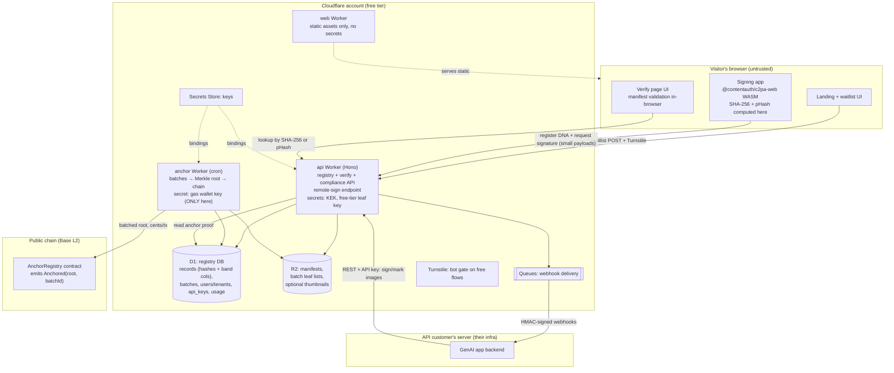
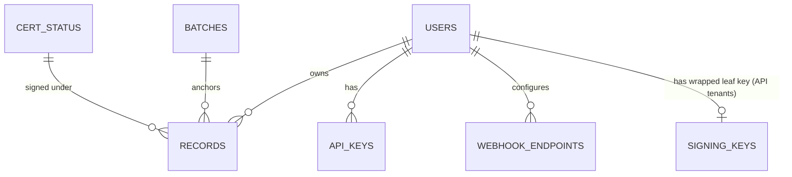
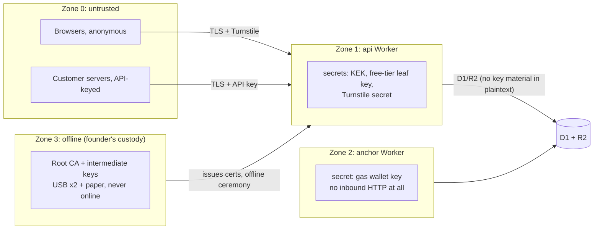
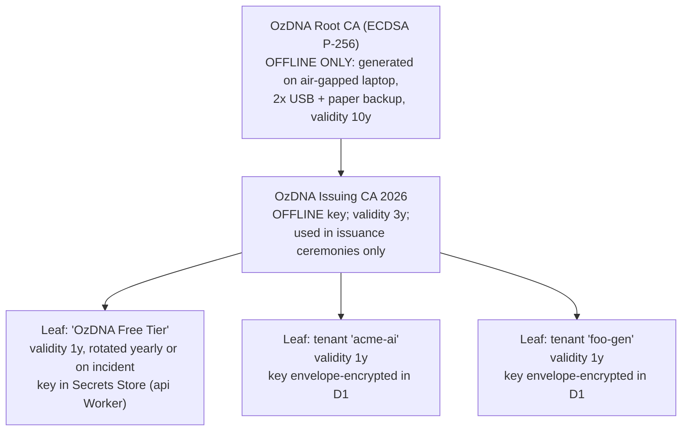

# 01 — OzDNA System Architecture

> 2026-07-06 (v1.1): ratification pass — rule-6 amendment founder-ratified (§3.2, full-image `POST /v1/marks` now the sanctioned primary mode); anchoring adopts 03 §3.4 threshold cron + 24h-free/1h-paid SLA (§0, §2, §4.2, §12); blockhash-core row corrected to "rejected" per R4.
> 2026-07-06 · ratification pass — rule-6 primary mode + anchor-cron body edits

*Written July 6, 2026, for future Claude Code sessions building the October 2026 MVP. Read `CLAUDE.md` and `docs/BLUEPRINT.md` first — the hard rules there override anything here. Sibling documents own some decisions (real filenames on disk; ownership map + precedence rules live in `plan/08-ROADMAP-GATES.md`): **02-TECH-STACK.md** (framework/library/payment/email choices), **03-ALGORITHMS.md** (perceptual-hash algorithm, band scheme, match thresholds, Merkle leaf construction), **04-MVP-SPEC.md** (exact REST schemas, full SQL DDL, **and week-by-week build scope**), **05-RISK-REGISTER.md** (risks/kill criteria), **06-COST-MODEL.md** (every dollar, free-tier headroom math), **07-GTM-SEO-PR.md** (GTM/SEO/PR). `plan/00-INDEX.md` (reading order) is referenced by 08 but **not yet written**. Where this document sketches something a sibling owns, the sketch is illustrative and the owner is canonical.*

*All Cloudflare limits, package versions, and prices below were verified on **2026-07-06** with the source cited inline. Re-verify anything older than ~2 months before building against it.*

---

## 0. How it all fits — plain-language narrative (read this first)

OzDNA gives an image a "DNA record" made of three things:

1. **A signature inside the file** (C2PA manifest): like a tamper-evident seal glued into the image itself. Anyone can open the file and check the seal. If one pixel changes, the seal breaks.
2. **A timestamp nobody can fake** (blockchain anchor): on a rolling schedule (a cron checks every 15 minutes and anchors whenever enough records are waiting — every free record within 24 hours, every paid record within 1 hour; mechanism owned by 03 §3.4), we take the fingerprints of newly registered images, squash them into a single 32-byte code (a *Merkle root* — think of it as a receipt for the whole stack), and write that one code onto a public blockchain. Cost: one transaction of a few cents covers thousands of images. Because the blockchain is public and append-only, nobody — including us — can later pretend an image was registered earlier than it was.
3. **A fingerprint that survives abuse** (perceptual hash): social platforms strip the seal (point 1) when you upload. Screenshots destroy it entirely. So at signing time we also compute a *perceptual* fingerprint — a short code describing what the image *looks like*, not its exact bytes. A screenshot or re-compressed copy produces a nearly identical code. Our registry can therefore say "this stripped copy matches DNA record #12345, registered on Oct 14, signed by X" even when the file itself carries no metadata. **This registry is the moat** — signing is a commodity (Adobe does it free); remembering is not.

Physically, the whole thing is five small pieces running on Cloudflare's free tier:

- **The website** (`ozdna.com`) — landing page, waitlist, the signing app, and the verify page. Static files; Cloudflare serves them free and unlimited.
- **The signing app** runs *in the visitor's browser* (WebAssembly). Their laptop does the heavy work of hashing the image; our server only performs the final tiny signature (a few kilobytes). We pay near-zero compute.
- **The API** (`api.ozdna.com`) — one Cloudflare Worker. Free creators' browsers call it to register DNA records; paying GenAI companies' *servers* call it to sign their generated images for EU AI Act compliance. Records live in a small SQL database (D1); the signed manifests and small thumbnails live in object storage (R2).
- **The anchoring worker** — a scheduled job (cron, every 15 minutes) that runs on its own, batches newly registered records, and writes one Merkle root to the Base blockchain from a gas wallet we own. This wallet holds only our own few dollars of gas — never user funds (hard rule 2).
- **The verify page** — anyone drags an image in. If the seal is intact, their own browser validates it and we show the anchor proof. If the seal was stripped, we look up the perceptual fingerprint and show the closest registered originals.

Nothing here requires users to know or care that a blockchain exists. In all copy it is "a public, tamper-proof timestamp." (Hard rule 4.)

---

## 1. Component map



Six components, three of which are Workers:

| # | Component | What it is | Public surface |
|---|---|---|---|
| 1 | **web** | Static site: landing, segmented waitlist, signing app SPA, verify page, docs. Served as Workers static assets (free, unlimited). | `ozdna.com` |
| 2 | **api** | Single Hono app: waitlist intake, DNA registration, remote signing, verification lookups, compliance REST API, admin routes. | `api.ozdna.com` |
| 3 | **anchor** | Cron-triggered Worker. No HTTP route at all. Builds Merkle batches, submits the anchor transaction, writes proofs back. | none |
| 4 | **registry data** | D1 (relational records) + R2 (manifest bytes, batch leaf lists, thumbnails). | via api only |
| 5 | **AnchorRegistry contract** | ~20-line Solidity contract on Base emitting `Anchored(bytes32 root, uint256 batchId)`. Deploying our own contract (vs raw calldata) costs the same cents and is the artifact Base's retroactive Builder Grants program looks for. | public chain |
| 6 | **dashboard + admin/ops** | Customer-facing **minimal dashboard** per 04-MVP-SPEC §1.1 (API keys, usage-vs-quota, billing link, webhook config) — it is the first UI cut if Week 4 tightens (04 §8 cut line: keys then issued by admin script). Founder admin = a `/admin/*` route group on the api Worker protected by Cloudflare Access, plus `wrangler tail` for logs and the D1 console for queries. | dashboard: customers; admin: founder only |

**Why three Workers instead of one?** Trust isolation, not scale. The gas-wallet private key is bound *only* to the anchor Worker; a bug or dependency compromise in the public-facing api Worker cannot exfiltrate it. The web Worker binds no secrets at all. (See §8 trust boundaries.)

**Monorepo layout** (stack details → 02-TECH-STACK):

```
ozdna/
  apps/web/        # static site + signing/verify SPA
  apps/api/        # Hono Worker
  apps/anchor/     # cron Worker
  packages/dna-core/        # shared: SHA-256 helpers, pHash impl (03 owns algorithm), Merkle
  packages/anchor-backends/ # AnchorBackend interface + adapters (§6)
  contracts/       # AnchorRegistry.sol + deploy scripts
```

The perceptual hash **must be one shared implementation compiled/bundled for both browser and Worker** (`packages/dna-core`). Two independent implementations that drift by one bit destroy matching. This is an architectural invariant regardless of which algorithm 03 picks.

---

## 2. Cloudflare primitive mapping, with free-tier limits at each point of use

All limits fetched 2026-07-06 from Cloudflare docs (URLs inline). Free tier throughout; the *first* paid upgrade, if ever needed, is Workers Paid at **$5/mo minimum** — 10M requests/mo, 30M CPU-ms/mo, per-invocation CPU raised from 10 ms to up to 5 min ([pricing](https://developers.cloudflare.com/workers/platform/limits/), [pricing page](https://developers.cloudflare.com/workers/platform/pricing/)) — well inside the ~$20/mo pre-approved budget.

| Primitive | Used for | Free-tier limit at this point of use (verified 2026-07-06) | Headroom analysis |
|---|---|---|---|
| **Workers static assets** | Entire website incl. WASM bundles | Requests to static assets are **free and unlimited**, do not count toward Worker request quota ([billing-and-limitations](https://developers.cloudflare.com/workers/static-assets/billing-and-limitations/)) | The Aug 2 PR traffic spike costs nothing. This is why the site is static-first. |
| **Workers (api)** | All API traffic | 100,000 req/day, **10 ms CPU/invocation**, 128 MB memory, 3 MB gzipped script, 50 subrequests/req ([limits](https://developers.cloudflare.com/workers/platform/limits/)) | 10 ms CPU is the binding constraint — it dictates the client-pays-compute design (§3). MVP API volume (hundreds–low thousands/day) is <5% of request quota. |
| **Workers (anchor)** | Batched root + chain tx (15-min cron) | Cron-triggered invocations also get 10 ms CPU on free ([limits](https://developers.cloudflare.com/workers/platform/limits/)). Cron trigger count per Worker is low single digits on free (docs currently inconsistent, ~3/Worker — [docs issue #29326](https://github.com/cloudflare/cloudflare-docs/issues/29326)); we use exactly **one**. | **Correction (review pass 2026-07-06):** the bare 10k-leaf Merkle build with the pinned `@noble/hashes@2.2.0` measures **~11 ms on a fast M-series laptop** — at/over the 10 ms free budget *before* proof extraction and ~MBs of proof-JSON serialization; Workers CPUs won't be faster. On the free plan the batch cap must be **~2–4k leaves** (chaining extra batches) or the tree must hash via native `crypto.subtle.digest`. In practice this is moot: **Workers Paid ($5/mo) is on from launch day** (06-COST-MODEL §2's call, adopted here — see §3.2), which raises per-invocation CPU to 30 s+. |
| **D1** | Registry DB | 5M rows read/day, **100k rows written/day**, 5 GB total ([d1 pricing](https://developers.cloudflare.com/d1/platform/pricing/)) | One registration ≈ **~15–19 billed row writes** once index rows are counted (D1 bills each indexed column write as an extra row; arithmetic owned by 04-MVP-SPEC §5). Free tier ≈ **~5–6k registrations/day** — still beyond MVP volume; Workers Paid (on from launch) includes 50M writes/mo. Verify lookups are reads (5M/day). |
| **R2** | Manifests (~5–50 KB each), batch leaf lists, thumbnails (~20–40 KB WebP) | 10 GB-month storage, 1M Class A (writes) /mo, 10M Class B (reads) /mo, **egress free** ([r2 pricing](https://developers.cloudflare.com/r2/pricing/)) | 10 GB ≈ ~150k records with thumbnails. Free egress means the verify page can serve thumbnails at PR-spike volume for $0. |
| **KV** | Read-heavy caches only: published cert-status list (mini-CRL), public config | 100k reads/day, **1k writes/day**, 1 GB ([kv limits](https://developers.cloudflare.com/kv/platform/limits/)) | 1k writes/day makes KV **unsuitable for counters/rate-limiting** — a common design mistake to avoid. We write to KV only on cert status changes (rare). |
| **Queues** | Webhook delivery to API customers; retry with backoff | Available on free plan: **10k operations/day**, 24 h retention ([queues pricing](https://developers.cloudflare.com/queues/platform/pricing/)) | One webhook ≈ 3 ops (write/read/delete). ~3k webhooks/day free. Fine for MVP. |
| **Cron Triggers** | One 15-min anchor cron (threshold-triggered — §4.2) | See anchor row above | — |
| **Turnstile** | Bot gate on waitlist form and free signing flow | Free: unlimited challenges, up to 20 widgets ([turnstile plans](https://developers.cloudflare.com/turnstile/plans/)) | We need 2 widgets. |
| **Secrets Store** | KEK, free-tier leaf signing key, gas wallet key, webhook/TSA secrets | Beta; **20 secrets free**, Workers integration live; values not readable back out via dashboard ([blog](https://blog.cloudflare.com/secrets-store-beta/)) | 20 is enough because per-tenant keys are envelope-encrypted in D1, not stored one-per-secret (§9). Fallback if Secrets Store beta misbehaves: classic `wrangler secret put` per-Worker secrets (64 env vars × 5 KB, [limits](https://developers.cloudflare.com/workers/platform/limits/)). |
| **Durable Objects** | *Not used in v1.* Noted as the upgrade path for strict per-key rate limiting and distributed locks. | Available on free plan, SQLite-backed only: 100k req/day, 5M rows read/day, 100k rows written/day ([DO pricing](https://developers.cloudflare.com/durable-objects/platform/pricing/)) | Deliberately excluded from v1 to keep the moving-part count down. |
| **WAF Rate Limiting** | Coarse abuse shield on `api.ozdna.com` | Free plan: **1 rate-limiting rule**, IP-based counting only ([rate-limiting rules](https://developers.cloudflare.com/waf/rate-limiting-rules/)) | The one rule: per-IP cap on `/v1/*`. Fine-grained per-API-key quotas are enforced in the api Worker against D1 (§7). |
| **Cloudflare Access** | Protect `/admin/*` routes | UNVERIFIED: Zero Trust free plan seat count (believed ≤50 users — confirm at https://www.cloudflare.com/plans/zero-trust-services/ before relying on it) | Two seats needed (founder + partner). |
| **Pages** | *Not used.* Workers static assets replaces it for new projects; one Worker project instead of Pages+Worker split. (Pages free: 500 builds/mo, 20k files, 25 MiB/file — [pages limits](https://developers.cloudflare.com/pages/platform/limits/)) | Avoids the Pages/Workers feature drift; Cloudflare's own guidance favors Workers for new builds. |

**Verified library versions (npm, 2026-07-06)** — final stack selection belongs to 02-TECH-STACK, but these are the verified candidates this architecture assumes:

| Package | Version | Role | Note |
|---|---|---|---|
| `@contentauth/c2pa-web` | 0.12.0 (published 2026-06-16) | In-browser C2PA read + Builder-based manifest creation (WASM) | Official CAI SDK, actively maintained ([github](https://github.com/contentauth/c2pa-js)) |
| `@trustnxt/c2pa-ts` | 0.14.0 (2026-04-21) | Pure-TS C2PA "reading, validation, and creation" (npm description) — no native deps, runs on Workers | Server-side assembly path for the compliance API |
| `@contentauth/c2pa-node` | 0.6.0 (2026-06-18) | Native Node bindings (c2pa-node-v2 repo) | **Not usable on Workers** (native binary); kept as escape hatch if we ever add a Node runtime |
| `viem` | 2.54.6 | Chain client for anchor Worker | |
| `hono` | 4.12.28 | api Worker framework | |
| `@noble/hashes` | 2.2.0 | Merkle/SHA-256 in Workers (sync, pure JS, audited) | |
| `blockhash-core` | 0.1.0 (last publish 2019-12-07) | **Considered and rejected** (per R4; 03-ALGORITHMS is the owner) — unmaintained, DCT-less, measurably weaker; superseded by OzDNA pHash v1 + PDQ-256 | |

---

## 3. The two signing paths — and why they differ

This is the single most important architectural decision, driven by two hard constraints: the 10 ms Worker CPU limit and hard rule 6 (client pays compute for free users).

### 3.1 Free creators: browser-assembled, remotely signed

The browser does everything heavy; the server contributes only the final signature.

*(Endpoint names in this section and the §4 diagrams are illustrative; 04-MVP-SPEC §4.2 owns the canonical names — `POST /v1/sign` → **`POST /v1/sign-digest`**, `POST /v1/assets` → **`POST /v1/registrations`**, verify lookups → **`GET /v1/verify?hash=…&phash=…`**.)*

1. Browser (WASM) decodes the image, computes **SHA-256** (via native `crypto.subtle`, fast even for 20 MB) and the **perceptual hash** (`dna-core`, algorithm per 03).
2. Browser assembles the C2PA manifest with `@contentauth/c2pa-web`'s Builder: assertions (created-with, timestamp claim, our soft-binding assertion carrying the pHash), thumbnail generation.
3. The *signature itself* uses the **remote-signing pattern**: the Builder produces the small to-be-signed payload (COSE `Sig_structure`, a few KB); the browser POSTs it to `POST /v1/sign`; the api Worker signs with ES256 (ECDSA P-256, natively supported by `crypto.subtle.sign` in Workers — sub-millisecond, well inside 10 ms CPU) using the free-tier leaf key; the signature comes back and the browser embeds it.
   - Rationale: **private keys never leave our server** (a browser-held key could be extracted and used to forge OzDNA signatures forever), yet the server never touches the multi-megabyte image. Best of both.
   - UNVERIFIED: the exact remote-signer callback shape exposed by `@contentauth/c2pa-web` 0.12.0 (`Builder.sign()` signer interface). The underlying `c2pa-rs` supports async remote signers; if the WASM wrapper of the pinned version doesn't expose it, the fallback is a thin fork or signing via `@trustnxt/c2pa-ts` primitives in the browser. **Prototype this in week 1 of the October build — it is the highest technical risk in the MVP.**
4. Browser calls `POST /v1/assets` with: SHA-256, pHash, media type, dimensions, manifest bytes (server stores to R2), optional client-generated ≤256 px WebP thumbnail. Turnstile token required.
5. Server writes the registry rows, returns the DNA record ID + a one-time **management token** (random 256-bit secret, stored only as a hash) that later authorizes deletion — this is how anonymous users retain GDPR erasure rights without us storing any identity (§8).
6. The signed file is saved **locally by the browser** (File System Access API / download). We never receive the full-resolution original.

Free-flow abuse control: Turnstile on every `/v1/sign` + `/v1/assets` call, the zone-level IP rate rule, and a per-IP daily registration cap checked in D1.

### 3.2 API customers: server-side assembly on our Workers

Paying GenAI customers integrate with **one POST from their server** — they will not run WASM or a browser. Their duty (EU AI Act Art. 50 / Dec 2 grace expiry) is machine-readable marking of generated images at creation time.

Two endpoints, one simple and one efficient (exact schemas → 04-MVP-SPEC; canonical name for full-image mode there is **`POST /v1/marks`**, and the hash/remote-sign volume mode is **not in 04's October scope** — post-MVP):

| Mode | Endpoint | Flow | For whom |
|---|---|---|---|
| **Full-image** (default, easiest integration) | `POST /v1/images/sign` (multipart or bytes, ≤20 MB) | We decode, compute SHA-256 + pHash, assemble the manifest with `@trustnxt/c2pa-ts` (pure TS, Workers-compatible), sign with the **tenant's own leaf key** (§9), embed, register, and stream the signed image back. The original is processed **in memory only** and never persisted (§8). | Small GenAI apps — the primary wedge. Integration effort ≈ 10 lines. |
| **Hash/remote-sign** (volume) | `POST /v1/manifests/sign` | Customer's server computes hashes locally with our thin SDK (published npm package wrapping `dna-core` + c2pa builder), sends only hashes + to-be-signed payload; we sign + register and return the manifest. Their bandwidth and CPU, our signature. | Customers generating >10k images/day, once they exist. |

**CPU budget honesty:** full-image mode hashes and re-encodes megabytes. JPEG re-embedding of a manifest is a byte-splice, not a re-encode, and `crypto.subtle.digest` is native — but the pHash requires an image *decode*, which is real CPU (WASM decoder, likely `@cf-wasm/photon`; choice → 02-TECH-STACK) and does **not** fit the free plan's 10 ms per-invocation budget. Plan of record (adopting 06-COST-MODEL §2, which this document previously contradicted): **Workers Paid ($5/mo) is switched on voluntarily at launch day (October 2026)** — not at the first paying customer. Two reasons: (a) full-image mode must already work during pre-sale evaluation, because §7 promises test-key customers can integrate *before* paying; (b) free-tier limits are hard daily caps, and one PR spike would take the API down. The per-invocation CPU limit rises to 30 s+, the $5 sits inside the ~$20/mo budget and is covered ~40× by one $199 subscription. The free creator flow would fit the free plan either way because its Worker work is signature-only.

**Hard rule 6 — founder-ratified amendment (2026-07-06, already carried in CLAUDE.md):** the **free flow signs client-side in-browser (client pays compute)**; **paid API tenants may use our metered server-side Worker compute, priced into their tier.** Accordingly, full-image `POST /v1/marks` is the **sanctioned primary revenue mode** — no longer "pending sign-off" — because a GenAI backend will not run a browser and the compliance wedge (BLUEPRINT §4 customer #1) is a server-to-server product. SDK/hash mode (`POST /v1/manifests/sign` — the client hashes, we assemble/sign) remains an **available option, not the default posture.** The economics hold with wide margin: metered Worker compute is **≤$0.000004/image (~93% gross margin)**, well inside 06-COST-MODEL's planning number. Client-pays-compute still governs the free tier; paid tenants use our metered compute on the paid plan.

### 3.3 Side-by-side

| | Free creator flow | Compliance API flow |
|---|---|---|
| Who calls us | Their **browser** | Their **server** |
| Heavy compute (decode, hash, pHash, assemble) | Client device | Our Worker (paid plan) or their server (SDK mode) |
| Signing identity | Shared `OzDNA Free Tier` leaf cert — asserts *"signed via OzDNA at time T"*, deliberately **not** asserting who the creator is | **Per-tenant leaf cert** (e.g. `acme-ai.tenants.ozdna.com`) — the customer's own marking identity; revocable alone (§9) |
| Auth | Turnstile + per-IP caps; anonymous | API key (`ozdna_live_…`), per-key quotas |
| Original image | Never uploaded to us | Passes through memory only; never stored |
| Metering | none | usage rows per call → billing (§7) |
| Webhooks | none | anchor-confirmed, quota, key events (§7) |
| SLA/promises | best effort | rate limits + status page; still **never** "trusted Content Credentials" (hard rule 5) |

---

## 4. The four core journeys (sequence diagrams)

### 4.1 Creator signs an image in the browser

```mermaid
sequenceDiagram
    autonumber
    participant U as Creator's browser (WASM app)
    participant API as api Worker
    participant D1 as D1 registry
    participant R2 as R2

    U->>U: decode image; SHA-256 (crypto.subtle); pHash (dna-core)
    U->>U: c2pa-web Builder: assertions + thumbnail + soft-binding(pHash)
    U->>API: POST /v1/sign {tbs_payload (~KB), turnstile_token}
    API->>API: verify Turnstile; ES256 sign with free-tier leaf key (WebCrypto)
    API-->>U: {signature, cert_chain}
    U->>U: embed signature -> signed JPEG/PNG saved locally
    U->>API: POST /v1/assets {sha256, phash, manifest bytes, thumb?, dims}
    API->>R2: PUT manifest (+thumbnail)
    API->>D1: INSERT record row (sha256, phash, band columns, status=registered)
    API-->>U: {dna_id, management_token (shown once), verify_url}
    Note over U,API: Full-resolution original never leaves the browser.<br/>Anchoring happens later, asynchronously (4.2).
```

### 4.2 Anchoring worker batches and commits registry hashes on-chain

```mermaid
sequenceDiagram
    autonumber
    participant CRON as Cron trigger (every 15 min)
    participant AW as anchor Worker
    participant D1 as D1 registry
    participant R2 as R2
    participant CH as Base L2 (AnchorRegistry contract)
    participant Q as Queue (webhooks)

    CRON->>AW: scheduled()
    AW->>D1: acquire anchor_lock row (single-writer guard)
    AW->>D1: read pending count, oldest-pending age, oldest paid-item age (status='registered')
    alt threshold met (pending 100+ OR oldest 23h+ OR any paid item 40min+)
        AW->>D1: SELECT sha256 FROM assets WHERE status='registered' LIMIT 10000
        AW->>AW: build Merkle tree (SHA-256, sorted leaves) -> root
        AW->>D1: INSERT batch (root, leaf_count, status='submitting')
        AW->>R2: PUT batches/{id}/leaves.json (ordered leaf list)
        AW->>CH: viem: AnchorRegistry.anchor(root) from gas wallet
        CH-->>AW: txid; wait 1 confirmation (I/O wait, not CPU)
        AW->>D1: UPDATE batch {txid, block_time, status='anchored'}
        AW->>D1: per asset: UPDATE {status='anchored', batch_id, merkle_proof}
        AW->>Q: enqueue webhook events for tenant-owned assets
        AW->>D1: release anchor_lock
    else
        AW->>D1: release lock; done (no tx, no cost)
    end
    Note over AW,CH: One tx anchors up to 10k assets. Base tx fees are typically<br/>sub-cent to a few cents (theblock.co / l2fees.info, checked 2026-07-06)<br/>=> worst case ~96 tx/day ≈ $53/yr (03 §3.6). Backlog >10k: loop batches.
```

Idempotency details: the batch row is written *before* broadcast with a deterministic nonce; on crash-and-rerun the worker finds `status='submitting'`, checks the chain for the pending tx by nonce, and resumes rather than double-spending. Single cron writer + the D1 lock row means no concurrent nonce races.

### 4.3 Verifying an intact signed image

```mermaid
sequenceDiagram
    autonumber
    participant V as Verifier's browser (verify page)
    participant API as api Worker
    participant D1 as D1
    participant R2 as R2

    V->>V: drag image in; c2pa-web reads manifest
    V->>V: validate signature chain locally (WASM, client CPU)
    V->>V: extract SHA-256; recompute over asset; compare
    V->>API: GET /v1/verify/hash/{sha256}
    API->>D1: lookup asset + batch + cert status
    API-->>V: {dna_id, signed_at, signer, batch: {root, txid, block_time}, merkle_proof, cert_status}
    V->>V: verify Merkle proof: leaf -> root (client-side JS)
    V->>V: link out to block explorer for the tx (independent check)
    Note over V: Verdict shown: "Signed via OzDNA on Oct 14, 2026, anchored<br/>publicly the same day (within 24h, free tier). Signature valid."<br/>NEVER worded as C2PA-trusted Content Credentials (hard rule 5).
```

The server is a dumb lookup here; every cryptographic check (signature chain, hash recompute, Merkle proof) runs in the verifier's browser and can be independently reproduced — that is the credibility story for journalists.

### 4.4 Verifying a stripped / re-encoded / screenshotted copy

```mermaid
sequenceDiagram
    autonumber
    participant V as Verifier's browser
    participant API as api Worker
    participant D1 as D1
    participant R2 as R2

    V->>V: drag image in; c2pa-web finds NO manifest (stripped)
    V->>V: compute pHash with dna-core (same impl as signing!)
    V->>API: GET /v1/verify/phash/{alg}/{value}
    API->>D1: band the query hash; indexed band-column lookups (probing per 03-ALGORITHMS)
    API->>API: full Hamming distance on candidates; threshold per 03-ALGORITHMS
    API->>D1: fetch matching assets + anchor proofs
    API-->>V: [{dna_id, similarity, thumb_url?, signed_at, anchor…}, …]
    V->>R2: GET thumbnails (via api-proxied URL)
    V->>V: human confirms visually: "yes, that's the same picture"
    Note over V,API: Result is honest-by-design: "visually matches a registered<br/>original" — a probabilistic claim, clearly distinguished from the<br/>cryptographic claim of 4.3. UI wording matters legally.
```

**pHash candidate search — how it stays cheap on D1:** exact nearest-neighbor Hamming search doesn't exist in SQLite. We use *multi-index banding*: the 64-bit hash is split into `k` bands stored as **indexed integer columns on the record row** (canonical DDL → 04-MVP-SPEC §5). By pigeonhole, two hashes within Hamming distance `d < k` must agree exactly on at least one band, and probing each band with its near variants extends the guaranteed radius — cheap indexed equality/`IN` lookups retrieve a candidate superset, and the Worker computes true Hamming distance on the (small) candidate list. **03-ALGORITHMS owns hash length, band width/count, probe radius, and match thresholds** (its pick: 4 × 16-bit bands with multi-index probing, complete to `d ≤ 10` at radius 2 — **settled 2026-07-06:** 04-MVP-SPEC §5's DDL now carries 03's `band0..band3` 16-bit columns; band columns and advertised max distance remain ONE coupled decision). Honest trade-off: with band *columns*, changing the band scheme is an `ALTER TABLE` + backfill migration — accepted deliberately, because banding-as-rows would multiply billed D1 writes per registration (see §2 D1 row).

---

## 5. Registry data model

**Canonical DDL ships in 04-MVP-SPEC §5 — and it is deliberately FLAT** (consistency resolution, 2026-07-06): one `records` table carrying `sha256`, `phash`, and the indexed band columns inline, plus `users`, `api_keys`, `anchor_batches`, `usage_events`, `webhook_endpoints`/`webhook_deliveries`, `idempotency_keys`, `login_tokens`, `waitlist`. An earlier draft of this document declared a polymorphic `soft_bindings`/`soft_binding_bands` two-table design an "architectural invariant"; that language is **withdrawn** — per the 08-ROADMAP-GATES precedence rules 04-MVP-SPEC owns the schema, and its flat design wins on D1 write economics (every index write bills as a row; band-rows would roughly double the billed writes per registration). The entity map of the canonical shape:



Illustrative sketch only — **do not write DDL from this document**; 04-MVP-SPEC §5 is canonical (D1 = SQLite dialect):

```sql
CREATE TABLE records (
  id                 TEXT PRIMARY KEY,            -- ULID (sortable, no coordination)
  user_id            TEXT REFERENCES users(id),   -- NULL = anonymous free tier
  media_type         TEXT NOT NULL,               -- 'image/jpeg' | 'image/png' (v1); column exists so video/audio need no migration
  sha256             BLOB NOT NULL UNIQUE,        -- 32 bytes, the Merkle leaf
  phash              BLOB NOT NULL,               -- 64-bit perceptual hash (algorithm -> 03)
  -- band0..band3     INTEGER NOT NULL,           -- indexed band columns; count/width is the
                                                  -- 03<->04 coupled decision (see section 4.4)
  manifest_r2_key    TEXT NOT NULL,
  thumb_r2_key       TEXT,                        -- NULL = user opted out (section 8)
  cert_serial        TEXT NOT NULL,               -- which leaf cert signed it -> cert_status
  mgmt_token_hash    BLOB,                        -- free tier: SHA-256 of one-time deletion token
  status             TEXT NOT NULL DEFAULT 'registered',  -- registered|anchored|deleted|suspect
  batch_id           TEXT REFERENCES batches(id),
  merkle_proof       TEXT,                        -- JSON array of hex nodes + index
  created_at         INTEGER NOT NULL             -- unix ms
);

CREATE TABLE batches (
  id            TEXT PRIMARY KEY,       -- ULID
  merkle_root   BLOB NOT NULL,
  leaf_count    INTEGER NOT NULL,
  leaves_r2_key TEXT NOT NULL,          -- full ordered leaf list (audit/re-derivation)
  chain         TEXT NOT NULL,          -- 'base-mainnet' | 'base-sepolia' | 'null' (dev)
  txid          TEXT,
  block_time    INTEGER,
  status        TEXT NOT NULL DEFAULT 'building',  -- building|submitting|anchored|failed
  created_at    INTEGER NOT NULL
);
```

Plus (sketched here, canonical in 04-MVP-SPEC): `users`, `api_keys (key_hash, prefix, scopes, revoked_at)`, `signing_keys (tenant_id, wrapped_key, cert_pem, serial, not_after)`, `cert_status (serial, status, revoked_at, compromise_time)`, `usage_events` / `usage_daily`, `webhook_endpoints (url, secret_wrapped)`, `webhook_deliveries`, `waitlist (email, segment, created_at)`, `anchor_lock`.

**v2 migration note — how the flat schema does NOT foreclose v2:** when a second soft-binding algorithm (TrustMark watermark IDs, a video fingerprint) or a second media type arrives, the polymorphic design comes back as an **additive migration**: `CREATE TABLE soft_bindings (record_id, alg /* reverse-DNS, e.g. 'com.ozdna.phash.v1' — id owned by 03 §4.1 */, value)` + optional band tables, backfilled from `records.phash` — new tables and a backfill job, no destructive change to `records`, no downtime. Until then, v1's single algorithm is implied by a version constant in `dna-core`, and the reverse-DNS algorithm identifier convention is kept in API surfaces (§4.4 URL, C2PA-style ids) so the migration renames nothing publicly.

Design choices that matter:

- **`sha256` is the identity** of a record and the Merkle leaf. Re-registering identical bytes is idempotent (UNIQUE).
- **Fingerprint extensibility lives in three cheap v1 habits**, not in v1 tables: the `media_type` column, reverse-DNS algorithm ids in every API surface, and the documented additive migration above. (Supersedes the withdrawn "polymorphic invariant" claim.)
- **Merkle proofs are precomputed** at anchor time and stored per record (~1 KB JSON). Costs one already-necessary row update; makes verify a pure read with zero CPU-heavy recomputation. The full leaf list in R2 lets anyone re-derive every proof independently (auditability).
- **Accounts are minimal but they exist** (consistency resolution, 2026-07-06 — supersedes this document's earlier "no user accounts table in v1" stance): 04-MVP-SPEC, owner of MVP scope, ships magic-link email `users`, self-serve API keys, and the minimal dashboard within the 4 weeks. If the build tightens, 04 §8's cut line drops dashboard UI first (keys via founder-run admin script) — that fallback *is* the manual-provisioning minimalism this document originally proposed. Note the residual: 04's story 1 has free signing behind a login while §3.1/§8 here describe an anonymous flow with a one-time management token; 04 as scope owner decides, and §8's data-minimization posture then applies to the minimal `users` row (email, optional display name) instead of "no identity at all". Verification stays account-free either way.

---

## 6. Chain-agnostic anchoring boundary

Hard requirement from BLUEPRINT §3: apply to every ecosystem's grants (Filecoin, Base, Solana, Arweave) **without re-architecture**. The boundary is one TypeScript interface in `packages/anchor-backends`:

```ts
export interface AnchorBackend {
  readonly chainId: string;                       // 'base-mainnet', 'base-sepolia', 'null', later 'filecoin-fvm', 'solana', 'arweave'
  /** Commit a 32-byte Merkle root. MUST be idempotent per (root, batchId). */
  anchor(root: Uint8Array, batchId: string): Promise<AnchorReceipt>;
  /** Independently confirm a receipt against the public chain. */
  verify(receipt: AnchorReceipt, root: Uint8Array): Promise<AnchorStatus>;
  /** Deep link a human can click to see the proof on a public explorer. */
  explorerUrl(receipt: AnchorReceipt): string;
}

export interface AnchorReceipt {
  chainId: string;
  txid: string;
  blockTime?: number;        // unix seconds, set once confirmed
  raw?: Record<string, unknown>;
}
export type AnchorStatus = 'pending' | 'confirmed' | 'reorged' | 'not_found';
```

Rules that make the boundary real:

1. **Nothing outside `apps/anchor` imports viem or any chain SDK.** The api Worker and verify page consume only `batches` rows and `AnchorReceipt` JSON.
2. The registry schema stores `chain` as an opaque string; the verify UI renders `explorerUrl()` output. No chain names in copy (hard rule 4 — it's "public timestamp ledger" in user-facing text; the explorer link speaks for itself for those who care).
3. **v1 ships two adapters:** `NullAdapter` (dev/test: logs, returns fake receipts) and `BaseAdapter` (viem 2.54.6, OP-Stack; works unchanged on Base Sepolia for staging). Because Base is OP-Stack EVM, the same adapter covers Optimism/other OP chains with a config change — one adapter, many grant applications.
4. **Multi-anchor is additive:** `batches` → `batch_anchors` (one row per chain) is a v2-ready extension; anchoring the same root to Filecoin FVM *in addition to* Base for a Filecoin grant is a new adapter + one loop, zero schema surgery. (Do not build `batch_anchors` in v1 — YAGNI — but don't write code assuming exactly one receipt per batch either; pass receipts as arrays internally.)
5. Chain choice for launch: **Base mainnet** — sub-cent txs (checked 2026-07-06: [theblock.co L2 fees](https://www.theblock.co/data/scaling-solutions/scaling-overview/layer-2-average-transaction-cost-in-usd-daily-7dma), [l2fees.info](https://l2fees.info/)); our math **undercuts** the Capture/Numbers benchmark of ~$0.0001/asset amortized by orders of magnitude, it does not merely match it: at 06-COST-MODEL §3's planning fee of **$0.001/tx** ($0.005 conservative), one tx ÷ 10k leaves = **$0.0000001–0.0000005/asset** — 200–1,000× below the benchmark (even a pessimistic $0.05 tx is still 20× below). A deployed contract is also the entry ticket to Base retroactive Builder Grants ([docs.base.org/get-started/get-funded](https://docs.base.org/get-started/get-funded)).

The gas wallet: a fresh EOA generated offline, funded manually with ~$10–20 of Base ETH (months of runway even at the ~96 tx/day worst case — 03 §3.6), private key in Secrets Store bound only to the anchor Worker. It never holds user funds or receives payments — it is a stamp machine, not a wallet product (hard rule 2; Turkey Law 7518 posture).

---

## 7. How the paying flow differs: keys, metering, webhooks, rate limits

### API keys
- Format (canonical → 04-MVP-SPEC §4.1): `ozdna_live_<32 random base62>` / `ozdna_test_...`. Test keys sign with a staging cert chain and anchor to Base Sepolia — customers can integrate before paying. (This promise is why Workers Paid is on from launch day, §3.2 — full-image mode must work during pre-sale evaluation, not only after the first payment.)
- Stored as SHA-256 hash in `api_keys` (indexed — the hash itself is the O(1) lookup key); a short plaintext `key_prefix` (e.g. `ozdna_live_k8Qw`, 04-MVP-SPEC §5) kept for dashboard display only. Constant-time compare on the hash. Never recoverable after creation.
- Scopes: `sign`, `verify`, `webhooks` (verify-only keys let a customer embed verification in their product without signing rights).
- Rotation: two keys may be active per tenant simultaneously (create-new → migrate → revoke-old, zero downtime).

### Usage metering
- Every billable call inserts one `usage_events` row (tenant, op, ts, bytes). A nightly step in the anchor Worker's cron rolls events into `usage_daily` and prunes raw events >90 days. At MVP volume this costs hundreds of the 100k daily D1 writes; the documented upgrade path at scale is Workers Paid + aggregation before insert.
- Quota enforcement: plan limits ($49 Starter = 2,000 marks/mo, $99 Growth = 10,000, $199 Scale = 50,000 — pricing owned by BLUEPRINT §4; quotas by 04-MVP-SPEC §3.6/§4.6; funnel math by 07-GTM-SEO-PR) checked against `usage_daily` + today's events on each call; soft-fail at 100% with `429 quota_exceeded` and a webhook at 80%.
- Billing/payment provider is **out of architecture scope** → 02-TECH-STACK (merchant-of-record viability from TR/UAE: Paddle vs Lemon Squeezy — UNVERIFIED here, verify there). Architecture only guarantees: metering data sufficient to invoice.

### Webhooks
- Events: `asset.anchored` (the big one — "your image's public timestamp is now on-chain", with receipt + proof), `quota.warning`, `key.expiring`, `cert.revoked`.
- Delivery: Queues consumer POSTs JSON with `X-OzDNA-Signature: hmac-sha256(body, tenant_webhook_secret)`; retries with exponential backoff within the 24 h free-tier retention; dead letters recorded in `webhook_deliveries` for manual replay.
- Why webhooks at all: anchoring is async — the public SLA is within 24h (free) / within 1h (paid). A compliance customer's audit log wants the on-chain receipt attached to each generated image; polling 10k assets would waste both sides' quotas.

### Rate limits (layered, cheapest first)

| Layer | Mechanism | Protects against |
|---|---|---|
| 1 | Cloudflare WAF: the 1 free IP-based rate rule on `api.ozdna.com/v1/*` | Dumb floods, scrapers |
| 2 | Turnstile on free-tier endpoints | Bot abuse of free signing |
| 3 | Per-API-key quota check in Worker against D1 | Paying-tier overuse |
| 4 | Per-IP daily cap (D1 counter) on anonymous registration | Free-tier registry spam |

Deliberately **no** Durable-Object token buckets in v1 — approximate limits are fine when the worst case is somebody registering too many hashes; revisit if abuse proves otherwise.

---

## 8. Trust boundaries & data minimization



- Zone 0 → 1 is the only inbound path. Zone 2 has **no HTTP handler** — its only trigger is the cron schedule; compromising the public API cannot reach the gas wallet key because the secret simply isn't bound to that Worker.
- Zone 3 never touches the cloud. Certificate issuance is an offline laptop ceremony (§9).

### What we store — and what we never store

| Data | Stored? | Where | Why / why not |
|---|---|---|---|
| C2PA manifest bytes | ✅ | R2 | The product: recoverable provenance for stripped copies |
| SHA-256 of the asset | ✅ | D1 (+ Merkle leaf on-chain, aggregated) | Identity + anchor. A hash of an image is not reversible to the image |
| Perceptual hash | ✅ | D1 | The moat (soft-binding match) |
| Thumbnail ≤256 px WebP | ✅ **default-on, opt-out for free users** | R2 | **Decision + justification:** a pHash match without a visual is unactionable — the verifying journalist must confirm "same picture" with their eyes; Adobe's registry stores thumbnails for exactly this reason. Kept small (≈20–40 KB), generated client-side in the free flow so we never see full resolution. Opt-out honored because thumbnails are the one stored item that can contain personal data (faces). **Consent surface:** the signing UI shows a pre-checked "include a small preview thumbnail" checkbox with plain copy at the moment of upload — a visible, revocable choice, not a buried setting. (Consistency resolution 2026-07-06: 04-MVP-SPEC's record page previously said "if opted in"; updated to match this default-on/opt-out decision.) |
| Dimensions, format, size | ✅ | D1 | Match plausibility filtering |
| Signing cert serial + timestamps | ✅ | D1 | Revocation reasoning (§9) |
| **Full-resolution originals** | ❌ **never persisted** | — | Free flow: never uploaded at all. API flow: processed in Worker memory, streamed back, never written to R2/D1. This is both the GDPR story and the cost story — we cannot leak, be subpoenaed for, or pay storage on what we don't have |
| EXIF GPS / device serials | ❌ stripped from anything we index | — | Data minimization; provenance ≠ surveillance |
| Free-user identity (email, name, IP) | ❌ (waitlist emails live separately, consent-based) | — | Anonymous free tier + one-time management token (hash only) = erasure rights without identity storage |
| API customer PII | Company name, billing email only | D1 | B2B contract necessity |

### GDPR posture (plain language)

- **Roles:** for API customers we are a **processor** (their images, their users — a DPA template ships with the API terms; 04-MVP-SPEC owns the doc). For the free flow and waitlist we are a **controller** of, deliberately, almost nothing.
- **Erasure vs. blockchain immutability — solved by construction:** nothing personal ever goes on-chain. The chain holds only Merkle roots of SHA-256 hashes. Erasure = delete D1 rows + R2 objects (manifest, thumbnail); the surviving on-chain root is a hash-of-hashes whose preimage no longer exists, which is the standard accepted pattern for GDPR-compatible anchoring. Free users erase with their management token; API tenants via the API.
- **Location:** Cloudflare is a global network; regional pinning (Data Localization Suite) is enterprise-priced, so v1 relies on Cloudflare's standard DPA/SCCs — stated honestly in our privacy policy rather than overpromised "EU-only hosting."
- **Retention:** manifests/hashes are the product and persist until erasure request; raw usage events pruned at 90 days; waitlist deleted on launch or on request.

---

## 9. Key management — first-class, per BLUEPRINT §3

**Design motivator — the Nikon incident:** Nikon revoked its entire camera-signing program over one vulnerability; every signature ever made under that hierarchy became untrustworthy at once. Two lessons are load-bearing here: **(a) blast-radius partitioning** — one compromised tenant must not invalidate anyone else; **(b) time-of-signing survivability** — a later key compromise must not retroactively destroy trust in earlier signatures. Our chain anchor uniquely solves (b): the anchor proves a signature existed *before* the compromise date, so pre-compromise assets remain defensible. That is a pitch slide, and it falls out of the architecture for free.

### Hierarchy (all self-signed in v1 — hard rule 5 wording applies everywhere)



- **Algorithm ES256** (ECDSA P-256): supported by C2PA, natively fast in Workers WebCrypto, small signatures.
- **Root + Issuing CA keys never exist in any cloud system.** Issuance is an offline ceremony with `openssl` on the founder's machine (scripted, documented in the repo, takes minutes). Frequency: a few times a year.
- **Free tier = one shared leaf** whose Common Name honestly says what it attests: *signed via OzDNA at time T* — not who the author is. No identity overclaim.
- **API tenants = one leaf each** (`<slug>.tenants.ozdna.com` style CN). Blast radius: exactly one customer.
- **Conformance path — corrected 2026-07-06 (an earlier draft called this "a cert swap, not a re-architecture"; that was wrong):** trust-list CAs issue **end-entity** claim-signing certificates (basicConstraints `CA:FALSE`, no `keyCertSign`) under the C2PA Certificate Policy. OzDNA **cannot chain its self-issued per-tenant leaf certs under a conformant cert** — a CA-issued cert signs claims, it does not become a new top for our hierarchy. If/when we pursue conformance, the realistic options are: **(a) one shared conformant signing cert** for all tenants — which sacrifices per-tenant blast-radius isolation *on the conformant chain* (the self-issued per-tenant hierarchy can continue in parallel for registry-level attribution and revocation), or **(b) one CA-issued cert per tenant** — preserving isolation at a recurring per-tenant cert cost that is currently unpriced and unmodeled in 06-COST-MODEL. What genuinely survives either way is the **storage machinery below** (wrapped keys, serials, envelope encryption, rotation/revocation bookkeeping — it doesn't care who issued a cert); the hierarchy diagram above does not. **Action:** the pre-build conformance@c2pa.org email (docs/ACTION_PLAN.md item ①) must also ask: *can a conformant service obtain per-tenant end-entity claim-signing certs, and at what per-cert price?*

### Key storage — Secrets Store, with envelope encryption for scale

| Key | Where | Why |
|---|---|---|
| Root / Issuing CA private keys | **Offline only** (USB ×2 + paper) | Cloud compromise cannot mint valid OzDNA certs |
| Free-tier leaf key | Cloudflare **Secrets Store**, bound to api Worker | Signs thousands of times/day; must be online |
| **KEK** (key-encryption key, 256-bit) | Secrets Store, bound to api Worker | Wraps all tenant keys (below) |
| Tenant leaf keys | **D1 `signing_keys.wrapped_key`** — AES-GCM-encrypted under the KEK, decrypted only in Worker memory per request | Secrets Store free tier is 20 secrets ([blog](https://blog.cloudflare.com/secrets-store-beta/)); one-secret-per-tenant caps us at ~15 customers. Envelope encryption scales to thousands of tenants while the only cloud-stored plaintext-equivalent secret remains the single KEK |
| Gas wallet key | Secrets Store, bound to **anchor Worker only** | §8 zone isolation |
| Turnstile secret, webhook HMAC master, TSA creds | Secrets Store (api) | Housekeeping |

**Why Secrets Store and not Workers KV:** KV is a general-purpose readable datastore — any Worker with the namespace binding, any dashboard user, and any API token scoped to KV can *read values back out*. Secrets Store is purpose-built: values are write-only after creation (not readable via dashboard), bindings are per-Worker and scoped, access is audit-logged, and it is explicitly the product Cloudflare tells you to put credentials in ([Secrets Store overview](https://developers.cloudflare.com/secrets-store/)). KV additionally has a 1k-writes/day free cap that rotation churn would fight. Fallback if the beta misbehaves: classic per-Worker `wrangler secret put` secrets — equally non-readable, just less centralized.

### Rotation & revocation flow

1. **Routine rotation:** leaf certs live 1 year; rotate at 10 months. New key generated in the offline ceremony, new cert issued, Secrets Store/envelope updated, old cert marked `superseded` in `cert_status` (still *valid* for verifying old signatures — supersession is not revocation).
2. **Tenant compromise:** set `cert_status = 'revoked'` with `compromise_time`; push the updated signed status list to KV (our mini-CRL, one of KV's ≤1k daily writes — rare by nature); fire `cert.revoked` webhook; issue replacement leaf same day. **Assets signed under the revoked cert:** anything whose *anchored block_time predates `compromise_time`* stays `anchored`/valid-with-note; anything after (or unanchored) flips to `status='suspect'` and the verify page says so plainly. This is the anti-Nikon mechanic.
3. **Free-tier leaf compromise:** same flow; blast radius is the free tier only, and pre-compromise anchors keep every earlier free signature defensible.
4. **Issuing CA compromise** (the disaster case): root signs a new Issuing CA offline; all leaves reissued (hours, scripted — small N); old intermediate revoked in the published status list; anchors again preserve the pre-compromise past. Root compromise has no technical remedy — hence root never touches a networked machine.
5. **Publication:** the verify page and API always return `cert_status` alongside results; the signed status list is public at `GET /trust/status.json` (KV-cached) so third parties can check independently.
6. **RFC 3161 timestamping** (countersigned time from a public TSA, which is how C2PA signatures outlive cert expiry in the standard's own model): include *if* a reliable free TSA is confirmed — SSL.com's free 10k/yr tier requires a conformance record we won't have at launch (BLUEPRINT §3); public free TSAs exist but reliability is UNVERIFIED → final pick is 02-TECH-STACK's. **The chain anchor already gives us an independent, stronger time proof**, so TSA is belt-and-suspenders, not a blocker.

---

## 10. Operational resilience — backups, alerting, and what "the registry is the moat" obliges

§0 calls the registry the moat. A moat you can lose in one bad day is not a moat, so this section exists even though v1 is a solo-founder MVP. Four cheap mechanisms, all fitting the ~$0–20/mo budget:

1. **D1 is the single source of truth — and R2 is NOT a substitute.** `batches/{id}/leaves.json` in R2 can rebuild Merkle batches, but **not** pHashes, band columns, users/tenants, wrapped keys, or usage — losing D1 loses the business. Therefore: a **nightly D1 export to R2** (`backups/YYYY-MM-DD.sql.gz`), run as a step in the anchor Worker's existing cron (or `wrangler d1 export` from the founder's machine while the DB is small), plus a periodic **off-Cloudflare copy** (download to the founder's laptop, monthly at minimum). The restore drill — export → restore into a fresh D1 → row counts + 10 spot-checked records — is already a gate item in 08-ROADMAP-GATES (runbook: `plan/runbooks/backup-restore.md`); this section just makes the cadence architectural. D1 also has **Time Travel** point-in-time restore as a second layer (UNVERIFIED: retention window on free vs paid plans — believed ~7 vs 30 days; confirm at https://developers.cloudflare.com/d1/reference/time-travel/ before relying on it). Time Travel protects against fat-fingered writes; the exports protect against everything else.
2. **A silent anchor failure must page the founder, not wait to be noticed.** `wrangler tail` is live-only — a week of failed anchor runs would otherwise leave records unanchored and webhooks unfired with nobody watching. Mechanism: the anchor Worker ends every **successful** run by pinging a dead-man's-switch URL (healthchecks.io-style free service, or equivalent); a missed ping triggers an email/push alert. Belt-and-suspenders: a cheap `/health/anchor` check on the api Worker answers "when did the last `status='anchored'` batch complete, and are records pending?" — if the last successful anchor is **>48 h old while records are pending**, that is an alert, full stop. (Anchoring is async by design, so a few hours of lag is normal; two days is an incident.)
3. **The gas wallet must not silently run dry.** "Months of runway" (§6) is true until it isn't. Mechanism: the anchor run reads the wallet balance via viem *before* submitting; below a floor of ~50 remaining transactions' worth, it fires a low-balance alert (email via the transactional provider 02-TECH-STACK picks — e.g. Resend's free tier — or the same dead-man's-switch service's notification channel) and keeps anchoring until actually empty. An empty wallet degrades gracefully: batches queue as `building` and anchor on the next funded run — records are never lost, only their public timestamp is delayed, and the verify page keeps working.
4. **One daily health summary, not a dashboard.** The same cron step that rolls up usage (§7) appends a one-line status (records registered, batches anchored, webhook dead letters, gas balance, backup written) — delivered by email or simply written to a D1 row the founder checks. Failed webhook deliveries and `status='failed'` batches surface here for manual replay. No Grafana, no paid observability; revisit post-revenue.

---

## 11. v2 extension points — and the v1 choices that keep them open

| v2 feature | Extension point built into v1 | v1 rule that must NOT be violated |
|---|---|---|
| **Video/audio signing** | `records.media_type` column; R2 keys are format-agnostic; Merkle leaves are just SHA-256; new fingerprint types arrive via the additive `soft_bindings` migration (§5 v2 note) | Never hardcode `image/*` assumptions in registry, batching, or verify-lookup code paths — only the signing pipelines (browser WASM, API endpoint) are image-scoped |
| **Mobile capture app** | The remote-sign endpoint (`POST /v1/sign-digest`, 04 §4.2) is client-agnostic — a mobile app is just another Zone-0 client computing hashes locally | Keep `/v1/sign-digest` free of browser-only assumptions (no cookie auth; token-based) |
| **TrustMark invisible watermark** (C2PA-approved, open source — Adobe's `com.adobe.trustmark.*` family) | The signing pipeline is staged: `decode → [watermark slot] → assemble → sign → encode`. TrustMark embedding drops into the empty slot; its decoded ID becomes a row in the v2 `soft_bindings` table (`alg='com.adobe.trustmark.Q'` or ours — additive migration, §5 v2 note) | Don't fuse decode/assemble/encode into one opaque function; keep the staged pipeline in `dna-core`. UNVERIFIED: existence of a WASM build of TrustMark (reference impls are Python/Rust — [github.com/adobe/trustmark](https://github.com/adobe/trustmark)); if absent, embedding starts server-side (API tier) only |
| **Federated registry / C2PA v2.4 Soft Binding Resolution API** (the "neutral registry" endgame — BLUEPRINT §2) | Our `GET /v1/verify/phash/{alg}/{value}` is deliberately shaped like the spec's resolution semantics: *soft binding in → manifest store out* ([spec.c2pa.org v2.4 Decoupled Soft Binding API](https://spec.c2pa.org/specifications/specifications/2.4/softbinding/Decoupled.html)). The URL namespace `api.ozdna.com/c2pa/*` is **reserved now** for a spec-conformant façade mounted over the same D1/R2 data | Store manifests as **byte-exact originals** in R2 (never a lossy parsed form) so a spec-conformant endpoint can serve real manifest stores later; keep `alg` identifiers reverse-DNS |
| **Multi-chain anchoring** (grant flexibility) | `AnchorBackend` adapters + receipts-as-arrays internally (§6) | Nothing outside `apps/anchor` imports a chain SDK |
| **Detection consortium interop (Feb 2, 2027)** | The registry + soft-binding API *is* the interoperable mechanism the EU Code's Measure 1.1.3 describes | No detection classifiers in v1 (hard rule 3) — interop means *lookup*, not *classification* |
| **Per-verification metering ($0.05–0.50, BLUEPRINT §4)** | `usage_events` already logs verify ops per key | Keep verify endpoints key-attributable even while free |

---

## 12. Decision log & cross-document ownership

| Decision made HERE | Choice | One-line rationale |
|---|---|---|
| Worker topology | 3 Workers (web/api/anchor) | Secret isolation: gas key unreachable from public surface |
| Free-tier signing | Browser assembles, server remote-signs tiny payload | Client pays compute (rule 6) AND keys never leave server |
| API-tier signing | Server-side assembly on Workers via `@trustnxt/c2pa-ts`; full-image + hash modes | Customers integrate with one POST; pure-TS lib fits Workers |
| Originals | Never persisted, anywhere | GDPR, cost, breach surface — can't leak what we don't hold |
| Thumbnails | Stored, ≤256 px, client-generated (free flow), **default-on with a visible pre-checked opt-out at upload** — 04-MVP-SPEC's record page aligned to this 2026-07-06 | pHash matches need human visual confirmation to be actionable |
| Registry schema shape | Flat `records` table with inline phash + indexed band columns (04-MVP-SPEC §5 canonical); polymorphic `soft_bindings` deferred to a documented additive v2 migration | D1 bills index writes as rows — band-rows ≈ double the write cost; 04 owns the DDL and its flat design wins (supersedes this doc's earlier "polymorphic invariant" claim) |
| Accounts & dashboard | Adopt 04-MVP-SPEC's scope: magic-link `users`, self-serve keys, minimal dashboard; dashboard is the first UI cut if Week 4 tightens | 04 owns MVP scope (08 precedence); the cut-line fallback is this doc's original manual-provisioning stance |
| pHash search | Multi-index banding via indexed band columns in D1 + in-Worker Hamming; band scheme/probe radius owned by 03-ALGORITHMS | Only exact-match indexes exist in SQLite; banding + probing gives guaranteed recall |
| Anchor cadence/chain | 15-min threshold cron (public SLA within 24h (free) / within 1h (paid); mechanism 03 §3.4), Base mainnet, own minimal contract | Worst case ~96 tx/day ≈ $53/yr (03 §3.6); contract = Base grant eligibility |
| Merkle proofs | Precomputed at anchor time, stored per asset | Verify stays a pure read inside 10 ms CPU |
| Key storage | Secrets Store + KEK-envelope for tenant keys; roots offline | 20-secret free cap; blast-radius partitioning (Nikon) |
| Revocation semantics | Anchor time vs compromise time decides validity | Pre-compromise signatures survive — the anti-Nikon story |
| Free-user identity | Minimal; anonymous flows keep the one-time management token, accounts (if 04 requires login) hold email only | Data minimization as a feature |
| Conformance path (future) | Trust-list CAs issue **end-entity** certs only → either one shared conformant cert (loses per-tenant isolation on that chain) or per-tenant CA-issued certs (unpriced recurring cost); **not** a swap at the top of our hierarchy | Corrected 2026-07-06 (§9); per-tenant cert availability/price added to the conformance@c2pa.org email |
| Paid-plan trigger | **Workers Paid $5/mo voluntarily from launch day** (adopting 06-COST-MODEL §2; supersedes this doc's earlier "at first paying customer") | Test-key customers must be able to use full-image mode pre-sale; free-tier hard daily caps are outage risk on PR days; 40× covered by one $199 sub |
| Ops resilience | Nightly D1 export to R2 + off-Cloudflare copy; dead-man's-switch on anchor cron; gas low-balance alert; daily health summary (§10) | The registry is the moat — losing D1 or silently failing to anchor for a week must be impossible to miss |

| Owned elsewhere | Document (real filename on disk) |
|---|---|
| Final framework/library/build choices, image-decode WASM lib, TSA pick, payment provider, email provider | **`plan/02-TECH-STACK.md`** |
| pHash algorithm, hash length, band scheme + probe radius, Hamming thresholds, false-positive targets, Merkle leaf construction | **`plan/03-ALGORITHMS.md`** |
| Exact REST paths/schemas, error codes, full DDL, DPA template, API docs, **MVP week-by-week build scope**, SLOs | **`plan/04-MVP-SPEC.md`** (live task list: `docs/ACTION_PLAN.md`) |
| Risk list, mitigations, kill criteria | **`plan/05-RISK-REGISTER.md`** |
| Every dollar; free-tier headroom math; spend triggers | **`plan/06-COST-MODEL.md`** |
| Pricing tiers | **`docs/BLUEPRINT.md` §4** |
| GTM sequencing, waitlist funnel, PR playbook, SEO targets | **`plan/07-GTM-SEO-PR.md`** |
| Phases, gates, decision rights, cross-doc precedence | **`plan/08-ROADMAP-GATES.md`** |
| Reading order / corpus map | `plan/00-INDEX.md` — **not yet written** as of 2026-07-06 |

---

## 13. Verification appendix (all fetched 2026-07-06)

- Workers limits (100k req/day, 10 ms CPU, 3 MB, 128 MB, 64 env vars): https://developers.cloudflare.com/workers/platform/limits/
- Workers Paid $5/mo, 10M req + 30M CPU-ms/mo: https://developers.cloudflare.com/workers/platform/pricing/
- Static assets free/unlimited: https://developers.cloudflare.com/workers/static-assets/billing-and-limitations/
- D1 free 5M reads / 100k writes / 5 GB: https://developers.cloudflare.com/d1/platform/pricing/
- KV free 100k reads / 1k writes / 1 GB: https://developers.cloudflare.com/kv/platform/limits/
- R2 free 10 GB / 1M A / 10M B / free egress: https://developers.cloudflare.com/r2/pricing/
- Queues on free plan, 10k ops/day, 24 h retention: https://developers.cloudflare.com/queues/platform/pricing/
- Durable Objects on free plan (SQLite-backed): https://developers.cloudflare.com/durable-objects/platform/pricing/
- WAF free plan: 1 IP-based rate-limiting rule: https://developers.cloudflare.com/waf/rate-limiting-rules/
- Turnstile free, unlimited challenges, 20 widgets: https://developers.cloudflare.com/turnstile/plans/
- Secrets Store beta, 20 free secrets: https://blog.cloudflare.com/secrets-store-beta/
- Pages free limits (not used): https://developers.cloudflare.com/pages/platform/limits/
- npm versions via `npm view` on 2026-07-06: `@contentauth/c2pa-web@0.12.0`, `@trustnxt/c2pa-ts@0.14.0`, `@contentauth/c2pa-node@0.6.0`, `viem@2.54.6`, `hono@4.12.28`, `@noble/hashes@2.2.0`, `blockhash-core@0.1.0`
- Base L2 fee order of magnitude (sub-cent to ~5¢): https://www.theblock.co/data/scaling-solutions/scaling-overview/layer-2-average-transaction-cost-in-usd-daily-7dma , https://l2fees.info/ , https://docs.base.org/base-chain/network-information/network-fees
- C2PA v2.4 Decoupled Soft Binding API: https://spec.c2pa.org/specifications/specifications/2.4/softbinding/Decoupled.html
- Base grants (contract-deployment eligibility): https://docs.base.org/get-started/get-funded

**Measured (review pass 2026-07-06):** bare 10k-leaf Merkle build with pinned `@noble/hashes@2.2.0` ≈ **10.8 ms** on a fast M-series laptop — the basis for §2's anchor-row correction (free-plan 10 ms budget insufficient at a 10k cap).

**UNVERIFIED items carried in this document** (each flagged inline): remote-signer callback API shape in `@contentauth/c2pa-web@0.12.0`; Cloudflare Zero Trust (Access) free-plan seat count; existence of a TrustMark WASM build; reliability of any free public RFC 3161 TSA; cron-trigger-per-Worker exact count on free plan (docs inconsistent; we need only 1); D1 Time Travel retention window on free vs paid plans (§10 — believed ~7 vs 30 days, confirm at https://developers.cloudflare.com/d1/reference/time-travel/); free tier of a healthchecks.io-style dead-man's-switch service (§10); per-tenant end-entity claim-signing cert availability and price from trust-list CAs (§9 — asked in the conformance@c2pa.org email).
