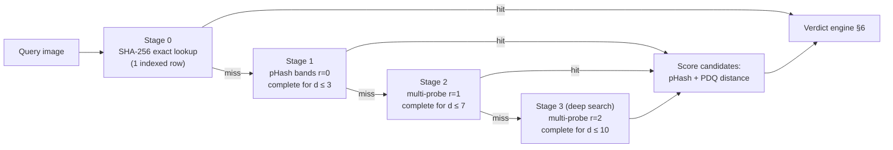
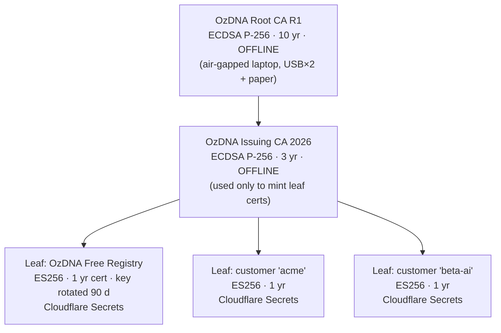
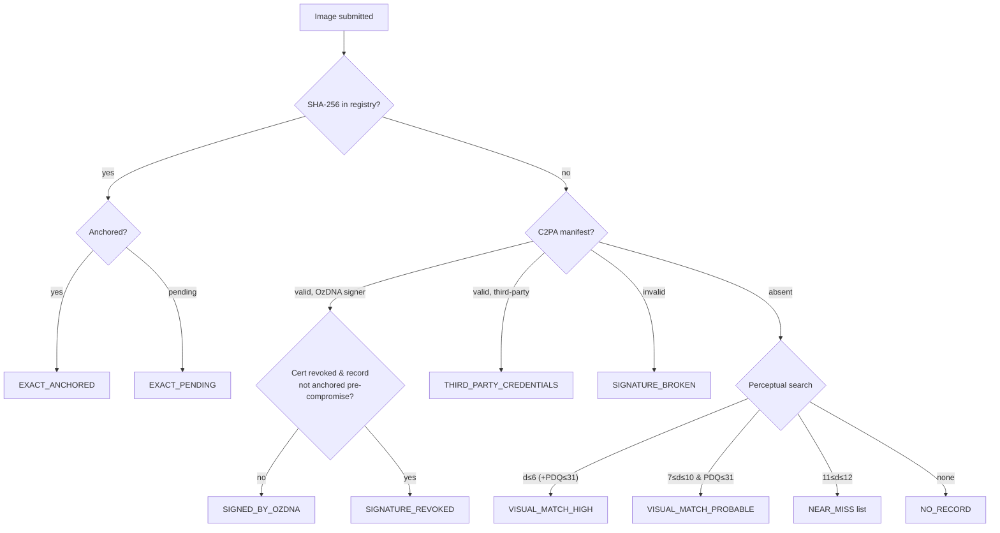

# 03 — OzDNA Algorithms & Cryptography Design

> Changelog
> 2026-07-06 · ratification pass — confirmed enum, proof, moderation ownership

*Written July 6, 2026, for future Claude Code sessions building the October 2026 MVP. Every volatile fact (package versions, prices, limits) was re-verified on July 6, 2026 with the source URL inline. Anything that could not be verified is prefixed `UNVERIFIED:`. Sibling docs (real filenames on disk): `02-TECH-STACK.md` owns runtime/hosting choices, `04-MVP-SPEC.md` owns HTTP API schemas and the canonical SQL DDL — this document defines the algorithms, data layouts, and cryptographic protocols they build on.*

**Scope guard (from CLAUDE.md hard rules):** images only (JPG/PNG); no AI-detection classifiers; no token; blockchain is invisible plumbing; never claim "trusted Content Credentials"; client pays the heavy compute; Cloudflare-first on ~$0 budget.

---

## Table of contents

1. [Perceptual hashing](#1-perceptual-hashing)
2. [Matching pipeline at scale](#2-matching-pipeline-at-scale)
3. [Batched blockchain anchoring](#3-batched-blockchain-anchoring)
4. [C2PA layer](#4-c2pa-layer)
5. [Key management](#5-key-management)
6. [Verify-page decision tree](#6-verify-page-decision-tree)

---

## 1. Perceptual hashing

### 1.1 Why a perceptual hash at all

SHA-256 proves *byte-identity*: change one byte and the hash changes completely. But every social platform re-encodes uploads (new JPEG quantization → different bytes) and strips C2PA metadata (Instagram, X, TikTok, WhatsApp — verified in BLUEPRINT.md §2). So the moment an image travels, both the exact hash and the embedded signature are gone. The perceptual hash is the layer that survives: it fingerprints *what the image looks like*, not what its bytes are. This is exactly the "fingerprinting backed by registry databases" mechanism in the EU Code of Practice's three-layer marking model, and it is OzDNA's moat (the "Remember" pillar).

### 1.2 How DCT-based pHash works (and why it survives re-encoding)

The classic 64-bit pHash pipeline:

1. **Decode** the image to raw pixels.
2. **Grayscale**: convert to luminance (Rec. 601: `Y = 0.299·R + 0.587·G + 0.114·B`). Color shifts, saturation filters, and grayscale conversion no longer matter.
3. **Downscale to 32×32** with an area-averaging (box) filter. This throws away all fine detail — JPEG compression artifacts, small watermarks, sharpening, and resolution differences live in the fine detail, so they're gone. Aspect ratio is deliberately ignored (stretch to square), so aspect distortion also doesn't matter.
4. **2-D DCT-II** (Discrete Cosine Transform) over the 32×32 grid. The DCT decomposes the image into frequency components; natural images concentrate almost all their energy in the low frequencies ("energy compaction" — the same property JPEG itself exploits).
5. **Keep the top-left 8×8 block** of coefficients — the 64 lowest frequencies, i.e., the coarse light/dark structure of the image.
6. **Median threshold**: compute the median of those 64 coefficients; each bit of the hash is `1` if its coefficient is above the median, else `0`. Median (not mean) makes the hash immune to global brightness/contrast changes, because those scale all coefficients together without reordering them around the median.

The result: 64 bits describing "where the coarse structure of this image is lighter or darker than its own typical level." A re-encode, a resize, a 90 %-quality screenshot of the full frame, a brightness tweak, or an Instagram filter changes a handful of bits at most. Two *different* photographs differ in ~32 bits on average.

**What survives / what doesn't (v1 stance, put this honestly in docs and the verify page):**

| Transform | Match? | Why |
|---|---|---|
| Re-encode (any quality ≥ ~50), format change JPG↔PNG | ✅ typically d ≤ 4 | fine detail discarded at step 3 |
| Resize / thumbnail / aspect stretch | ✅ typically d ≤ 4 | hash computed at 32×32 anyway |
| Full-frame screenshot (image fills the capture) | ✅ typically d ≤ 6 | same as re-encode + resize |
| Brightness / contrast / color filter / grayscale | ✅ typically d ≤ 6 | luma + median threshold |
| Small watermark or logo overlay (<5 % of area) | ✅ usually d ≤ 8 | low-frequency structure barely moves |
| Horizontal mirror | ✅ via **mirror probe** (§2.4) | mirroring permutes DCT signs predictably; we hash the mirrored query too |
| Meme caption bars, screenshot with UI chrome, letterboxing | ⚠️ best-effort, often d 8–16 | added borders shift the whole frame's coarse structure |
| Crop > ~15–25 % of frame | ❌ usually no match | different coarse structure — this is pHash's known blind spot |
| Rotation (even ~5°) | ❌ | DCT basis is not rotation-invariant |

**Crops and heavy edits — locked v1 policy:** full-frame transforms are in scope and are the claim we make publicly ("survives re-encoding, resizing, screenshots"). Heavy crops are explicitly *best-effort* and the verify page never implies otherwise. The fix for crops is **tiled/grid hashing** (hash the full frame + 3×3 overlapping tiles = 10 hashes per image, match any tile) — that is a **v2 feature**: it multiplies storage and index cost ×10 and is not needed to win wedge #1 (compliance customers verify their *own* marked outputs, which circulate as re-encodes, not crops).

### 1.3 The exact "OzDNA pHash v1" specification (normative)

Different libraries (pHash.org, Python `imagehash`, `sharp-phash`) produce *different* 64-bit hashes for the same image because they disagree on resize filters and median details. Browser `canvas.drawImage()` scaling is **not pixel-identical across browsers**, so we must NOT use canvas scaling for the hash. OzDNA defines its own deterministic spec so the browser client, the Workers backend, and any third-party implementation agree:

```
OzDNA-pHash-v1(image bytes) → 64-bit hash
0. Apply EXIF orientation to the pixels BEFORE anything else (normative).
   - Browser: createImageBitmap(blob, { imageOrientation: 'from-image' }) — pass the option
     EXPLICITLY; never rely on the platform default.
   - Workers: @cf-wasm/photon (Rust image crate) does NOT apply EXIF orientation on decode —
     read the Orientation tag (values 1–8) from the JPEG ourselves and apply the matching
     flip/transpose to the decoded pixels manually.
   Why normative: phone JPEGs routinely ship rotated pixels + an Orientation tag. If one
   implementation honors the tag and the other doesn't, the same photo hashes 90°-rotated
   on one side — and rotation is fatal to pHash (§1.2 table). This would silently break
   browser-registered vs server-verified matching for the entire phone-photo class.
1. Decode to RGBA at native resolution.
   - Browser: createImageBitmap() → OffscreenCanvas at NATIVE size (no scaling) → getImageData().
   - Workers: decode via @cf-wasm/photon v0.3.6 (WASM Rust image lib that runs on Workers;
     verified latest 0.3.6, published 2026-05-29, https://www.npmjs.com/package/@cf-wasm/photon).
2. Luma: y = 0.299*R + 0.587*G + 0.114*B, float64, alpha ignored
   (composite alpha over white first: c' = c*a/255 + 255*(1-a/255)).
3. Downscale to exactly 32×32 with area-average (box) pixel binning implemented in
   OUR OWN code (~30 lines of TS, shared module) — never the platform's resampler:
   out[i][j] = mean of y over source rect [i*H/32,(i+1)*H/32) × [j*W/32,(j+1)*W/32),
   fractional edges weighted by coverage.
4. 2-D DCT-II, orthonormal scaling, over the 32×32 luma grid (~40 lines of TS, shared).
5. Take coefficients C[u][v] for u,v in 0..7 (64 values, row-major, DC included).
6. m = median of the 64 values (mean of 32nd and 33rd order statistics).
7. bit(8*u+v) = 1 if C[u][v] > m else 0. Hash = bits packed MSB-first:
   bit(0)=(u=0,v=0) is the most significant bit of the 64-bit value.
Output serialized as 16 lowercase hex chars.
```

Residual nondeterminism: JPEG *decoders* themselves may differ by ±1 in pixel values across platforms (IDCT implementations), which can flip 0–2 hash bits. That is inside our match threshold and is the reason thresholds below are never set to 0. Build-time requirement: commit ≥ 5 golden test images with expected hashes to the repo; the browser and Workers implementations must both reproduce them exactly (same decoder family) or within d ≤ 2 (cross-decoder). At least one golden image MUST carry a non-default EXIF Orientation tag (e.g. Orientation=6, a typical portrait phone photo) — that is the only test that catches a step-0 divergence — and one SHOULD be a near-flat image (the median-tie degenerate case, next paragraph).

Median split sets approximately 32 bits in a natural image's hash — but not exactly: a bit is 1 only if its coefficient is *strictly* greater than the median, so ties straddling the median reduce the count (degenerate case: a near-flat image yields DC plus ~63 zero coefficients, median 0, popcount 1). **Never validate hashes by popcount** — a `popcount == 32` assertion would reject legitimate hashes. For natural images the split is near-balanced, so ideal capacity is on the order of C(64,32) ≈ 1.8×10¹⁸ ≈ 2^60.7 — effectively ~61 bits, slightly less in practice (see 1.5).

### 1.4 Candidates compared, and the recommendation

| Algorithm | Bits | Character | Verdict for OzDNA |
|---|---|---|---|
| **DCT pHash (spec above)** | 64 | Simple, ~70 lines of dependency-free TS, cheap to index (fits one SQLite INTEGER), 20+ years of production use | **PRIMARY — retrieval hash** |
| **Meta PDQ** | 256 | DCT-based like pHash but with Jarosz box filters and 16×16 output; built by Meta for industrial-scale image matching; published production threshold: Hamming distance **≤ 31 of 256** = near-duplicate (reference implementation & docs: https://github.com/facebook/ThreatExchange/tree/main/pdq; evaluation: https://arxiv.org/abs/1912.07745). 4× the bits → astronomically better false-positive separation (math in 1.5) | **SECONDARY — confirmation/scoring hash, stored from day one** |
| blockhash (blockhash.io) | 256 | Mean-luminance grid hash, no DCT; simplest possible; npm `blockhash-core` v0.1.0 last published **2019-12-07** (verified via npm registry — abandoned); measurably weaker robustness to recompression than DCT methods | Rejected (unmaintained, weaker) |

**Decision — two-hash design:**

- **`phash64` (OzDNA pHash v1) is the primary hash**: computed in the browser (client pays compute, hard rule 6), indexed in D1 for candidate retrieval (§2). 64 bits fits natively in a SQLite INTEGER and keeps the index tiny.
- **`pdq256` is stored from day one** in the same row (nullable BLOB), computed in the browser via npm **`pdq-wasm` v0.3.9** (WASM bindings for Meta's reference PDQ; BSD-3; verified on npm registry: latest 0.3.9, published 2025-11-08, repo https://github.com/Raudbjorn/pdq-wasm, 276 KB unpacked). UNVERIFIED: `pdq-wasm` has had no release since Nov 2025 and looks single-maintainer — vendor the package (BSD-3 permits it) and budget a build-time spike; the fallback is compiling Meta's reference C++ (also BSD) to WASM ourselves.
- PDQ is **not indexed** in v1. It is the *scorer*: after pHash retrieval produces candidates, PDQ distance ≤ 31 confirms or rejects each candidate. This gives us pHash's cheap indexing plus PDQ's false-positive immunity, and when the registry grows we can switch retrieval to PDQ bands **without recomputing anything** — the data is already there. If `pdq-wasm` fails the spike, v1 ships pHash-only with the tighter thresholds below and PDQ backfills in v1.1.

### 1.5 Hamming-distance thresholds and the false-positive math

Model unrelated images as independent uniform 64-bit hashes. The probability that a random hash lands within Hamming distance *t* of a given hash:

```
P(d ≤ t) = Σₖ₌₀..t  C(64, k) / 2⁶⁴
```

Expected false positives **per verify query** against a registry of N records = `N × P(d ≤ t)`:

| t | P(d ≤ t) | E[FP] @ N=10⁴ | E[FP] @ N=10⁶ | E[FP] @ N=10⁸ |
|---|---|---|---|---|
| 2 | 1.13×10⁻¹⁶ | 1.1×10⁻¹² | 1.1×10⁻¹⁰ | 1.1×10⁻⁸ |
| 4 | 3.68×10⁻¹⁴ | 3.7×10⁻¹⁰ | 3.7×10⁻⁸ | 3.7×10⁻⁶ |
| 6 | 4.52×10⁻¹² | 4.5×10⁻⁸ | 4.5×10⁻⁶ | 4.5×10⁻⁴ |
| 8 | 2.78×10⁻¹⁰ | 2.8×10⁻⁶ | 2.8×10⁻⁴ | 2.8×10⁻² |
| **10** | 9.98×10⁻⁹ | 1.0×10⁻⁴ | **1.0×10⁻²** | **1.0 (!)** |
| 12 | 2.28×10⁻⁷ | 2.3×10⁻³ | 0.23 | 23 |
| 16 | 3.87×10⁻⁵ | 0.39 | 39 | 3,867 |

Two honest corrections to the ideal model:

1. **Real pHashes are not uniform.** Bits are correlated (low frequencies of natural images are structured), and whole content classes collide: plain-background product shots, text-on-solid-color memes, logos. UNVERIFIED: no published universal derating factor exists; standard engineering practice is to assume the effective false-positive rate is **10–100× worse** than the table for the worst content classes. Design accordingly: never let a pHash distance alone produce a "match" verdict near the threshold.
2. **PDQ fixes this.** At its published threshold t = 31 of 256, the same formula gives P = 8.3×10⁻³⁸ — expected false positives at N = 10⁸ are ~10⁻²⁹, i.e., zero forever. This is why the confirmation stage exists.

**Locked v1 thresholds** (registry N ≤ ~10⁶, the realistic 12-month ceiling):

| Band | pHash distance d | + PDQ confirmation | Verdict class (§6) |
|---|---|---|---|
| Exact | SHA-256 equal | n/a | `EXACT_ANCHORED` / `EXACT_PENDING` (split by anchor state, §6.2) |
| Strong | d ≤ 6 | PDQ d ≤ 31 (when both hashes present) | `VISUAL_MATCH_HIGH` |
| Probable | 7 ≤ d ≤ 10 | PDQ d ≤ 31 **required** to show as match; else listed as "similar, unconfirmed" | `VISUAL_MATCH_PROBABLE` |
| Weak | 11 ≤ d ≤ 12 | shown only in an expandable "near matches" list, never as a match | `NEAR_MISS` |
| None | d > 12 | — | `NO_RECORD` |

**§6.3 is the single source of truth for the verdict enum** — this column uses its names verbatim, and `04-MVP-SPEC.md` adopts them verbatim too. Do not invent enum values elsewhere. (Resolved 2026-07-06: `04-MVP-SPEC.md` adopts this §6.3 enum verbatim in its API responses; any `match_type`/`confidence` convenience field 04 keeps is a documented mapping layered over these canonical names, not a competing source.)

Revisit trigger (write into ops runbook): when registry N passes 10⁶, tighten `Probable` to d ≤ 8 or make PDQ mandatory for all match verdicts; when N passes 10⁷, retrieval must move to PDQ bands (§2.6).

### 1.6 Adversarial considerations — read before writing any verify-page copy

Perceptual hashes are **not cryptographic**. Published attacks matter to us in three ways:

1. **Second-preimage attacks are practical.** Gradient-based attacks craft an image that *looks like anything the attacker wants* but has a pHash within threshold of a chosen target hash — demonstrated repeatedly against NeuralHash and classic pHash (e.g., "Learning to Break Deep Perceptual Hashing", arXiv:2111.06628; USENIX Security 2022 work on perceptual-hash evasion/collision). Consequence: **a perceptual match must never be presented as proof of origin or authorship.** It is a *discovery* signal that links a stripped copy back to a registry record; the proof weight is carried only by SHA-256 identity, the C2PA signature, and the chain anchor. An attacker who crafts a collision against a registered hash gains only a misleading "visually similar" line on our verify page — the copy below is written so that this buys them nothing ("similarity is not certification").
2. **Evasion is even easier than collision.** Anyone who wants their copy NOT to match can crop/rotate/perturb past the threshold. The registry catches honest-path redistribution (platform re-encodes), not determined adversaries. Never claim "tamper-proof tracking."
3. **First-registrant ambiguity.** Nothing stops someone registering an image they didn't create. Registration order is evidence, not ownership. All copy says "registered by {account} on {date}", never "created by" or "belongs to" (full copy strings in §6).

**What this means (for the founder):** the fingerprint is a 64-bit summary of what the image *looks like* at a glance, so it survives everything platforms do to images — recompression, resizing, screenshots — which is precisely what kills the metadata everyone else relies on. The math table says: with a million registered images, a distance-10 match is wrong about 1 % of the time in theory, and the 256-bit second fingerprint (Meta's own open-source PDQ, the industry standard) squeezes that error to effectively zero. Crops and rotations are the known weakness — we say so openly and sell what works. And because a determined forger *can* fabricate a lookalike fingerprint, the fingerprint only ever *finds* records; the cryptographic signature and blockchain timestamp are what *prove* them. Our public wording is engineered around that distinction, which is also what keeps us honest under hard rule 5.

---

## 2. Matching pipeline at scale

### 2.1 Pipeline overview



Stage 0 catches the most common compliance-API case: the signed file itself, passed around unmodified. Stages 1–3 escalate only on miss, so typical queries stay cheap.

### 2.2 Why multi-index bit-sampling beats a BK-tree here

A BK-tree partitions by distance from pivot nodes and needs **many sequential, data-dependent lookups** (walk the tree, each step depends on the previous). On D1 — a network-attached SQLite where every query is a round trip and rows-read are billed — pointer-chasing is the worst possible access pattern. It also degrades badly under inserts (unbalanced) and is hard to page.

Multi-index hashing (Norouzi, Punjani & Fleet, *Multi-Index Hashing for Fast Search in Hamming Space*, IEEE CVPR 2012 / TPAMI 2014) is the standard industrial answer (it's what PDQ's own tooling ships, as MIH): split the 64-bit hash into **4 disjoint 16-bit bands** and index each band. **Pigeonhole guarantee:** if two hashes differ by ≤ d bits total, at least one band differs by ≤ ⌊d/4⌋ bits. Therefore:

- **r = 0** (exact band equality, 4 indexed lookups): complete for d ≤ 3 (if all 4 bands differed by ≥ 1, total ≥ 4).
- **r = 1** (probe each band with all 16 one-bit variants + itself = 17 values/band, 68 lookups): complete for d ≤ 7.
- **r = 2** (probe C(16,0)+C(16,1)+C(16,2) = 137 values/band, 548 lookups): complete for d ≤ 10 — exactly our outer threshold.

Everything is set-based (`IN` lists over an indexed column), which is one round trip per band and lets SQLite do the work.

16-bit bands are the right width: 2¹⁶ = 65,536 buckets keeps buckets selective (8-bit bands would have only 256 buckets → thousands of rows per probe; 32-bit halves would need radius-5 probing → millions of probe values).

### 2.3 D1 schema (algorithm view — the canonical DDL lives in `04-MVP-SPEC.md` §5)

> Naming note (consistency pass 2026-07-06): 04's canonical schema calls this table `records` (and §3.4's `batches` is `anchor_batches`) and uses prefixed-ULID ids (`rec_…`), TEXT timestamps. The **algorithm-derived columns below are normative and 04 §5 carries them**: `phash64` as a signed 64-bit INTEGER, `band0..band3` 16-bit slices, nullable `pdq256` BLOB. Everything else here (id format, timestamp style, unrelated columns) follows 04.

```sql
-- One row per registered asset. sha256 is of the FINAL signed file (manifest embedded).
CREATE TABLE assets (
  id              TEXT PRIMARY KEY,          -- UUIDv4, lowercase
  sha256          BLOB NOT NULL,             -- 32 bytes
  phash64         INTEGER NOT NULL,          -- OzDNA-pHash-v1 as SIGNED 64-bit
                                             -- (store BigInt.asIntN(64, hash); compare via BigInt.asUintN)
  pdq256          BLOB,                      -- 32 bytes, NULL until computed
  band0           INTEGER NOT NULL,          -- (phash >> 48) & 0xFFFF  (bits 63..48)
  band1           INTEGER NOT NULL,          -- (phash >> 32) & 0xFFFF
  band2           INTEGER NOT NULL,          -- (phash >> 16) & 0xFFFF
  band3           INTEGER NOT NULL,          --  phash        & 0xFFFF
  manifest_sha256 BLOB,                      -- 32 bytes; NULL if user skipped C2PA embed
  account_id      TEXT NOT NULL,
  source          TEXT NOT NULL CHECK (source IN ('browser','api')),  -- who computed the hashes
  status          TEXT NOT NULL DEFAULT 'active'
                  CHECK (status IN ('active','disputed','withdrawn')),
                                             -- registry metadata, deliberately NOT in the
                                             -- leaf preimage (§3.2) → mutable without
                                             -- breaking anchored proofs; drives §6 overlay
  registered_at   TEXT NOT NULL,             -- server-assigned ISO 8601 UTC, ms, 'Z'
  batch_id        INTEGER,                   -- NULL until anchored (§3)
  leaf_index      INTEGER                    -- position in the batch's Merkle tree
);
CREATE UNIQUE INDEX idx_assets_sha256 ON assets(sha256);
CREATE INDEX idx_assets_band0 ON assets(band0);
CREATE INDEX idx_assets_band1 ON assets(band1);
CREATE INDEX idx_assets_band2 ON assets(band2);
CREATE INDEX idx_assets_band3 ON assets(band3);
CREATE INDEX idx_assets_batch ON assets(batch_id);   -- for proof assembly
```

`source` matters for honesty: browser-computed hashes are client-asserted (we never saw the pixels — a privacy *feature*: free-tier images never leave the user's machine); API-tier hashes are computed by us server-side from the uploaded bytes and are operator-verified. The verify page discloses which (§6).

### 2.4 Query plan

**Stage 0:**
```sql
SELECT * FROM assets WHERE sha256 = ?1;   -- UNIQUE index probe, ~1 row read
```

**Stages 1–3** (shown for band0; run 4 statements in one `db.batch()` round trip, or a single `UNION`):
```sql
SELECT id, phash64, pdq256 FROM assets WHERE band0 IN (v1, v2, ..., vK)
```
Probe values are **inlined as integer literals** (they are app-computed integers in 0..65535 — no injection surface). This deliberately sidesteps D1's bound-parameter-per-query cap and keeps statements < 5 KB even at r = 2 (137 literals/band). `EXPLAIN QUERY PLAN` must show `SEARCH assets USING INDEX idx_assets_band0 (band0=?)` — verify in tests.

**Mirror probe:** compute the pHash of the horizontally mirrored query image too (client-side, costs one extra DCT) and run both hashes through stages 1–3. Doubles query cost, catches the extremely common mirrored-repost case.

**Scoring in the Worker:** dedupe candidate ids; for each candidate compute pHash Hamming distance with a SWAR popcount over two 32-bit halves (split each 64-bit value once via BigInt, then pure `Number` bit ops — ~50 ns/candidate); for survivors with `pdq256` present, XOR + popcount 32 bytes. Sort by (PDQ distance, pHash distance); apply §1.5 bands.

### 2.5 Cost model per deep verify (stage 3, r = 2, worst case — uniform-bucket estimate)

All figures include the **×2 mirror probe** locked in §2.4 (both the query hash and its mirrored hash run through every stage — a deep verify reads 2 × 548 probes' worth of candidates).

| Registry N | avg rows/bucket (N/2¹⁶) | candidate rows read (548 probes × 2 mirror) | D1 free budget (5M rows-read/day, https://developers.cloudflare.com/d1/platform/pricing/) | Worker CPU est. |
|---|---|---|---|---|
| 10⁴ | 0.15 | ~168 | ~29,500 deep verifies/day | < 1 ms — fine on free plan (10 ms CPU, https://developers.cloudflare.com/workers/platform/limits/) |
| 10⁶ | 15.3 | ~16,800 | ~295 deep verifies/day | ~10–30 ms (parse + popcount) — needs Workers Paid ($5/mo, 30 s CPU) or serve from stage-1/2 (r ≤ 1 → ~2,000 rows incl. mirror, ~4 ms) |
| 10⁸ | 1,526 | ~1,670,000 | ~3 deep verifies/day (!) | hundreds of ms + rows-read blowout — **infeasible; redesign required (§2.6)** |

Also relevant: registration writes ≈ 1 row + 6 index entries ≈ 7 rows-written → free tier's 100k rows-written/day supports ~14k registrations/day; D1 free DB size cap 500 MB ≈ ~2M records at ~200 B/row incl. indexes; paid cap 10 GB ≈ ~4×10⁷ records (limits: https://developers.cloudflare.com/d1/platform/limits/).

**Adaptive policy (locked):** free-tier verifies run stages 0–2 only (complete for d ≤ 7 — catches virtually all platform re-encodes); the "deep search" stage 3 is a paid-API feature and a button on the verify page ("search harder") behind Turnstile. This keeps the free tier inside free-plan quotas at N = 10⁶.

### 2.6 When we outgrow D1, and what replaces it

Triggers and answers, in order:

1. **N > ~2M records** (D1 free 500 MB cap) → Workers Paid, $5/mo (pre-approved budget covers it). No code change.
2. **N > ~10⁷** or deep-verify p95 > 100 ms → switch retrieval to **PDQ bands**: 256 bits / 16 bands × 16 bits; pigeonhole completeness for d ≤ 31 needs only r = 1 (⌊31/16⌋ = 1 → 17 probes × 16 bands = 272 lookups) with *much* sharper score separation. Same D1 machinery, new band columns — data already stored since day one (§1.4).
3. **N approaching ~4×10⁷** (D1 paid 10 GB cap) → options verified July 6, 2026:
   - **Shard D1 by hash prefix** (e.g., 16 databases keyed on band0's top 4 bits): paid accounts get 50,000 DBs (https://developers.cloudflare.com/d1/platform/limits/); mechanical, keeps one stack.
   - **Cloudflare Vectorize** as ANN: map bits to ±1 float vectors (Hamming ↔ cosine is monotonic). Verified free tier: 30M queried vector dimensions/mo + 5M stored dimensions (https://developers.cloudflare.com/vectorize/platform/pricing/) — 5M dims ÷ 64 = only ~78k vectors free, so it's a *paid-tier* option; index cap 10M vectors as of Jan 23, 2026 (https://developers.cloudflare.com/changelog/post/2026-01-23-increased-index-capacity/), so 10⁸ needs multiple indexes anyway.
   - **Dedicated matcher** (Meta's own MIH tooling or usearch/FAISS on a ~$5 VPS) — most performant, breaks Cloudflare-only purity.
   - **Verdict:** don't decide now. A 4×10⁷-record registry means the business succeeded beyond every projection in `06-COST-MODEL.md`; re-evaluate then with revenue. Nothing in the v1 schema blocks any of the three paths.

**What this means (for the founder):** finding "the same picture" among a million registered ones sounds like it needs Google infrastructure — it doesn't. The trick is a 2012 academic technique from the University of Toronto (later shipped by Facebook in its PDQ tooling): chop the 64-bit fingerprint into four 16-bit chunks and look each chunk up in an ordinary database index; a near-duplicate is mathematically guaranteed to agree exactly on at least one chunk. On Cloudflare's free database that handles the first million registrations for $0, and the first paid step is $5/month. The table above is the dashboard: it tells future sessions exactly when the free tier runs out and which lever to pull next — every lever is already compatible with the data we store from day one.

---

## 3. Batched blockchain anchoring

### 3.1 What anchoring is for

The C2PA signature proves *who* signed and *that the bytes are unmodified* — but a signer can backdate their own clock, and (hard rule 5) our self-signed certs carry no external trust yet. The blockchain anchor supplies the one thing nobody — including us — can fake: **an upper bound on when a record came into existence.** We batch thousands of registry records into one Merkle tree and publish the 32-byte root on Base (an Ethereum L2). Cost is sub-cent per batch; trust is inherited from Ethereum. No custody, no user funds, no token — our own gas wallet pays (hard rules 1–2 compliant; CASP-safe per BLUEPRINT).

### 3.2 Canonical record serialization (normative — the leaf preimage)

Independent verifiers must reproduce leaves byte-for-byte from public data, so the serialization is a fixed newline-delimited template — no JSON canonicalization edge cases, trivially portable to any language:

```
leaf_preimage (UTF-8 bytes) =
  "ozdna.v1"        "\n"
  id                "\n"   -- record id per 04-MVP-SPEC §4 (prefixed ULID, e.g. rec_01JZ…)
  sha256_hex        "\n"   -- 64 lowercase hex chars
  phash64_hex       "\n"   -- 16 lowercase hex chars (unsigned interpretation)
  pdq256_hex        "\n"   -- 64 lowercase hex chars, or "" if absent
  manifest_sha256_hex "\n" -- 64 lowercase hex chars, or "" if absent
  account_id        "\n"
  registered_at     "\n"   -- ISO 8601 UTC with milliseconds, e.g. 2026-10-14T09:31:02.417Z
```

Every field in the preimage is immutable once written (append-only registry; corrections create new records that reference old ones — never rewrite, or anchored proofs break). The one deliberately *mutable* column is `assets.status` (§2.3): it is excluded from the leaf preimage precisely so flipping `active` → `disputed`/`withdrawn` never touches anchored bytes; the dispute trail itself is recorded as correction records referencing the original, so it stays auditable.

### 3.3 Merkle tree construction (normative)

- `leaf = SHA-256( 0x00 ‖ leaf_preimage )`
- `node = SHA-256( 0x01 ‖ left ‖ right )`
- Leaves ordered by `leaf_index` (0-based, assigned at batch build in `registered_at, id` order).
- Pair left-to-right at each level; **an odd trailing node is promoted unchanged** to the next level (no duplication — duplicating the last node is the design that caused Bitcoin's CVE-2012-2459 mutation bug).
- The `0x00`/`0x01` domain-separation prefixes prevent second-preimage games between leaves and interior nodes (same defense as RFC 6962 / Certificate Transparency).
- Implementation is ~50 lines of TS; write it ourselves with committed test vectors rather than depending on `merkletreejs` (v0.6.0, verified on npm, is fine but its many hashing modes invite spec drift; our spec above is the single source of truth).

### 3.4 Batch cadence policy (locked)

A single Workers Cron Trigger runs every 15 minutes (cron triggers are available on the free plan: https://developers.cloudflare.com/workers/configuration/cron-triggers/) and anchors a new batch **iff**:

```
pending_count >= 100
OR (pending_count >= 1 AND oldest_pending_age >= 23h)
OR (any pending record belongs to a paid account AND its age >= 40min)
```

Guarantees to publish: free tier "anchored within 24 hours", paid API tier "anchored within 1 hour". The triggers are deliberately 23 h / 40 min — not 24 h / 60 min — because the cron adds up to 15 min of lag and confirmation adds more; a 24 h trigger makes the worst case ~24 h 15 m + confirmation, i.e. the published SLA would be arithmetically unreachable. 23 h + 15 m + confirmation and 40 m + 15 m + confirmation both land inside the promise with headroom. Worst case is 96 batches/day; cost table below shows that's still pocket lint. Batches are sequential (one operator wallet, one nonce stream — no race). `batches` table:

```sql
CREATE TABLE batches (
  batch_id     INTEGER PRIMARY KEY,          -- must equal on-chain batchId
  merkle_root  BLOB NOT NULL,                -- 32 bytes
  leaf_count   INTEGER NOT NULL,
  tx_hash      TEXT,                         -- 0x…, NULL until confirmed
  block_number INTEGER,
  block_time   TEXT,
  status       TEXT NOT NULL CHECK (status IN ('building','sent','confirmed','failed'))
);
```

### 3.5 The contract (Base mainnet, chain id 8453)

```solidity
// SPDX-License-Identifier: MIT
pragma solidity ^0.8.24;

/// @title OzDNA batch anchor — emits Merkle roots of registry batches. Holds no funds, ever.
contract OzDnaAnchor {
    event Anchored(uint256 indexed batchId, bytes32 merkleRoot, uint64 leafCount);
    event OperatorRotated(address indexed newOperator);
    address public immutable rotator;   // cold key, offline (§5.2) — can ONLY rotate the operator
    address public operator;            // hot gas-wallet key — can ONLY anchor
    uint256 public nextBatchId;
    constructor(address firstOperator) { rotator = msg.sender; operator = firstOperator; }
    function setOperator(address newOperator) external {
        require(msg.sender == rotator, "not rotator");
        operator = newOperator;
        emit OperatorRotated(newOperator);
    }
    function anchor(bytes32 merkleRoot, uint64 leafCount) external {
        require(msg.sender == operator, "not operator");
        emit Anchored(nextBatchId++, merkleRoot, leafCount);
    }
}
```

Fifteen lines of logic, no funds ever held, no logic upgradability (nothing to upgrade), one `SSTORE` for the counter so batch ids are chain-sequenced. The one mutable slot — `operator` — exists because the operator key is the hot gas-wallet key in Cloudflare Secrets (§5.2): if it leaks and the operator were `immutable`, a thief could emit junk `Anchored` events under our contract forever, polluting the batch-id sequence the `batches` table must equal and forcing a contract redeploy + verify-page migration. With rotation, the offline `rotator` key (kept under the same regimen as the root CA, never on a networked machine) swaps in a fresh operator and the incident ends; the thief could never forge proofs anyway — verdicts only trust roots that match our published batch records. Deploy once with the gas wallet as `firstOperator` (~250k gas ≈ $0.005 one-time; `anchor()` gains one cold SLOAD ≈ +2,100 gas — ~7 % on a 30k-gas tx, still sub-millicent). Shipping this on Base also unlocks the Base Builder Grants path (BLUEPRINT §6).

### 3.6 Per-asset cost math (prices verified July 6, 2026)

Verified inputs: Base L2 base fee ≈ **0.005 gwei** (BaseScan gas tracker snapshot, https://basescan.org/gastracker; ethgastracker.com showed 0.01 gwei the same week — use 0.01 as planning number); **ETH ≈ $1,750–1,780** on July 6, 2026 (https://fortune.com/article/price-of-ethereum-07-06-2026/, https://www.coingecko.com/en/coins/ethereum) — use $1,800. `anchor()` costs ≈ 32,000 gas (21k intrinsic + calldata + operator SLOAD + SSTORE + LOG2); the table below rounds on 30k — the difference is inside the estimates' noise.

| Scenario | L2 execution fee per batch tx | Per asset @ batch=100 | @ batch=10,000 | @ batch=1,000,000 |
|---|---|---|---|---|
| Verified now (0.005 gwei) | $0.00026 | $2.6×10⁻⁶ | $2.6×10⁻⁸ | $2.6×10⁻¹⁰ |
| Planning (0.01 gwei) | $0.00053 | $5.3×10⁻⁶ | $5.3×10⁻⁸ | $5.3×10⁻¹⁰ |
| 10× stress (0.05 gwei) | $0.0026 | $2.6×10⁻⁵ | $2.6×10⁻⁷ | $2.6×10⁻⁹ |

UNVERIFIED: the exact L1 data fee component (Base adds a blob-based L1 fee per tx; post-EIP-4844 it is typically well under $0.001 for a ~130-byte tx, but I could not pin a July 2026 figure). Even assuming a full extra $0.001/tx: hourly batching ≈ 8,760 tx/yr ≈ **$13/year total**, worst-case 96/day cadence ≈ $53/year. A **$20 one-time ETH top-up on Base funds ~2+ years** of anchoring — this is the entire "blockchain budget" and comfortably beats Capture's $0.0001/asset benchmark at any batch size ≥ 100.

### 3.7 Inclusion proof returned to users (self-contained content set canonical here; `04-MVP-SPEC.md` may rename fields but must carry the full set)

```json
{
  "version": "ozdna-proof-v1",
  "record": {
    "id": "9f1c2e34-5a6b-4c7d-8e9f-0a1b2c3d4e5f",
    "sha256": "e3b0c44298fc1c149afbf4c8996fb92427ae41e4649b934ca495991b7852b855",
    "phash64": "ac83e1b4d2f09173",
    "pdq256": "…64 hex…",
    "manifest_sha256": "…64 hex…",
    "account_id": "acct_7f3k",
    "registered_at": "2026-10-14T09:31:02.417Z"
  },
  "leaf_index": 41,
  "leaf_count": 10000,
  "leaf": "…64 hex…",
  "proof": [
    { "pos": "right", "hash": "…64 hex…" },
    { "pos": "left",  "hash": "…64 hex…" }
  ],
  "merkle_root": "…64 hex…",
  "anchor": {
    "network": "base-mainnet",
    "chain_id": 8453,
    "contract": "0x<deployed address>",
    "batch_id": 42,
    "tx_hash": "0x…",
    "block_number": 31456789,
    "block_time": "2026-10-14T10:00:07Z",
    "explorer": "https://basescan.org/tx/0x…"
  }
}
```

`proof` lists sibling hashes leaf→root; levels where the node was promoted (odd trailing) contribute no element. Proof size is ⌈log₂(leaf_count)⌉ × 32 bytes — 14 hashes for a 10k batch.

**Self-contained content set — canonical here (resolved 2026-07-06):** this proof deliberately carries everything the §3.8 walkthrough needs with no OzDNA API call — the full `record` fields (§3.2), `leaf_index`, `leaf_count`, the `leaf`, the `{pos, hash}` sibling array, `merkle_root`, and the `anchor` block. `04-MVP-SPEC.md` may keep its own field names, but its proof example MUST include this entire content set; a proof missing any of it is not independently verifiable. This resolves the earlier "field names owned by 04" ambiguity: 04 owns naming, 03 §3.7 owns the required content.

### 3.8 Independent verification walkthrough (the no-backdating claim, made airtight)

A skeptic proves "this record existed before block N" **without trusting OzDNA at all**:

1. **Rebuild the leaf.** Concatenate the record fields per §3.2 (all fields are in the proof JSON), prepend `0x00`, SHA-256. Must equal `leaf`. (~5 lines in any language; we publish a 30-line reference script.)
2. **Walk the proof.** Fold: `h = SHA-256(0x01 ‖ left ‖ right)` per `pos` at each step. Result must equal `merkle_root`.
3. **Check the chain — not our API.** Fetch tx `tx_hash` from any Base node or public explorer (`cast tx 0x… --rpc-url https://mainnet.base.org`, or basescan.org). Confirm: (a) it calls `contract`, (b) the `Anchored` event carries `batch_id` and a `merkleRoot` equal to step 2's result, (c) it sits in block `block_number` with the stated timestamp.
4. **Conclusion:** the record's exact bytes — including its SHA-256 and fingerprints — were fixed **no later than** that block's timestamp. Neither OzDNA nor anyone else can move that date backwards; inserting a "new old" record would require a different Merkle root in an already-mined block.

For a maximalist skeptic who doesn't trust Base's sequencer clock: Base state roots are posted to Ethereum L1 within hours, so the timestamp is independently bounded by the L1 inclusion — the claim degrades gracefully from "±2 s" to "±a few hours", never breaks.

**What the anchor does NOT prove (this list appears verbatim on the verify page, per hard rule 5):**

- It timestamps **registration, not capture or creation.** An old photo registered today anchors at today.
- It does **not** prove authorship or ownership — only that this account registered this fingerprint at this time (first-registrant caveat, §1.6).
- It does **not** prove the image is real, unedited, or not AI-generated.
- A missing anchor proves nothing negative — records younger than the batch cadence are legitimately unanchored for up to 24 h.

Optional v1.1, $0: also stamp each batch root with **OpenTimestamps** (free public Bitcoin calendar servers) for a second, Bitcoin-rooted timestamp. UNVERIFIED: OTS calendar servers' current availability/policy — check at build time; strictly additive either way.

**What this means (for the founder):** we press thousands of registrations into one 32-byte "wax seal" and stamp it into a public ledger about once an hour, for about a dollar a month — total. Anyone on Earth can check the seal with 30 lines of code and no OzDNA account, which is exactly what makes "no one can backdate, not even us" a *provable* sentence in sales copy instead of a marketing claim. Equally important is the fine print we volunteer: the stamp proves *when we registered it*, not *when the photo was taken* — saying that out loud is what keeps regulators, journalists, and hostile HN commenters on our side.

---

## 4. C2PA layer

### 4.1 The manifest we assemble

Built with `@contentauth/c2pa-web` **v0.12.0** (verified: latest on npm, published 2026-06-16; Builder API with intents documented at https://github.com/contentauth/c2pa-js/tree/main/packages/c2pa-web). Manifest definition:

| Assertion | Content | Notes |
|---|---|---|
| `c2pa.actions` | `c2pa.created` with a **caller-declared** `digitalSourceType` (IPTC vocabulary), `when` = server-assigned signing time | For API customers this IS their EU AI Act Art. 50 / SB 942 machine-readable disclosure: `…/trainedAlgorithmicMedia` for AI output. We record what the caller declares; we never detect. |
| `c2pa.soft-binding` | `alg: "com.ozdna.phash.v1"`, value = phash64 hex (+ PDQ block when present) | The spec's own hook for fingerprints — this is us speaking C2PA's soft-binding language (spec anticipates third-party registries, BLUEPRINT §2). |
| `com.ozdna.registry` (custom) | `{ record_id, verify_url: "https://ozdna.com/r/{id}" }` (route per 04-MVP-SPEC §3.3) | The pointer from the file back to registry + (later) anchor proof. The anchor itself can't be in the manifest — anchoring happens after signing. |
| `stds.schema-org.CreativeWork` | creator name/URL — **only if the user typed one** | Marked user-asserted; we don't verify identity in v1. |
| Hard binding (`c2pa.hash.data`) | automatic | Added by the SDK; covers asset bytes with manifest-region exclusions. |

**Deliberately NOT asserted:** no capture-device or camera claims (we can't verify hardware), no GPS/EXIF replication, no "authentic/verified" wording anywhere in assertion labels, no AI-detection verdicts (hard rule 3), no full-resolution upload to our servers (any manifest thumbnail is generated client-side and stays in the file; the separate small registry preview thumbnail in R2 follows 01-ARCHITECTURE §8's default-on, opt-out consent decision).

### 4.2 Signing identity — the decision

**Decision: hybrid remote signing.** The browser does ALL heavy compute — decode, hard-binding hashes, pHash, PDQ, thumbnail, manifest assembly, and byte-embedding. The only thing that ever happens server-side is one ECDSA P-256 signature (~1 ms) over the ~1 KB claim, using a key that lives in Cloudflare Secrets and **never ships to any browser.**

This is natively supported: verified in `c2pa-web` v0.12.0 source (`packages/c2pa-web/src/lib/signer.ts`, https://raw.githubusercontent.com/contentauth/c2pa-js/main/packages/c2pa-web/src/lib/signer.ts) —

```ts
export interface Signer {
  sign: (data: Uint8Array, reserveSize: number) => Promise<Uint8Array>;
  reserveSize: () => Promise<number>;
  alg: SigningAlg;            // 'es256' | … | 'ed25519'
}
// builder.sign(signer, format, blob) / builder.signAndGetManifestBytes(...)
```

Our `Signer.sign` implementation POSTs `data` to `/v1/sign-digest` and returns the signature bytes; the Worker signs with WebCrypto (`crypto.subtle.sign` ES256). UNVERIFIED (build-week-1 spike — budget **1–2 afternoons**, not hours; this is the single biggest schedule risk in §4): whether the callback must return the raw ES256 signature or a complete COSE_Sign1 structure with the cert chain and RFC 3161 token. Note the `Signer` interface above has **no field for a cert chain**, which makes the full-COSE_Sign1 outcome the likely one — c2pa-rs supports both patterns; determine empirically against the official verify tool and pin the answer in `04-MVP-SPEC.md`.

**Fallback, locked now so the October session isn't improvising:** if c2pa-web expects COSE_Sign1, the Worker assembles the COSE_Sign1 envelope server-side around the claim bytes. This preserves hard rule 6 — the payload is still only ~1 KB of claim; the browser still did all the heavy decode/hash/embed work, the Worker just signs and wraps a kilobyte. Candidate implementation paths, in preference order: (1) hand-rolled COSE_Sign1 — it is a small fixed CBOR structure (protected headers with `alg` + `x5chain`, detached payload, ES256 over the `Sig_structure`), and a minimal CBOR encoder for exactly this shape is ~100 lines of TS; (2) an existing JS COSE library (`cose-js` is the historical one — UNVERIFIED: check maintenance status at build time before adopting); (3) compile c2pa-rs's COSE assembly path to WASM for the Worker (heaviest, most spec-faithful). The RFC 3161 token (§4.3) rides in the COSE unprotected header in every variant, so the TSA policy below is unaffected by which path wins.

**Why the alternatives lose, honestly analyzed:**

| Option | Verdict | Reason |
|---|---|---|
| (a) Ship our shared cert + key to the browser for "true" in-browser signing | **REJECTED — dangerous** | The key is extractable in DevTools in minutes. Anyone could then sign arbitrary deepfakes as "OzDNA" — the Nikon scenario, self-inflicted. A shared key in a browser is a published key. |
| (b) Per-user throwaway self-signed certs generated in-browser (WebCrypto) | REJECTED for v1 | Cryptographically fine, trust-wise worthless: any attacker can mint the same throwaway identity, so the signature asserts nothing beyond what the registry record already does. Adds cert-management UX for zero verdict value. Revisit later as a "bring your own key" power feature. |
| (c) Full server-side signing (upload whole image) | REJECTED as default | Violates the intent of hard rule 6 (client pays compute), costs us bandwidth/CPU, and kills the "your image never leaves your machine" privacy line. It IS the mode for API customers, who upload anyway and pay for it. |
| **(d) Hybrid remote signing (chosen)** | **LOCKED** | Client pays ~100 % of compute (satisfying hard rule 6's intent — hashing and embedding are the heavy part; the ECDSA op is milliseconds); key never leaves Cloudflare Secrets; per-customer sub-certs possible (§5). |

**Reconciliation with hard rule 6, stated plainly:** rule 6's purpose is that *the client pays the heavy compute so our bill stays ~$0*. Under (d) it does — a 20 MB JPEG is decoded, hashed, fingerprinted, and re-written entirely in the user's browser; our server does one millisecond of math on one kilobyte. Shipping the private key to browsers to make signing "fully" client-side would satisfy the letter of the rule while burning the platform. (d) is the safe reading and is hereby the locked interpretation.

**Identities per tier:** free/browser users → signed by the shared **"OzDNA Free Registry" leaf cert** (the user's name, if given, rides in the CreativeWork assertion — the cert asserts "registered via OzDNA", not identity). API customers → **per-customer leaf certs** (§5.4), so a customer's signed output carries their own OrganizationName, and one customer's compromise never touches anyone else.

**Abuse control on `/v1/sign-digest`** (a signing oracle is a target): account required; free tier 50 web signs/month (limit owned by 04-MVP-SPEC §7) + Cloudflare Turnstile; every signature logged in D1 (`sha256(signed_payload)`, account, cert serial, timestamp) — the log makes any abused signature attributable and revocable; the manifest always embeds `com.ozdna.registry.record_id`, tying every signed file to an account.

### 4.3 RFC 3161 trusted timestamping on a $0 budget

A countersigned RFC 3161 token inside the COSE signature lets the signature stay valid after cert expiry and adds an independent clock. Verified free options (July 6, 2026):

| TSA | Status | Source |
|---|---|---|
| DigiCert `http://timestamp.digicert.com` | free, valid for production use | https://knowledge.digicert.com/general-information/rfc3161-compliant-time-stamp-authority-server |
| FreeTSA `https://freetsa.org/tsr` | free; certs modernized Mar 2026 (ECDSA P-384, valid to Feb 2040) | https://www.freetsa.org/index_en.php |
| Sigstore `timestamp.sigstore.dev`, GitHub `timestamp.githubapp.com` | free public TSAs | https://docs.sigstore.dev/cosign/verifying/timestamps/ |
| SSL.com | free tier: 10,000 timestamps/yr + one Level 1 claim-signing cert — **gated on a C2PA conformance record ID** | research-2026-07-06.json (fetched 2026-07-06 from ssl.com C2PA page) |

**Policy:** DigiCert primary, FreeTSA fallback, applied server-side during `/v1/sign-digest` (the TSA call adds ~200 ms and must not be a browser dependency). If both fail, sign without the token and record `tsa: none` — the chain anchor remains the primary timestamp. Switch to SSL.com's 10k/yr once conformance lands (that also flips our verify-tool status from "unknown source"; hard rule 5 posture unchanged until then).

**What this means (for the founder):** think of signing as a notary stamp. The heavy lifting — reading the document, filling the forms — happens on the user's computer; only the final stamp is pressed on our server, because the stamp die (the private key) must never leave the safe. Anyone we let hold a copy of the die could stamp fake documents in our name — that is how Nikon lost its entire camera-signing program, and why option (a) is rejected in writing. Timestamping ("what time does the notary's clock show?") comes free from DigiCert today; the paid-grade version unlocks automatically when C2PA conformance happens.

---

## 5. Key management

*Nikon lesson (BLUEPRINT §3): one key vulnerability revoked an entire provenance program. Key management is first-class from day one, even while self-signed.*

### 5.1 Hierarchy — built for conformance from the start

Three tiers, even in self-signed v1, so passing the C2PA Conformance Program later means *swapping the root of trust, not re-architecting*:



Generation commands (run on a machine with networking disabled; root and intermediate keys never touch a networked device):

```bash
# Root (10 years)
openssl ecparam -name prime256v1 -genkey -noout -out root.key
openssl req -x509 -new -key root.key -sha256 -days 3650 \
  -subj "/C=AE/O=Find Below Ventures/CN=OzDNA Root CA R1" \
  -addext "basicConstraints=critical,CA:TRUE,pathlen:1" \
  -addext "keyUsage=critical,keyCertSign,cRLSign" -out root.crt

# Intermediate (3 years)
openssl ecparam -name prime256v1 -genkey -noout -out issuing2026.key
openssl req -new -key issuing2026.key \
  -subj "/C=AE/O=Find Below Ventures/CN=OzDNA Issuing CA 2026" -out issuing2026.csr
openssl x509 -req -in issuing2026.csr -CA root.crt -CAkey root.key -CAcreateserial \
  -days 1095 -sha256 -out issuing2026.crt \
  -extfile <(printf "basicConstraints=critical,CA:TRUE,pathlen:0\nkeyUsage=critical,keyCertSign,cRLSign")

# Leaf (1 year) — repeat per identity
openssl ecparam -name prime256v1 -genkey -noout -out leaf-free-registry.key
openssl req -new -key leaf-free-registry.key \
  -subj "/C=AE/O=Find Below Ventures/CN=OzDNA Free Registry" -out leaf.csr
openssl x509 -req -in leaf.csr -CA issuing2026.crt -CAkey issuing2026.key -CAcreateserial \
  -days 365 -sha256 -out leaf-free-registry.crt \
  -extfile <(printf "basicConstraints=critical,CA:FALSE\nkeyUsage=critical,digitalSignature\nextendedKeyUsage=emailProtection")
```

UNVERIFIED: the exact EKU OID set required by the current C2PA certificate profile (spec v2.4 §trust model; historically `id-kp-emailProtection` and/or `id-kp-documentSigning`). Check https://spec.c2pa.org before minting production certs; wrong EKU = official validators reject the chain even when the math is right.

### 5.2 Storage & rotation

| Key | Where it lives | Rotation | Rationale |
|---|---|---|---|
| Root | 2 × USB (different physical locations) + paper (BIP39-style hex transcription); passphrase-encrypted (AES-256, `openssl enc -pbkdf2`) | 10 yr | used ~once per 3 yr to sign a new intermediate |
| Intermediate | same offline regimen | 3 yr | used only when minting leaves (~monthly ceremony at most) |
| Leaf private keys | **Cloudflare Secrets** (`wrangler secret put SIGNING_KEY_FREE_REGISTRY` — encrypted at rest, exposed only to the Worker at runtime, not readable back via API/dashboard) | cert 1 yr; **free-registry key re-minted every 90 days** (new key + new cert serial) | the free-registry key is the highest-volume signer → smallest blast-radius window |
| Cert chains (public) | R2 + `/.well-known/ozdna-certs/` | n/a | verifiers need them; also pinned in the verify page |
| Gas wallet key (§3) — also the contract's `operator` | Cloudflare Secrets; wallet holds ≤ $20 in ETH, ours only | top-up yearly; **rotatable as operator via the offline rotator key (§3.5)** | worst-case theft = $20 of our own gas + junk `Anchored` events until the rotator swaps in a fresh operator — no forged proofs (verdicts only trust roots matching our published batch records), no contract redeploy, zero user funds (hard rule 2) |
| Anchor rotator key (§3.5) | same offline regimen as root (USB ×2 + paper, never on a networked machine) | n/a — used only to call `setOperator` | exists solely so a gas-wallet compromise never forces a contract redeploy and verify-page migration |

Signature log (§4.2) doubles as the rotation ledger: every signature row records the cert serial that produced it, so "which signatures did key K make, between when and when" is one SQL query.

### 5.3 Compromise runbook (write once, hope never)

Trigger: any evidence a leaf private key left Cloudflare Secrets (anomalous signature-log entries, CF audit alert, researcher report).

1. **T+0 h — Freeze:** `wrangler secret delete` the key; `/v1/sign-digest` returns 503 for that identity. (Signing pauses; verification is unaffected.)
2. **T+2 h — Revoke:** add the cert serial + `compromise_time` (set conservatively EARLY — the last provably clean signature-log timestamp) to the public revocation list at `/.well-known/ozdna-crl.json` (KV-backed; our verify page consults it on every check — we run our own trust, so we run our own revocation).
3. **Verdict semantics after revocation — the anchor saves history:** signatures by the revoked cert with a registry record **anchored before `compromise_time`** stay green (an attacker cannot retroactively insert records under an already-mined Merkle root — §3.8). Signatures **not** anchored before `compromise_time` flip to `SIGNATURE_REVOKED` (§6). This is the concrete payoff of anchoring: key compromise does not vaporize the historical registry, which is exactly what Nikon couldn't say.
4. **T+24 h — Re-key:** mint replacement leaf (offline ceremony), `wrangler secret put`, resume signing. Affected paid customers get new sub-certs and free re-signing of impacted assets.
5. **T+72 h max — Disclose:** named incident page (what leaked, the two timestamps, what verdicts changed, what users must do), linked from the verify page for any affected asset. Silence is how provenance companies die; disclosure discipline is a sales asset for a PR-founder.
6. **Post-mortem** in the repo within 2 weeks.

Root or intermediate compromise (should be near-impossible offline): revoke the whole branch, stand up "Root R2", re-sign active customer leaves. Anchored history *still* survives — chain proofs don't depend on our PKI at all.

### 5.4 Per-customer sub-identities

Every paid API customer gets their own leaf cert (`CN=<customer legal name>, O=Find Below Ventures OzDNA`) minted at onboarding from the offline intermediate, key stored as a separate CF Secret (`SIGNING_KEY_CUST_<slug>`), serial mapped to the account in D1. Consequences: (a) their compliance story shows *their* name in the signature, not just ours; (b) one customer's compromise revokes one serial — the free registry and every other customer are untouched; (c) offboarding = revoke serial, done. The onboarding ceremony (~10 min offline) is scriptable and is a natural paid-tier gate.

**What this means (for the founder):** three keys, like a bank: a vault master key you use once every few years and keep on two USB sticks in different places, a drawer key you use monthly to make new stamps, and the daily stamps themselves, which live inside Cloudflare's sealed storage and get replaced every 90 days. If a daily stamp ever leaks, the runbook above turns a company-ending event into a bad week — and everything already anchored on-chain stays provable, because the blockchain doesn't care about our keys. That last sentence is a pitch slide: it's the exact failure that ended Nikon's program, survived.

---

## 6. Verify-page decision tree

### 6.1 Signals collected per check

| Signal | Values | Source |
|---|---|---|
| `S` — SHA-256 exact match | hit / miss | §2 stage 0 |
| `M` — C2PA manifest | absent / valid / **invalid** (hash mismatch = modified after signing) | c2pa-web Reader (client-side) |
| `K` — signer | ozdna-chain / ozdna-revoked (per §5.3 semantics) / third-party / n/a | cert chain vs our root + CRL |
| `A` — anchor proof | valid @ block/time / pending (< 24 h) / n/a | §3.7 proof check |
| `P` — perceptual distance | pHash d + PDQ d vs §1.5 bands | §2 stages 1–3 |
| `src` — hash provenance | browser-asserted / operator-computed | `assets.source` (§2.3) |
| `st` — record status | active / disputed / withdrawn | `assets.status` (§2.3) |

### 6.2 Decision tree



(When both a manifest verdict and a perceptual match exist, show the manifest verdict first and the registry match beneath it — they compose, e.g. `SIGNATURE_BROKEN` + `VISUAL_MATCH_HIGH` is the classic "tampered copy of a registered original" story and gets both blocks.)

**Record status overlay (`st`, §6.1) — the data path for §1.6's first-registrant problem.** Anyone can register an image they didn't create, so the verdict engine needs a way to flag a record without breaking its anchor math. Every verdict that references a registry record checks `assets.status`:

- `disputed` → the verdict card keeps its full anchor proof (the chain claim — *this fingerprint was registered at this time* — remains true and provable) but the account attribution gets a mandatory banner: *"This record's registration claim is contested. The blockchain anchor still proves when the fingerprint was registered — it never proved who rightfully made the image (see footer)."* No permanent unqualified green card for a contested record.
- `withdrawn` (registrant request, GDPR erasure, or takedown — this is the public verify page's legal surface) → the record is excluded from match results; its direct `/v/{id}` page says only "withdrawn on {date}". A proof JSON already in someone's hands still verifies against the chain — we cannot un-anchor, and the copy says so.
- Status changes are executed as correction records referencing the original (the §3.2 append-only mechanism), so the dispute/withdrawal trail is itself auditable, and `assets.status` stays outside the leaf preimage so no anchored byte ever changes.

The dispute intake process (who can file, what evidence, response SLA) is policy, not algorithm — it lives in the ops runbook; this section only guarantees the data layout and verdict semantics exist from day one.

**Schema home (resolved 2026-07-06):** this mutable status column is owned by `04-MVP-SPEC.md` §5, where its canonical name is `moderation_status` (`active` | `disputed` | `withdrawn`), kept separate from the `records.status` lifecycle enum (`registered` | `anchoring` | `anchored` | `revoked`); 03 §6.2 defines only its verdict semantics and the tombstone-on-erasure behavior above.

### 6.3 Exact user-facing copy (locked strings — hard rule 5 compliant)

Global rules: never "authentic", "genuine", "trusted", "verified real", "original". Never "created by" — always "registered by". Every verdict card carries the footer: *"OzDNA records registration, not creation. A registration timestamp shows when a fingerprint entered our registry — not when or by whom the image was made, and not whether it is AI-generated."* Where `src = browser`, append: *"Fingerprints for this record were computed on the registrant's device."*

| Verdict | Headline | Body copy template |
|---|---|---|
| `EXACT_ANCHORED` | **Exact file found in the OzDNA registry** | "This exact file (byte-for-byte) was registered by **{account}** on **{registered_at}** and anchored on the Base blockchain in block **{block_number}** on **{block_time}**. Independent proof: this record has existed, unchanged, since at least {block_time}. [Download proof JSON] [Verify it yourself — no OzDNA required]" |
| `EXACT_PENDING` | **Exact file found — blockchain anchor pending** | "This exact file was registered by **{account}** on **{registered_at}**. Blockchain anchoring is pending (records are anchored within 24 hours; paid records within 1 hour). Check back after **{eta}** for the independent proof." |
| `SIGNED_BY_OZDNA` | **Carries a valid OzDNA signature** | "This file's embedded provenance signature is cryptographically valid and was made with OzDNA on **{signing_time}**{, timestamped by an independent time authority}. It matches registry record **{record_id}**{, anchored in block {block_number} on {block_time}}. Note: OzDNA signatures are not yet on the C2PA public trust list, so other verification tools may label the signer 'unknown source'. The blockchain anchor above is independently checkable regardless." |
| `VISUAL_MATCH_HIGH` | **Visually matches a registered image (high confidence)** | "This image's fingerprint is **{d} bits** away from a registered fingerprint (threshold 6){; confirmed by a second 256-bit fingerprint at distance {pdq_d} of 256 (threshold 31)}. The matching record was registered by **{account}** on **{registered_at}**{ and anchored on {block_time}}. **Important:** this is a visual-similarity match, not cryptographic proof — it indicates this image looks the same as the registered one, not that it is bit-identical or that either party made it. [Compare details]" |
| `VISUAL_MATCH_PROBABLE` | **Probably matches a registered image** | "This image is visually similar to a registered image (fingerprint distance **{d}** of 64; confirming fingerprint distance **{pdq_d}** of 256). Similarity at this level is usually — not always — the same picture after edits or recompression. Registered by **{account}** on **{registered_at}**. Treat as a lead, not a conclusion." |
| `NEAR_MISS` (expandable) | *Similar registered images* | "{n} registered image(s) with weak similarity (distance 11–12). These are frequently unrelated pictures that share coarse structure. Shown for completeness only." |
| `THIRD_PARTY_CREDENTIALS` | **Carries Content Credentials from another provider** | "This file has an embedded C2PA signature from **{issuer}**, which is not operated by OzDNA. We can report that the signature is cryptographically {valid/invalid} but cannot vouch for the issuer. Inspect the full credentials at the official C2PA Verify tool. No OzDNA registry record was found for this file." |
| `SIGNATURE_BROKEN` | **Provenance signature does not match this file** | "This file contains a provenance signature, but the file's current content no longer matches what was signed — it has been modified after signing (or the signature was copied from another file). This does not identify what changed{; a registry search found: see below}." |
| `SIGNATURE_REVOKED` | **Signature made with a revoked key** | "This file's signature was made with an OzDNA key that was later revoked (incident of **{incident_date}** — details). Because this record was **not** blockchain-anchored before the compromise window, OzDNA cannot vouch for it. Records anchored before the incident remain fully provable." |
| `NO_RECORD` | **No OzDNA record found** | "No registration matches this image. **This does not mean the image is fake or AI-generated** — the vast majority of images were never registered anywhere. It means only that OzDNA has no provenance information for it. {If d≤12 nothing found and query looks cropped: 'Note: heavy crops and rotations can defeat fingerprint matching — a registered original may still exist.'}" |

### 6.4 Worked examples (realistic numbers)

**Example A — compliance customer's AI output, reposted to X.** `acme-gen.ai` (API tier) signs and registers a generated image on 2026-12-03 09:14:02 UTC; batch 57 anchors at 10:00:11 in block 31,502,884. A journalist downloads the copy X re-encoded (metadata stripped, 1024→900 px). Check: S miss (bytes differ) → M absent (stripped) → pHash d = 3 (stage 1, r = 0 exact-band hit on bands 1,2,3), PDQ d = 9. Verdict `VISUAL_MATCH_HIGH`: "…fingerprint 3 bits away (threshold 6); confirmed at 9 of 256 (threshold 31). Registered by acme-gen.ai on 2026-12-03 09:14 UTC, anchored 2026-12-03 10:00 UTC in block 31,502,884." The journalist clicks through and sees `digitalSourceType: trainedAlgorithmicMedia` on the record — the AI disclosure survived the platform strip. That round trip is the entire product.

**Example B — the crafted-collision attack (§1.6).** An attacker gradient-optimizes a defamatory image until its pHash sits 5 bits from a famous registered photo, and posts "OzDNA says it matches!". On our page: PDQ distance comes out 96 of 256 → fails confirmation → the pHash proximity alone renders at best under `NEAR_MISS` semantics, and even a fully successful double collision would read: "visual-similarity match… **not cryptographic proof** … it indicates this image *looks the same as* the registered one." No OzDNA surface ever calls the attacker's file registered, signed, or anchored — those verdicts require cryptography he cannot forge. The copy design is the mitigation.

**Example C — backdating attempt.** A litigant registers a contract photo on 2027-01-10 and claims it existed in 2025. Their proof JSON pins the record's leaf under batch 112's root in block 32,911,207, mined **2027-01-10 14:00:09 UTC** — any third party running the §3.8 walkthrough sees the earliest provable existence is January 2027. The same mechanism that protects our users' priority claims caps them: the anchor is a one-way ratchet, for everyone. (And the verdict footer already said so: registration, not creation.)

**What this means (for the founder):** the verify page is where every promise in this document becomes a sentence a stranger reads, so the sentences are pre-written here and locked. The system never says "this is real" — it says exactly what it can prove ("this exact file, registered then, anchored in that block") and volunteers what it can't (similarity isn't proof; no record doesn't mean fake; registration isn't creation). That restraint is not legal cover only — it's the positioning: in a market that died of overclaiming (detection startups) and under a hard rule against overclaiming C2PA status, the vendor whose verify page a hostile expert can't fault is the one fact-checkers cite and compliance buyers trust.

---

## Cross-document pointers

- Runtime/hosting/package management, Workers Paid trigger, Turnstile setup → `02-TECH-STACK.md`
- HTTP shapes for `/v1/registrations`, `/v1/verify`, `/v1/sign-digest`, proof download → `04-MVP-SPEC.md` (must carry §3.7's full proof content set — 04's own field names OK — and adopt the §6.3 verdict enum verbatim)
- Costs roll-up (anchoring $13–53/yr, Workers Paid $5/mo trigger) → `06-COST-MODEL.md`
- Conformance timeline & SSL.com free-cert gate → `docs/ACTION_PLAN.md` item ①
