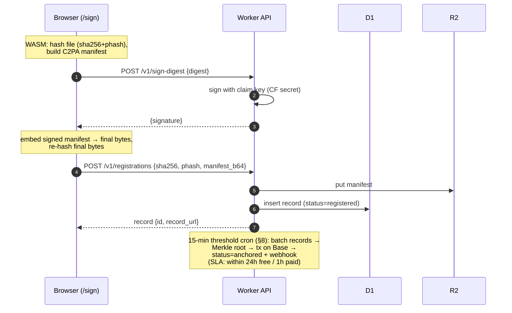
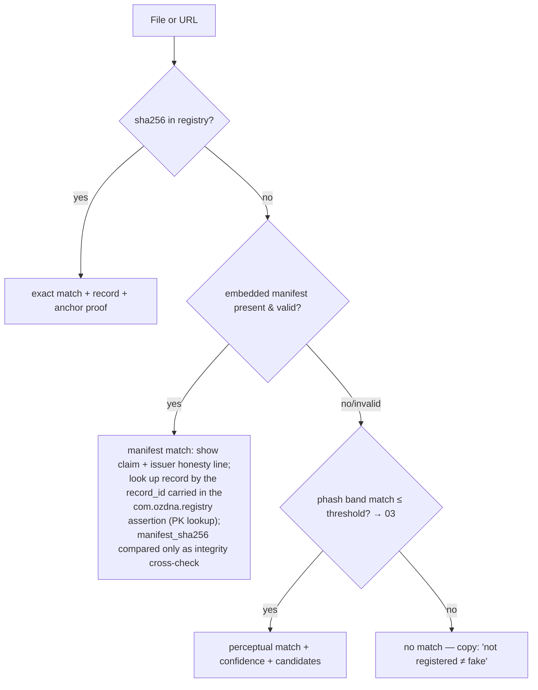

# 04 — OzDNA MVP Specification (October 2026, 4 weeks)

> Changelog
> 2026-07-06 · ratification pass — anchoring SLA, verdict enum, schema

*Part of the `plan/` corpus, July 6, 2026. Audience: a future Claude Code session building this with no memory of prior conversations, supervised by a non-engineer founder. This document owns: product scope, user stories, page specs, the REST API contract, the D1 database schema, product limits, the week-by-week build plan, and the launch checklist.*

**What this document does NOT own** (reference, don't reinvent):

| Decision | Owner document |
|---|---|
| System architecture, anchoring contract, key management design | `plan/01-ARCHITECTURE.md` |
| Framework/library/tooling choices, auth mechanism, billing provider, rate-limit implementation | `plan/02-TECH-STACK.md` |
| Perceptual-hash algorithm, band scheme parameters, Hamming-distance thresholds, Merkle leaf construction | `plan/03-ALGORITHMS.md` |
| Cost model, gas budgets | `plan/06-COST-MODEL.md` |
| SEO pages, PR calendar, pricing-page traffic strategy | `plan/07-GTM-SEO-PR.md` |

Where this spec needs a number owned elsewhere (e.g. a Hamming threshold), it states a **provisional default** and marks it `→ 03` etc. If the owning document says otherwise, the owning document wins.

---

## 1. Scope statement

### 1.1 In scope (ships by end of Week 4)

1. **Browser signing** of JPG/PNG images: C2PA-format manifest built and embedded client-side via `@contentauth/c2pa-web` (WASM, v0.12.0 — verified on the npm registry, published 2026-06-16); the actual cryptographic signature is produced by a **remote digest-signing endpoint** so the private key never leaves the server (see §3.2 plain-language box).
2. **DNA registry**: every signed/marked image gets a record — SHA-256 of the final bytes, a 64-bit perceptual hash (algorithm and parameters `→ 03`), and a stored copy of the manifest. Cloudflare D1 + R2.
3. **Batched on-chain anchoring**: Merkle root of pending record hashes written on-chain (Base first, chain-agnostic design `→ 01`) by a cron-triggered Worker from **our own** gas wallet. Per-record proof endpoint.
4. **Public verification**: web page + API. Three match paths: exact hash → embedded manifest → perceptual fingerprint (survives metadata stripping and re-encoding).
5. **Compliance API** (the primary wedge): `POST /v1/marks` lets a GenAI app send a generated image and get back the same image with an embedded, machine-readable **AI-generated** provenance manifest plus a registry record. Self-serve API keys, usage metering, tiered pricing $49–199/mo.
6. **Minimal dashboard**: API keys, usage-vs-quota, plan/billing link, webhook endpoint config. (Consistency resolution 2026-07-06: this scope wins over `01-ARCHITECTURE.md`'s earlier "no dashboard / no accounts / founder-provisioned tenants" draft, per 08's precedence; 01 has been aligned. The §8 cut line drops dashboard UI first if Week 4 tightens — that fallback is 01's original manual-provisioning stance.)
7. **Docs** (OpenAPI 3.1-derived reference + quickstart) and **pricing** pages.
8. **Segmented waitlist** (already live pre-MVP; ported from the partner's Netlify skeleton to Cloudflare, §10).

### 1.2 Explicitly OUT of scope (do not build, do not scope-creep)

| Out | Why (hard rule) |
|---|---|
| Video, audio, mobile capture apps | Hard rule 6: images only in v1 |
| AI-detection classifiers of any kind ("is this deepfake?") | Hard rule 3: provenance, not detection. TrueMedia died of detection compute |
| Any token, points, credits-as-asset | Hard rule 1 |
| User wallets, custody, payments in crypto, anything touching user funds | Hard rule 2 (Turkey Law 7518). Our gas wallet holds only our own ~$10–20 of ETH on Base |
| The phrase or promise "trusted Content Credentials"; any claim of C2PA conformance | Hard rule 5. Our self-signed cert shows "unknown source" in the official Verify tool. We ship our **own** verify page + public timestamp |
| TrustMark / invisible watermarking | Stretch goal only; first thing cut (§8). Registry fingerprint is the moat, watermark is additive |
| Per-verification metered billing, enterprise SSO, teams/orgs | LATER wedges. MVP is single-user accounts, flat monthly tiers |
| Native GIF/WebP/TIFF support | JPEG + PNG only (matches `@contentauth/c2pa-web` core formats and Adobe's own free-app scope) |
| EU AI Act legal advice | We sell tooling "designed to meet the machine-readable marking guidance"; copy always carries a not-legal-advice line |

---

## 2. User stories with acceptance criteria

### Story 1 — Creator signs an image and gets a DNA record + badge/share link

> As a photographer/creator, I upload my JPG on `/sign`, and I get back a signed copy plus a public record page I can link from my portfolio or Etsy listing.

**Acceptance criteria**
- Given a logged-in free user on `/sign`, when they drop a 8MB JPG and pick "My original work", then within 15s on a mid-range laptop they can download a signed JPG whose embedded manifest validates in `c2patool` (cryptographically valid; issuer will read "unknown source" in third-party trust-list tools — that is expected and never hidden).
- A record row exists in D1 with `kind='claimed_capture'`, `source='web_sign'`, correct `sha256` of the **signed** bytes, a computed `phash`, and `status='registered'`.
- The success screen shows: download button, permalink `https://ozdna.com/r/{record_id}`, embeddable badge snippet (`<a href=…></a>`), and honest copy: "This proves *who registered it and when* — it does not prove the content of the image is true."
- After the next threshold-cron anchor batch runs (free records anchor **within 24h**; paid within 1h — §8), the record page shows "Publicly timestamped" with a working proof link, without any user action.
- The original image bytes are **not** stored server-side (only hashes + manifest), and the page says so.
- Signing a byte-identical file twice returns the existing record instead of a duplicate (dedupe on `sha256`).

### Story 2 — Anyone verifies an intact signed image

> As anyone (no account), I drop a signed image on `/verify` and see where it came from.

**Acceptance criteria**
- Given an unmodified OzDNA-signed image, when dropped on `/verify`, then the result shows `match_type=exact`, the record summary (kind, registered-by display name or "anonymous creator", registration time), manifest status "present & cryptographically valid", and the anchor status with proof link.
- The whole check runs without upload of the full file where possible: the browser computes SHA-256 + phash locally and queries the API; the file leaves the browser only if the user opts into "deep manifest inspection" (or uses the API `POST /v1/verify`).
- No account, no Turnstile for the first 10 checks/day per IP; Turnstile challenge after that (§7).
- Result page has a shareable URL (`/verify/result?rec=…&match=exact` reconstructable view).

### Story 3 — Anyone verifies a stripped / re-encoded copy via perceptual match

> As a fact-checker, I paste a screenshot or a platform-recompressed copy (metadata gone) and still find the origin record.

**Acceptance criteria**
- Given a signed-then-registered image that has been (a) re-encoded at JPEG quality 70, or (b) screenshotted at ≥50% of original resolution, when checked on `/verify`, then the result shows `match_type=perceptual` with the matched record and a confidence label (`high`/`medium` mapping from Hamming distance, thresholds `→ 03`).
- Given an unrelated image, the result is `match_type=none` with the exact copy: "Not found in the OzDNA registry. **This does not mean the image is fake** — it means no one registered it with us." (Rule 3 guard: we never render a verdict about authenticity of unregistered content.)
- The response discloses the mechanism in plain words: "matched by visual fingerprint (survives metadata stripping), not by embedded metadata."
- False-positive guard: if multiple records match within threshold, all candidates are listed ranked by distance; UI never silently picks one (`→ 03` for tie-break policy).

### Story 4 — A GenAI company integrates the compliance API to mark its outputs (PRIMARY WEDGE)

> As the developer of a small image-generation app facing the Dec 2, 2026 marking deadline, I sign up, get a key, and add one HTTP call to my generation pipeline so every output carries machine-readable AI-provenance marking.

**Acceptance criteria**
- Self-serve: signup → verified email → API key visible in dashboard → first successful `POST /v1/marks` in under 10 minutes using only `/docs` quickstart (test with a cold-start user).
- The returned image contains a C2PA-format manifest whose assertions declare **AI generation** — `c2pa.actions` with action `c2pa.created` and `digitalSourceType` = IPTC `trainedAlgorithmicMedia` — **not** a capture claim. (This is the critical difference from Story 1: the manifest content asserts "AI-generated", which is exactly what EU AI Act Art. 50 machine-readable marking guidance describes.) A custom `com.ozdna.registry` assertion (name owned by 03-ALGORITHMS §4.1) carries the record id + registry URL so the mark survives *discovery* even if metadata is stripped (fingerprint fallback).
- Record row: `kind='ai_generated'`, `source='api_mark'`, metered in `usage_events`, counted against the plan quota.
- Rate limits and quotas enforced per §4.6; exceeding quota returns the documented 429 error with an upgrade link, never a silent failure.
- Idempotency: retrying the same request with the same `Idempotency-Key` returns the original response, creating no duplicate record or double-billing event.
- Marketing/docs copy for this feature says "designed to meet EU AI Act Article 50 machine-readable marking guidance" + not-legal-advice line; it never says "makes you compliant" as a guarantee and never says "trusted Content Credentials".

### Story 5 — Visitor lands from SEO and joins the segmented waitlist (pre-MVP; already live)

> As a founder googling "EU AI Act content marking API", I land on ozdna.com, understand the deadline and the fix in 30 seconds, and leave my email in the right segment.

**Acceptance criteria**
- Landing page states deadline (Dec 2, 2026) and the three-verb product (sign → timestamp → match) above the fold; zero mentions of chain names, tokens, or "AI × Blockchain" (hard rule 4).
- Form: email + segment radio (`ai_company` / `seller_creator` / `fact_checker` / `other`) + explicit consent checkbox (KVKK/GDPR) — all three required; row lands in D1 `waitlist` with `consent_at` timestamp and `source` (UTM/referrer).
- Double opt-in (required for a compliance brand, per `02-TECH-STACK.md` §10 / `07-GTM-SEO-PR.md` §2.2): on submit the row stores a `confirm_token` and a confirmation email is sent; the success state reads "check your inbox" (§3.1). The address is counted as a confirmed waitlist member only after the recipient clicks the link, which sets `confirmed_at`; unconfirmed rows are excluded from the Dec 2 sales-wave export.
- Turnstile on the form (invisible mode). Duplicate email upserts (updates segment) rather than erroring.
- Post-launch, the same form becomes "create free account" but the `waitlist` table and its export path keep working (it is the CRM seed for the Dec 2 sales wave).

---

## 3. Page-by-page web spec

Global rules for every page:
- **Copy positioning (hard rules 4 & 5):** the word "blockchain" never appears in headlines or hero copy. Approved phrase: **"tamper-evident public timestamp"**. Chain names appear only in technical proof surfaces (API responses, proof pages, docs) where they are needed for independent verification. Never "trusted Content Credentials", never "detection", never "certified". Approved claim set: "cryptographically signed provenance manifest (C2PA-compatible format)", "timestamp no one can backdate", "fingerprint that survives metadata stripping".
- Bilingual plan: EN at launch; TR versions of landing + privacy are a fast-follow (GTM doc owns). All strings in a locale file from day one.
- Every page renders a footer: Privacy (KVKK/GDPR), Terms, Imprint (Find Below Ventures, Sharjah Publishing City Free Zone), `conformance status` FAQ link, contact.

### 3.1 Landing `/`

| Section | Content & states |
|---|---|
| Hero | H1 guidance: "Proof of origin for the AI era." Sub: "Sign your images, get a tamper-evident public timestamp, and stay findable even when platforms strip your metadata." CTA pair: "Get your API key" (post-launch) / "Join the waitlist" (pre-launch) + "Verify an image" secondary |
| The clock | Deadline banner: "EU AI Act Article 50 machine-readable marking — grace for existing GenAI systems ends **Dec 2, 2026**." Links to compliance guide in docs. Not-legal-advice microcopy |
| How it works | 3 steps: **Sign** (in your browser — files don't leave your device) → **Timestamp** (public, tamper-evident, independently checkable) → **Match** (visual fingerprint finds stripped copies). No chain names |
| Segments | 3 cards mirroring waitlist segments: AI companies (→ `/docs` quickstart), sellers & creators (→ `/sign`), fact-checkers & newsrooms ("free forever — talk to us") |
| Honesty/FAQ | Must include: "Are you on the C2PA trust list?" → "Not yet. Signatures are cryptographically valid but display as 'unknown source' in trust-list tools; our own verify page and public timestamp do not depend on any trust list. Conformance is on our roadmap." Also: "Do you detect deepfakes?" → "No — we prove origin, which is the reliable half of that problem." |
| Waitlist/signup | Story 5 form. States: idle / submitting / success ("check your inbox") / error with retry |

### 3.2 `/sign`

Requires login (magic-link email auth; mechanism `→ 02`). Anonymous visitors see a 1-field email gate ("we need an account so the record has an owner").

Flow states: `idle (dropzone)` → `validating` (type/size: JPG/PNG ≤ 20MB) → `hashing` (SHA-256 + phash in browser) → `building manifest` → `signing` (remote digest sign, §box below) → `registering` (`POST /v1/registrations`) → `done` / `error` (per-stage messages, retry from failed stage).

Form fields before signing: kind selector — "My original work" (`claimed_capture`) / "AI-generated or AI-assisted" (`ai_generated`); optional title (≤120 chars, public); checkbox "store a small preview thumbnail on my record page" (default **on**, pre-checked, with a visible opt-out at upload — decision + GDPR justification owned by `01-ARCHITECTURE.md` §8, consistency resolution 2026-07-06; §3.3 below already reflects this).

Success state (Story 1): download, permalink, badge snippet, "what this proves / doesn't prove" box.

> **Plain-language architecture box (for the founder):** the browser does all the heavy work — reading the image, computing its hashes, building and embedding the manifest — so we pay ~zero compute (hard rule 6). But the signing key must never be sent to a browser (anyone could steal it and forge our signatures — the Nikon lesson). So the browser sends only a ~32-byte digest to `POST /v1/sign-digest`; the Worker holds the private key as a Cloudflare secret, signs that digest (sub-millisecond), and returns the signature, which the browser slots into the manifest. Key never leaves the server; images never reach the server. Details of cert/key generation and rotation `→ 01`.

### 3.3 `/verify` (+ public record page `/r/{record_id}` + `/badge/{record_id}.svg`)

Two input tabs: **file drop** and **URL** (URL mode is the W2 cut-line candidate). Browser computes sha256+phash locally and calls `GET /v1/verify?hash=…` then falls back to phash match; "deep manifest inspection" opt-in uploads the file to `POST /v1/verify`.

Result states:
1. **Exact/manifest match** — green; record card; manifest panel (`present & valid` / `present but invalid — file was modified after signing` / `absent`); anchor panel ("Publicly timestamped on {date} — view proof"); honesty line on issuer status.
2. **Perceptual match** — blue; "Visual fingerprint match (metadata was stripped or the file was re-encoded)"; confidence label + matched record(s) ranked; distance shown in an expandable "technical details".
3. **No match** — neutral gray, never red: the Story-3 mandated copy ("not registered ≠ fake").
4. Error / unsupported type / Turnstile challenge states.

`/r/{record_id}`: public permalink. Sections: status card (kind, registered date, owner display name or "anonymous creator", thumbnail unless the creator opted out — default-on with a pre-checked consent checkbox at signing; decision + GDPR justification owned by `01-ARCHITECTURE.md` §8, consistency resolution 2026-07-06), timeline (registered → timestamped w/ proof link), technical details (sha256, phash, manifest download `GET /v1/records/{id}/manifest`, batch id), "report abuse" mailto link. This page is the badge target and the PR artifact — it must look credible in a screenshot.

Takedown / revoked state (record pages are user-generated content — titles, thumbnails — served on ozdna.com, so a trust-branded product needs a working takedown path, not just a mailto): when an admin sets `records.status='revoked'`, `/r/{record_id}` renders a neutral "this record has been removed" state (no title, thumbnail, owner, or hashes), `/badge/{record_id}.svg` serves the generic not-found SVG, and the record is excluded from **all** verify lookups (exact, manifest, and phash). Criteria and checklist item in §9.4.

`/badge/{record_id}.svg`: Worker-rendered SVG, cache 1h: "OzDNA · Origin registered · {YYYY-MM-DD}" (+ "AI-generated · disclosed" variant when `kind='ai_generated'` — this is the Etsy-seller wedge asset). 404 → generic "record not found" SVG.

### 3.4 `/dashboard`

Minimal, one page + tabs. Requires login.
- **API keys**: list (prefix, name, created, last used), create (secret shown **once**, stored only as hash), revoke. Empty state = quickstart curl with a fresh test key pre-filled.
- **Usage**: current month marks/registrations vs quota (progress bar), 80% and 100% banners with upgrade CTA; last 30 days table from `usage_events`.
- **Plan & billing**: current plan, "Upgrade" → provider checkout link, "Manage billing" → provider portal (`→ 02` for provider; §6 for the integration contract).
- **Webhooks**: one endpoint URL + secret (regenerate), event checkboxes, last 10 deliveries with status.
- **Danger zone**: delete account (GDPR/KVKK path, §9.3).

### 3.5 `/docs`

Generated from `api/openapi.yaml` (OpenAPI 3.1, §4.8; rendering tool `→ 02`). Hand-written pages alongside the reference: Quickstart (5-minute curl to first mark), Authentication, Errors, Webhooks & signatures, **Verify an anchor yourself** (step-by-step independent Merkle-proof check — this page is the trust story), **EU AI Act Art. 50 marking guide** (the SEO-aligned compliance explainer; carries the not-legal-advice line), Limits & quotas.

### 3.6 `/pricing`

4 cards + feature matrix + FAQ:

| | Free | Starter $49/mo | Growth $99/mo | Scale $199/mo |
|---|---|---|---|---|
| API marks / mo | 25 | 2,000 | 10,000 | 50,000 |
| Web signs / mo | 50 | included in marks | included | included |
| Rate limit | 10 req/min | 60 req/min | 120 req/min | 300 req/min |
| Verifications | unlimited (fair use) | unlimited | unlimited | unlimited |
| Public timestamping | ✔ | ✔ | ✔ | ✔ |
| Webhooks | — | ✔ | ✔ | ✔ |
| Support | community | email | email | priority email |

FAQ must cover: what counts as a mark (one successful `POST /v1/marks` or `/v1/registrations`); what happens at quota (hard stop + 429, no surprise overage bills at MVP); fact-checkers/newsrooms → "free forever, write to us" (flagship flag, §7); cancellation; the honesty FAQ item from §3.1.

---

## 4. REST API v0

Base URL: `https://api.ozdna.com/v1`. All responses JSON UTF-8 unless a binary image is documented. CORS enabled for browser flows. IDs are prefixed ULIDs: `rec_…`, `bat_…`, `evt_…`, `key_…`, `usr_…`, `whe_…`.

### 4.1 Authentication

Header: `Authorization: Bearer ozdna_live_<32 random base62>` (or `ozdna_test_…`). Keys are shown once at creation; server stores only `sha256(key)` (§5 `api_keys`). Test-mode keys: same API, records flagged `is_test=1`, excluded from anchoring and quotas, purged after 30 days, limited to 100 calls/day. Public endpoints (`GET /v1/verify`, `GET /v1/records/{id}`, proofs, badge) need no key but are IP-rate-limited + Turnstile-guarded (§7).

### 4.2 Endpoints

| Method & path | Auth | Purpose |
|---|---|---|
| `POST /v1/marks` | key | **Primary wedge.** Mark an AI-generated image: embed AI-provenance manifest server-side, register, return marked image |
| `POST /v1/registrations` | key or session | Register hashes (+ optional manifest) for an image signed/embedded client-side (used by `/sign`) |
| `POST /v1/sign-digest` | session (web) or key | Remote signature over a manifest digest (browser signing path; `→ 01` for key mgmt) |
| `GET /v1/verify?hash=…` \| `?url=…` | none | Verify by sha256 (or by fetched URL); `&phash=…&max_distance=…` for fingerprint lookup from client-side hashing |
| `POST /v1/verify` | none (Turnstile) or key | Verify by uploaded file (server computes hashes + validates embedded manifest) |
| `GET /v1/records/{id}` | none | Public record (public fields only) |
| `GET /v1/records/{id}/manifest` | none | Raw stored manifest bytes |
| `GET /v1/anchors/{batch_id}/proof/{record_id}` | none | Merkle inclusion proof for independent verification |
| `GET /v1/usage` | key | Current-month usage + quota for the calling key's user |
| `POST /v1/waitlist` | none (Turnstile) | Waitlist signup (Story 5) |
| `POST /v1/webhook-endpoints` / `GET` / `DELETE /{id}` | key | Manage the webhook endpoint |

### 4.3 `POST /v1/marks` — request/response

Request `multipart/form-data`: part `file` (image/jpeg | image/png, ≤ 20MB) + optional part `options` (JSON string):

```bash
curl -X POST https://api.ozdna.com/v1/marks \
  -H "Authorization: Bearer ozdna_live_k8Qw…" \
  -H "Idempotency-Key: 018f3b2e-9c1d-7a4e-b2f0-5c6d7e8f9a0b" \
  -F "file=@output.png;type=image/png" \
  -F 'options={"generator":"acme-imagegen/2.3","title":"product hero v1","return":"json"}'
```

`options` fields: `generator` (string ≤100, becomes `softwareAgent` in the manifest), `title` (≤120, public), `return` (`"binary"` default | `"json"`), `webhook_metadata` (object ≤1KB echoed in webhook events).

**Memory guard (server-side pipeline — applies to `POST /v1/marks` and `POST /v1/verify`):** the 20MB cap bounds *bytes*, not *pixels*. A 20MB JPEG can decode to well over 200MB of raw RGBA, and a Workers isolate is hard-capped at **128MB of memory including WASM allocations** (verified: https://developers.cloudflare.com/workers/platform/limits/) — a naive full-resolution decode OOMs the never-cut wedge endpoint. Two mandatory mitigations: (a) reject oversized images by pixel count read from the image header *before* any decode — provisional cap **24 megapixels** (`→ 03`), returning `422 image_too_large_pixels` (§4.5); (b) compute the phash from a downscaled decode (e.g. libjpeg-turbo DCT-scaled 1/8 for JPEG, streaming row-by-row decode for PNG — phash only needs a tiny image), never from a full-resolution bitmap.

Manifest written (assertion content — exact manifest construction `→ 01`/`→ 03`): claim generator `OzDNA/0.x`; `c2pa.actions` v2 with action `c2pa.created`, `digitalSourceType: "http://cv.iptc.org/newscodes/digitalsourcetype/trainedAlgorithmicMedia"`, `softwareAgent` = `options.generator`; custom assertion `com.ozdna.registry` (name → 03 §4.1) `{record_id, registry:"https://ozdna.com/r/…", sha256_source}`. **Note the contrast with Story 1:** web-sign manifests carry the user's origin claim; marks manifests always carry the AI-generated assertion. There is no code path that lets an API caller mark AI output as a camera capture.

Response, `return=binary` (default): `200`, body = marked image bytes, same content type; headers `X-Ozdna-Record-Id`, `X-Ozdna-Record-Url`, `X-Ozdna-Sha256` (of returned bytes), `Location: /v1/records/{id}`.

Response, `return=json`:

```json
{
  "record": {
    "id": "rec_01JZX3E8LKWY2P4QD9T7RM5HBF",
    "kind": "ai_generated",
    "status": "registered",
    "sha256": "9f86d081884c7d659a2feaa0c55ad015a3bf4f1b2b0b822cd15d6c15b0f00a08",
    "phash": "c4a2b1d8e0f39a57",
    "created_at": "2026-10-21T14:03:22.113Z",
    "record_url": "https://ozdna.com/r/rec_01JZX3E8LKWY2P4QD9T7RM5HBF",
    "anchor": null
  },
  "marked_image": { "encoding": "base64", "content_type": "image/png", "data": "iVBORw0KG…" },
  "assertions_applied": ["c2pa.actions:c2pa.created(trainedAlgorithmicMedia)", "com.ozdna.registration"]
}
```

Errors: `415 unsupported_media_type`, `413 file_too_large`, `429 rate_limit_exceeded` / `429 plan_quota_exceeded`, `409 idempotency_key_reused`.

### 4.4 Other endpoint contracts

**`POST /v1/registrations`** (JSON):

```json
{
  "sha256": "9f86d081…64 hex…",
  "phash": "c4a2b1d8e0f39a57",
  "kind": "claimed_capture",
  "file_mime": "image/jpeg",
  "file_bytes": 2493344,
  "manifest_b64": "AAAAHGp1bWI…",
  "title": "Ayasofya at dawn"
}
```
`manifest_b64` optional, ≤ 1MB decoded, stored in R2. Duplicate `sha256` → `200` with existing record + `"deduplicated": true`. Response: the public record object (as in §4.3) with `"deduplicated": false`.

**`GET /v1/verify?hash=9f86d0…`** → 

```json
{
  "query": { "method": "hash", "sha256": "9f86d0…" },
  "match": {
    "verdict": "EXACT_ANCHORED",
    "headline": "Exact file found in the OzDNA registry",
    "match_type": "exact",
    "confidence": "exact",
    "hamming_distance": 0,
    "records": [ { "id": "rec_01JZX3…", "kind": "claimed_capture", "created_at": "…", "status": "anchored", "moderation_status": "active", "record_url": "…" } ],
    "footer": "OzDNA records registration, not creation. A registration timestamp shows when a fingerprint entered our registry — not when or by whom the image was made, and not whether it is AI-generated."
  },
  "anchor": {
    "status": "confirmed",
    "chain": "base-mainnet",
    "tx_hash": "0x8c1f…",
    "anchored_at": "2026-10-21T18:00:41Z",
    "proof_url": "https://api.ozdna.com/v1/anchors/bat_01JZX9…/proof/rec_01JZX3…"
  }
}
```
**The verdict vocabulary is owned by `→ 03` §6.3, not this document.** `verdict` carries one of its ten locked values — `EXACT_ANCHORED`, `EXACT_PENDING`, `SIGNED_BY_OZDNA`, `VISUAL_MATCH_HIGH`, `VISUAL_MATCH_PROBABLE`, `NEAR_MISS`, `THIRD_PARTY_CREDENTIALS`, `SIGNATURE_BROKEN`, `SIGNATURE_REVOKED`, `NO_RECORD` — and `headline`/`footer` reproduce that section's rule-5-safe copy strings verbatim; the API defines no verdict names of its own. `match_type` and `confidence` are a **documented convenience projection** of the verdict for clients that only need the coarse bucket: `match_type` ∈ `exact | manifest | perceptual | none`, `confidence` ∈ `exact | high | medium`, mapped as EXACT_ANCHORED · EXACT_PENDING → `exact`/`exact`; SIGNED_BY_OZDNA · THIRD_PARTY_CREDENTIALS · SIGNATURE_BROKEN · SIGNATURE_REVOKED → `manifest`; VISUAL_MATCH_HIGH → `perceptual`/`high`; VISUAL_MATCH_PROBABLE → `perceptual`/`medium`; NEAR_MISS → surfaced only in the expandable near-matches list (never a match); NO_RECORD → `none` (distance→label thresholds owned by `→ 03` §1.5: `high` = pHash d ≤ 6, PDQ-confirmed when both hashes present; `medium` = 7 ≤ d ≤ 10 with PDQ ≤ 31 required; d 11–12 surfaces only in an expandable "near matches" list, never as a match). `?phash=…&max_distance=…` performs fingerprint lookup: default searches run 03 §2's stages 0–2 (complete for d ≤ 7); the r = 2 deep search (complete for d ≤ 10, the outer ceiling) is Turnstile-gated / paid per 03 §2.5. **Coupling warning (aligned 2026-07-06 to 03, the owner):** the band columns, probe radii, and these ceilings are ONE decision owned by `→ 03` §2.2 — **4 disjoint 16-bit bands with multi-index probing** (r = 0 → complete for d ≤ 3; r = 1 → d ≤ 7; r = 2 → d ≤ 10, by pigeonhole). Change bands, probe radius, and advertised `max_distance` together, never separately. (This spec's earlier provisional 8×8-bit scheme is withdrawn: 8-bit bands give only 256 buckets — thousands of rows per probe at scale — and the d ≤ 7 recall it claimed is met by 03's r = 1 probing on 16-bit bands at far lower read cost.) Multiple candidates: `records[]` ranked by distance; API returns up to 5. `?url=` mode: Worker fetches the URL with SSRF guards (public IPs only, ≤10MB, image content types, 5s timeout).

**`POST /v1/verify`** (multipart `file`): server computes sha256, extracts/validates embedded manifest, computes phash, then same response shape (same `verdict`/`match_type` fields as above) plus `"manifest": {"present": true, "valid": true, "issuer": "OzDNA (self-declared; not on public trust lists)", "claim_summary": {…}}`.

**Tombstone-on-erasure (GDPR/KVKK).** Every record carries a `moderation_status` (`active | disputed | withdrawn`, §5) distinct from its lifecycle `status`, implementing `→ 03` §6.2: `disputed` keeps the full anchor proof but banners the attribution claim, and when a record is withdrawn or erased (`moderation_status='withdrawn'` — registrant request, right-to-erasure, or takedown, per `05` L1/T5) its row and R2 objects are deleted and `/r/{id}` renders a neutral tombstone, yet the already-anchored Merkle leaf — which contains no personal data and cannot be un-anchored — stays immutable, so any proof JSON already in a user's hands still verifies against the chain.

**`GET /v1/anchors/{batch_id}/proof/{record_id}`**:

```json
{
  "version": "ozdna-proof-v1",
  "record": {
    "id": "rec_01JZX3…",
    "sha256": "9f86d081…64 hex…",
    "phash64": "c4a2b1d8e0f39a57",
    "pdq256": "…64 hex…",
    "manifest_sha256": "…64 hex…",
    "account_id": "usr_01JZX0…",
    "registered_at": "2026-10-21T14:03:22.113Z"
  },
  "batch_id": "bat_01JZX9A2…",
  "chain": "base-mainnet",
  "contract": "0x…(per 01-ARCHITECTURE)",
  "tx_hash": "0x8c1f…",
  "block_number": 34210991,
  "block_time": "2026-10-21T18:00:41Z",
  "merkle_root": "0x5d2e…",
  "leaf": "0x71aa…",
  "leaf_index": 1042,
  "leaf_count": 4096,
  "proof": [
    { "pos": "right", "hash": "0x9b3c…" },
    { "pos": "left",  "hash": "0x02fe…" },
    { "pos": "right", "hash": "0x44d1…" }
  ],
  "hash_algorithm": "sha256",
  "leaf_construction": "per plan/03-ALGORITHMS.md §3.2 (concatenate the record fields above, prepend 0x00, SHA-256)",
  "verify_instructions_url": "https://ozdna.com/docs/verify-an-anchor"
}
```

The self-contained content set is owned by `→ 03` §3.7: the `record` block carries **exactly** the fields §3.2 concatenates into the leaf, each `proof` step is a `{pos, hash}` sibling (leaf→root), and `leaf_count` fixes the tree size — so a skeptic can rebuild the leaf, walk the siblings to `merkle_root`, and check it against the on-chain tx with no OzDNA API call (the runnable walkthrough is `→ 03` §3.8). This spec may keep its own field names but must ship this full set.

**Webhooks** — events: `record.anchored`, `mark.created`, `usage.threshold_reached` (fired at 80% and 100% of quota). Delivery: `POST` to the configured URL, JSON:

```json
{
  "id": "evt_01JZXA…",
  "type": "record.anchored",
  "created_at": "2026-10-21T18:00:45Z",
  "data": { "record_id": "rec_01JZX3…", "batch_id": "bat_01JZX9…", "chain": "base-mainnet", "tx_hash": "0x8c1f…" }
}
```
Signature header `Ozdna-Signature: t=1792608045,v1=<hex hmac-sha256(endpoint_secret, t + "." + raw_body)>`; reject if |now−t| > 5 min. Retries: attempts at +1m, +10m, +1h (cron-driven outbox, §5 `webhook_deliveries`), then marked `failed`, visible in dashboard.

### 4.5 Error model

Single shape everywhere:

```json
{
  "error": {
    "type": "rate_limit_error",
    "code": "plan_quota_exceeded",
    "message": "Monthly mark quota (2000) reached for plan 'starter'. Upgrade at https://ozdna.com/pricing.",
    "doc_url": "https://ozdna.com/docs/errors#plan_quota_exceeded",
    "request_id": "req_01JZXB…"
  }
}
```

| HTTP | `type` | Example `code`s |
|---|---|---|
| 400 | `invalid_request_error` | `missing_field`, `invalid_hash_format`, `url_not_allowed` |
| 401 | `authentication_error` | `invalid_api_key`, `revoked_api_key` |
| 403 | `permission_error` | `test_key_forbidden`, `turnstile_required` |
| 404 | `not_found_error` | `record_not_found`, `batch_not_found` |
| 409 | `idempotency_error` | `idempotency_key_reused` (same key, different payload) |
| 413 | `invalid_request_error` | `file_too_large` |
| 415 | `invalid_request_error` | `unsupported_media_type` |
| 422 | `invalid_request_error` | `image_undecodable`, `image_too_large_pixels` (server-side megapixel cap, §4.3) |
| 429 | `rate_limit_error` | `rate_limit_exceeded` (has `Retry-After`), `plan_quota_exceeded` |
| 500 | `api_error` | `internal` |
| 503 | `service_unavailable` | `anchoring_paused` (reads still work) |

Every response carries `X-Request-Id`. Rate-limited responses carry `X-RateLimit-Limit`, `X-RateLimit-Remaining`, `X-RateLimit-Reset`.

### 4.6 Rate limits & quotas (enforcement mechanism `→ 02`; contract here)

| Tier | req/min per key | Marks+registrations / month | Test calls/day |
|---|---|---|---|
| Free | 10 | 25 (API) + 50 web signs | 100 |
| Starter | 60 | 2,000 | 100 |
| Growth | 120 | 10,000 | 500 |
| Scale | 300 | 50,000 | 500 |
| Unauthenticated (per IP) | 30/min reads; verify: 10/day then Turnstile | — | — |

Quota exceeded ⇒ hard stop (`429 plan_quota_exceeded`); no automatic overage billing in MVP (removes bill-shock risk and billing complexity; revisit with metered pricing later).

### 4.7 Idempotency

`Idempotency-Key` header (any unique string ≤128 chars, UUIDv7 recommended) honored on `POST /v1/marks` and `POST /v1/registrations`. Scope: (api_key, endpoint, key). Server stores `sha256(raw request body)` + serialized response for 24h. Replay with same body ⇒ stored response + header `Idempotent-Replay: true`. Same key + different body ⇒ `409 idempotency_key_reused`.

### 4.8 OpenAPI 3.1

`api/openapi.yaml` in the repo is the single source of truth; the Worker routes and `/docs` reference are both derived from it (generation tooling `→ 02`). Version note: URL-versioned (`/v1`); breaking changes require `/v2`, additive changes don't. Publish the YAML at `https://api.ozdna.com/v1/openapi.yaml` (public — it is marketing for developers, and answer-engine food alongside `llms.txt`, §10).

### 4.9 Sequence diagrams





---

## 5. D1 SQL schema (complete, migration 0001)

D1 is SQLite. Conventions: TEXT ISO-8601 UTC timestamps; prefixed-ULID TEXT primary keys; booleans as INTEGER 0/1; `PRAGMA foreign_keys = ON` per connection.

**Free-tier headroom check — count index writes, they bill as rows.** D1 free = 5M row reads/day, 100k row writes/day, 5GB (verified: https://developers.cloudflare.com/d1/platform/pricing/). D1's billing rule (same source): *"Indexes will add an additional written row when writes include the indexed column."* One successful mark therefore writes ~**11–15 rows**, not ~4: the `records` row + ~8 index rows (unique sha256, 4 band indexes per 03 §2.2, user, batch, pending-anchor partial), `usage_events` + 1 index, `idempotency_keys` + expiry index, and `webhook_deliveries` + 1 index when a webhook is configured. The free tier thus supports roughly **7–9k marks/day** — comfortable for W1–W2 (web-sign volumes), but not a 10k/day claim. From W3, Workers Paid ($5/mo, §8) includes D1's paid allotment — **50M row-writes/month** — which is the real backstop. Write-amplification note: every index below costs one extra billed row per insert; if writes ever bite, cut `idx_records_batch` first (batch membership can be reconstructed from a leaf list stored alongside the batch in R2) — never the band indexes, which are the moat's read path.

```sql
-- 0001_init.sql
CREATE TABLE users (
  id                  TEXT PRIMARY KEY,                    -- usr_<ULID>
  email               TEXT NOT NULL UNIQUE COLLATE NOCASE,
  email_verified_at   TEXT,
  display_name        TEXT,                                -- public on records if set
  plan                TEXT NOT NULL DEFAULT 'free'
                        CHECK (plan IN ('free','starter','growth','scale')),
  is_flagship         INTEGER NOT NULL DEFAULT 0,          -- fact-checkers: free-forever raised limits
  billing_customer_id TEXT,                                -- provider customer id (→ 02)
  billing_sub_id      TEXT,
  plan_renews_at      TEXT,
  segment             TEXT,                                -- ai_company|seller_creator|fact_checker|other
  created_at          TEXT NOT NULL DEFAULT (strftime('%Y-%m-%dT%H:%M:%fZ','now')),
  deleted_at          TEXT                                 -- soft delete; purge job hard-deletes after 30d
);

CREATE TABLE api_keys (
  id           TEXT PRIMARY KEY,                           -- key_<ULID>
  user_id      TEXT NOT NULL REFERENCES users(id),
  name         TEXT NOT NULL DEFAULT 'default',
  key_hash     TEXT NOT NULL UNIQUE,                       -- sha256 hex of full secret; secret never stored
  key_prefix   TEXT NOT NULL,                              -- e.g. 'ozdna_live_k8Qw' for display
  mode         TEXT NOT NULL DEFAULT 'live' CHECK (mode IN ('live','test')),
  created_at   TEXT NOT NULL DEFAULT (strftime('%Y-%m-%dT%H:%M:%fZ','now')),
  last_used_at TEXT,
  revoked_at   TEXT
);
CREATE INDEX idx_api_keys_user ON api_keys(user_id);

CREATE TABLE records (
  id               TEXT PRIMARY KEY,                       -- rec_<ULID>
  user_id          TEXT REFERENCES users(id),              -- NULL only after GDPR detach
  kind             TEXT NOT NULL
                     CHECK (kind IN ('ai_generated','claimed_capture','unspecified')),
  source           TEXT NOT NULL
                     CHECK (source IN ('web_sign','api_mark','api_registration')),
  sha256           TEXT NOT NULL,                          -- 64 hex, hash of FINAL signed/marked bytes
  phash64          INTEGER NOT NULL,                       -- OzDNA-pHash-v1 as SIGNED 64-bit int (03 §2.3:
                                                           --  store BigInt.asIntN(64, hash); serialized as
                                                           --  16 lowercase hex in API responses)
  pdq256           BLOB,                                   -- 32 bytes; secondary confirmation hash (03 §1.4),
                                                           --  NULL until computed
  band0            INTEGER NOT NULL,                       -- (phash >> 48) & 0xFFFF — 4 × 16-bit bands for
  band1            INTEGER NOT NULL,                       -- (phash >> 32) & 0xFFFF   multi-index lookup;
  band2            INTEGER NOT NULL,                       -- (phash >> 16) & 0xFFFF   band scheme + probe
  band3            INTEGER NOT NULL,                       --  phash        & 0xFFFF   radii owned by 03 §2.2
                                                           --  — change these and the §4.4 ceilings together,
                                                           --  never separately
  title            TEXT,                                   -- optional, public, ≤120 chars
  manifest_key     TEXT,                                   -- R2 object key (NULL if none stored)
  manifest_sha256  TEXT,                                   -- integrity cross-check only; verify looks up by
                                                           -- record_id from the embedded assertion (§4.9),
                                                           -- so this column is deliberately unindexed
  file_mime        TEXT NOT NULL,
  file_bytes       INTEGER,
  thumb_key        TEXT,                                   -- R2 key, only if user opted in
  status           TEXT NOT NULL DEFAULT 'registered'      -- lifecycle: what the anchoring pipeline has done
                     CHECK (status IN ('registered','anchoring','anchored','revoked')),
  moderation_status TEXT NOT NULL DEFAULT 'active'          -- separate axis: 03 §6.2 dispute/erasure semantics;
                     CHECK (moderation_status IN ('active','disputed','withdrawn')),
                                                            --  'withdrawn' = tombstone-on-erasure (05 L1/T5),
                                                            --  excluded from all verify lookups; anchor stays
  anchor_batch_id  TEXT REFERENCES anchor_batches(id),
  leaf_index       INTEGER,
  is_test          INTEGER NOT NULL DEFAULT 0,
  created_at       TEXT NOT NULL DEFAULT (strftime('%Y-%m-%dT%H:%M:%fZ','now')),
  anchored_at      TEXT
);
CREATE UNIQUE INDEX idx_records_sha256 ON records(sha256) WHERE is_test = 0;
CREATE INDEX idx_records_band0 ON records(band0) WHERE is_test = 0;
CREATE INDEX idx_records_band1 ON records(band1) WHERE is_test = 0;
CREATE INDEX idx_records_band2 ON records(band2) WHERE is_test = 0;
CREATE INDEX idx_records_band3 ON records(band3) WHERE is_test = 0;
CREATE INDEX idx_records_user ON records(user_id, created_at DESC);
CREATE INDEX idx_records_batch ON records(anchor_batch_id);
CREATE INDEX idx_records_pending_anchor ON records(status) WHERE status = 'registered' AND is_test = 0;

CREATE TABLE anchor_batches (
  id            TEXT PRIMARY KEY,                          -- bat_<ULID>
  chain         TEXT NOT NULL DEFAULT 'base-mainnet',      -- chain choice → 01
  merkle_root   TEXT,                                      -- 0x-hex
  record_count  INTEGER NOT NULL DEFAULT 0,
  status        TEXT NOT NULL DEFAULT 'pending'
                  CHECK (status IN ('pending','submitted','confirmed','failed')),
  tx_hash       TEXT,
  block_number  INTEGER,
  gas_wei       TEXT,                                      -- stringified bigint, for cost tracking
  created_at    TEXT NOT NULL DEFAULT (strftime('%Y-%m-%dT%H:%M:%fZ','now')),
  confirmed_at  TEXT
);
CREATE INDEX idx_batches_status ON anchor_batches(status);

CREATE TABLE usage_events (
  id          INTEGER PRIMARY KEY AUTOINCREMENT,
  user_id     TEXT NOT NULL REFERENCES users(id),
  api_key_id  TEXT REFERENCES api_keys(id),                -- NULL for web-session actions
  event_type  TEXT NOT NULL
                CHECK (event_type IN ('mark','registration','verify_file','sign_digest')),
  record_id   TEXT,
  billable    INTEGER NOT NULL DEFAULT 1,                  -- 0 for test mode / flagship
  month       TEXT NOT NULL,                               -- 'YYYY-MM' written by app (quota key)
  created_at  TEXT NOT NULL DEFAULT (strftime('%Y-%m-%dT%H:%M:%fZ','now'))
);
CREATE INDEX idx_usage_quota ON usage_events(user_id, month, event_type, billable);

CREATE TABLE waitlist (
  id                 INTEGER PRIMARY KEY AUTOINCREMENT,
  email              TEXT NOT NULL UNIQUE COLLATE NOCASE,
  segment            TEXT NOT NULL
                       CHECK (segment IN ('ai_company','seller_creator','fact_checker','other')),
  source             TEXT,                                 -- utm/referrer blob
  locale             TEXT,                                 -- 'en'|'tr'|…
  consent_at         TEXT NOT NULL,                        -- KVKK/GDPR explicit consent timestamp
  confirm_token      TEXT,                                 -- double-opt-in token emailed on signup; cleared once confirmed
  confirmed_at       TEXT,                                 -- set when the recipient clicks the confirmation link (02 §10 / 07 §2.2)
  created_at         TEXT NOT NULL DEFAULT (strftime('%Y-%m-%dT%H:%M:%fZ','now')),
  converted_user_id  TEXT REFERENCES users(id)
);
CREATE INDEX idx_waitlist_segment ON waitlist(segment);

CREATE TABLE webhook_endpoints (
  id          TEXT PRIMARY KEY,                            -- whe_<ULID>
  user_id     TEXT NOT NULL REFERENCES users(id),
  url         TEXT NOT NULL,                               -- https only, public hosts only (SSRF guard)
  secret      TEXT NOT NULL,                               -- hmac secret, show-once + regenerate
  events      TEXT NOT NULL DEFAULT '["record.anchored","mark.created","usage.threshold_reached"]',
  active      INTEGER NOT NULL DEFAULT 1,
  created_at  TEXT NOT NULL DEFAULT (strftime('%Y-%m-%dT%H:%M:%fZ','now'))
);
CREATE INDEX idx_whe_user ON webhook_endpoints(user_id);

CREATE TABLE webhook_deliveries (                          -- outbox; cron drains + retries
  id            TEXT PRIMARY KEY,                          -- evt_<ULID> (doubles as event id)
  endpoint_id   TEXT NOT NULL REFERENCES webhook_endpoints(id),
  event_type    TEXT NOT NULL,
  payload       TEXT NOT NULL,                             -- serialized JSON body
  attempt       INTEGER NOT NULL DEFAULT 0,
  status        TEXT NOT NULL DEFAULT 'pending'
                  CHECK (status IN ('pending','delivered','failed')),
  next_retry_at TEXT,
  created_at    TEXT NOT NULL DEFAULT (strftime('%Y-%m-%dT%H:%M:%fZ','now')),
  delivered_at  TEXT
);
CREATE INDEX idx_whd_due ON webhook_deliveries(status, next_retry_at);

CREATE TABLE idempotency_keys (
  api_key_id      TEXT NOT NULL,
  endpoint        TEXT NOT NULL,
  idem_key        TEXT NOT NULL,
  request_sha256  TEXT NOT NULL,
  response_status INTEGER,
  response_body   TEXT,                                    -- JSON only; binary responses store record ref
  created_at      TEXT NOT NULL DEFAULT (strftime('%Y-%m-%dT%H:%M:%fZ','now')),
  expires_at      TEXT NOT NULL,                           -- created_at + 24h; cron purges
  PRIMARY KEY (api_key_id, endpoint, idem_key)
);
CREATE INDEX idx_idem_expiry ON idempotency_keys(expires_at);

CREATE TABLE login_tokens (                                -- magic-link auth; final auth choice → 02
  token_hash  TEXT PRIMARY KEY,                            -- sha256 of emailed token
  email       TEXT NOT NULL COLLATE NOCASE,
  expires_at  TEXT NOT NULL,                               -- +15 min
  used_at     TEXT
);
```

Storage layout note: R2 (free: 10GB, 1M Class-A + 10M Class-B ops/mo, free egress — verified: https://developers.cloudflare.com/r2/pricing/) holds `manifests/{record_id}.c2pa` (~30–80KB each) and opt-in `thumbs/{record_id}.jpg` (≤50KB). **No original images are ever stored** — privacy default and cost control at once.

---

## 6. Metering & billing integration points

The billing **provider** is chosen in `plan/02-TECH-STACK.md` — locked there 2026-07-06: **Paddle** (merchant of record) primary, **Polar** as the tested backup; Lemon Squeezy rejected (Stripe-acquisition limbo); Stripe direct rejected at launch (we would carry EU VAT ourselves). This spec defines the provider-agnostic contract:

1. **Adapter interface** (one module, swap-able):
   - `createCheckoutUrl(user, plan) → url` — used by `/pricing` and `/dashboard` upgrade buttons.
   - `createPortalUrl(user) → url` — "Manage billing".
   - `verifyAndParseWebhook(request) → {event_type, billing_customer_id, billing_sub_id, plan, status, renews_at}`.
2. **Webhook route** `POST /webhooks/billing` (separate from customer webhooks): on `subscription_created/updated` set `users.plan`, `billing_*`, `plan_renews_at`; on `cancelled/expired/payment_failed(final)` set `plan='free'`. Always 2xx-fast + idempotent (provider event id logged).
3. **Source of truth for enforcement** is `users.plan` in D1, nothing else. The quota check on every metered call differs by tier, because the free tier has **two separate buckets** (§3.6: 25 API marks AND 50 web signs) while paid tiers merge web signs into the marks quota:
   - **Free — two counts.** API bucket: `SELECT COUNT(*) FROM usage_events WHERE user_id=? AND month=? AND billable=1 AND event_type IN ('mark','registration') AND api_key_id IS NOT NULL` vs 25. Web bucket: same query with `event_type='registration' AND api_key_id IS NULL` vs 50.
   - **Paid — one merged count.** `SELECT COUNT(*) FROM usage_events WHERE user_id=? AND month=? AND billable=1 AND event_type IN ('mark','registration')` vs the plan quota.

   A single merged count on the free tier would either under- or over-enforce one of the buckets — this doc owns the limits, so the split rule lives here. (At MVP volumes these count queries are fine; add a rollup table only if D1 read limits ever bite — they won't at <100k marks/mo.)
4. **Metering write**: exactly one `usage_events` row per successful billable call, written in the same D1 batch as the record insert (D1 `batch()` gives atomicity). Test mode and flagship users write rows with `billable=0` (visible in dashboard, never counted).
5. **Reconciliation cron** (daily): for every user with `billing_sub_id`, if `plan_renews_at` < now − 3 days, re-fetch subscription state from the provider API and correct `users.plan` (heals missed webhooks).
6. **No card on free tier. No crypto payments** (hard rule 2 adjacency — we never receive user crypto).
7. **Dunning UX**: `payment_failed` → banner in dashboard + email; API keeps working until provider marks the sub expired (provider grace handles retries).

---

## 7. Free-tier product limits & abuse rationale

| Limit | Value | Rationale |
|---|---|---|
| Web signs (free account) | **50/month** | Generous vs. real creator behavior; our marginal cost ≈ 11–15 D1 row-writes (indexes bill as rows, §5) + ~50KB R2 + one anchor leaf (~$0.0001 benchmark, → cost doc). Adobe's free app is the competitive floor, so free must feel unlimited to a human, expensive to a bot |
| API marks (free key) | **25/month** | Enough to integrate and demo; not enough to run a production GenAI app — that's the conversion point |
| Test-mode calls | 100/day (500 paid) | Never anchored, purged after 30d, `billable=0` — integration friction ≈ 0 without quota anxiety |
| Flagship (fact-checkers, manually flagged) | 1,000 signs/mo, `billable=0` | Blueprint: free forever, PR channel, never customers |
| Verify (unauthenticated) | 10/day/IP frictionless, then Turnstile per session | Verification must stay effectively free/public (it IS the product's credibility), but hash-lookup endpoints can be scraped; Turnstile is free with unlimited challenges (verified: https://developers.cloudflare.com/turnstile/plans/) |
| Max file size | 20MB JPG/PNG + **24MP pixel cap** server-side (§4.3) | Byte cap matches Adobe's free-app cap; bytes don't bound pixels, so the megapixel cap is what protects the 128MB Worker memory ceiling |
| Signup guard | Email verification (magic link) + Turnstile on signup & waitlist; 20 new accounts/day/IP | Stops mass free-account farming that would burn D1 write quota + anchor slots |
| Records per anchor batch | cap 10,000 leaves | Bounds cron CPU; multiple batches per run if backlog |

Why abuse matters at all when compute is client-side: the scarce free resources are D1 **writes** (100k rows/day free, and every index write bills as an extra row, so one sign/mark costs ~11–15 rows — verified: https://developers.cloudflare.com/d1/platform/pricing/, arithmetic in §5), R2 storage growth, and the credibility of the registry itself (spam records pollute perceptual matching). With index writes counted, the free-tier quota supports roughly 7–9k metered actions/day — comfortable for W1–W2 and normal launch traffic, but a free-signup farm could exhaust it: one hostile account burning its full monthly allowance in a day (50 signs + 25 marks) costs ~800–1,100 rows, so ~90–120 such accounts saturate the free tier. That is what the 20-accounts/day/IP guard, Turnstile, and monthly buckets above are for; from W3, Workers Paid's included D1 allotment (50M row-writes/mo) is the real backstop.

---

## 8. Week-by-week build plan (October 2026)

Assumed pre-flight already done in September (afternoons):

- Domain reclaimed from partner; Cloudflare account + `ozdna.com` zone; waitlist live.
- Claim-signing cert + key generated per `→ 01`. The cert **must meet the C2PA certificate profile** (specific EKU + key-usage requirements) — a generic `openssl` self-signed cert fails `c2patool` validation with *errors*, not merely "unknown source", which would sink Story 1 in W1 with no time to debug PKI. Pre-flight verification step: sign a test image and confirm `c2patool` reports the signature **cryptographically valid** before October starts.
- Transactional-email account created and sending domain verified (SPF/DKIM on ozdna.com); provider choice `→ 02`. Magic-link auth is a W1 launch-blocking dependency, Cloudflare cannot send email natively, and the free MailChannels-from-Workers route was discontinued in 2024 — so this needs a third-party sender with its own DNS-propagation lead time. Prefer a free tier; count any cost against the ~$20/mo ceiling.
- Billing-provider account **applied for** (MoR approval has lead time — apply W-2 at latest).
- Base gas wallet created and funded with our own ~$10–20 (hard rule 2: our funds only, ever).
- The **embed-and-sign go/no-go spike** below, completed and decided.

**September go/no-go spike — embed-and-sign (launch-critical; deliberately moved out of W3):** `POST /v1/marks` must embed + sign server-side, and *both* candidate paths are UNVERIFIED (Appendix B items 1 and 7). Running the deciding spike in W3 — the same week the endpoint must ship — is how launches slip; September afternoons exist, so use them:

1. `@trustnxt/c2pa-ts` manifest **creation** round-trip on `workerd` (`wrangler dev`): mark a JPEG and a PNG, validate the output with `c2patool`.
2. Fallback: `@contentauth/c2pa-web`'s c2pa-rs WASM running under `workerd` with `nodejs_compat` — the package targets browsers; running its WASM in a Worker is unproven.
3. `@contentauth/c2pa-web` **remote digest signer** exercised in a real browser against a test Worker — the entire W1 `/sign` flow (§3.2) assumes this hook exists; Builder-API signing is confirmed in v0.12.0, the digest-callback signer specifically is not.

Decision rule: (1) works → primary path locked. Only (2) works → fallback locked. Both fail → choose the third fallback, **direct JUMBF/APP11 segment construction for JPEG** (we assemble the signed manifest bytes ourselves and splice the APP11 segment; marks become JPEG-only at MVP), or make the explicit scope decision that `/v1/marks` launches **registry-only** (record + fingerprint + anchor now, embedding post-MVP). Whichever way it falls, the call is made in September — W3 has no slack for it.

Budget note for the whole build: Cloudflare free tier suffices through W2; enable **Workers Paid $5/mo** (verified: 10M req + 30M CPU-ms included — https://developers.cloudflare.com/workers/platform/pricing/) at the start of W3, because server-side hashing/decoding for `POST /v1/marks` and `POST /v1/verify` will not fit the free tier's 10ms-CPU-per-request limit (verified: https://developers.cloudflare.com/workers/platform/limits/). $5/mo is well inside the pre-approved ~$20/mo ceiling, and Workers Paid also unlocks D1's paid allotment (50M row-writes/mo included) — the backstop for the write arithmetic in §5. Deploy cadence: hard rule 8 — work locally on `wrangler dev`, deploy once at the end of each week.

### Week 1 — Foundations + Sign

- **Deliverables:** repo scaffold + `wrangler` config; D1 migration 0001 applied; magic-link auth; product frontend (landing + app pages) served as **Workers static assets** (Astro static output on the same Worker that fronts the API — `→ 02` §4, **not** Cloudflare Pages) with waitlist → D1 (§10); `/sign` end-to-end: in-browser WASM signing (`@contentauth/c2pa-web@0.12.0`), `POST /v1/sign-digest`, `POST /v1/registrations`, record page `/r/{id}`; badge SVG endpoint.
- **Demo criterion (Friday):** founder drags a JPG onto `/sign` on his own laptop, downloads the signed copy, `c2patool` shows a valid manifest, and `/r/{id}` renders the record.
- **Cut line if behind:** badge SVG and share-snippet polish drop first; then PNG support (JPEG-only demo is acceptable); thumbnail opt-in was never in W1.

### Week 2 — Verify + fingerprint

- **Deliverables:** phash computed in-browser at sign time (algorithm from `→ 03`, shared TS module) and server-side for uploaded files; `GET /v1/verify` (hash + phash modes) with band-match query; `POST /v1/verify` with manifest validation (`@trustnxt/c2pa-ts@0.14.0` for the read path — pure TS, runs on Workers; verified on npm, published 2026-04-21; **caveat:** its README says under active development / chain-of-trust validation incomplete — acceptable for v1 because we validate against our own registry, but `→ 02` owns confirming or swapping this choice); `/verify` page with all four states; URL mode with SSRF guard.
- **Demo criterion:** take a W1-signed image, re-encode it at quality 70 **and** screenshot it; both come back as perceptual matches with sensible confidence; a random photo returns the honest "no match" copy.
- **Cut line:** URL mode drops first (file-only verify); then deep manifest render (show raw claim JSON in a `<pre>` instead of a designed panel). The perceptual match itself is never cut — it is the moat (Story 3).

### Week 3 — Compliance API (the wedge)

- **Deliverables:** API keys (create/revoke/hash-store) + dashboard; `POST /v1/marks` full pipeline server-side (header pixel-cap check → downscaled decode → phash → build AI manifest → embed → sign → register → return; signing runtime per `→ 02`, using whichever path the September go/no-go spike proved — see pre-flight above; W3 measures real CPU-ms **and peak memory** of the pipeline against the 128MB isolate cap per §4.3); rate limiting + monthly quotas + `usage_events`; idempotency; error model; `/docs` from `openapi.yaml`; `/pricing`; webhook endpoints + `mark.created`; test mode. Switch on Workers Paid.
- **Demo criterion:** a fresh account goes signup → key → successful curl mark in <10 minutes (Story 4 acceptance); the marked PNG's manifest shows `trainedAlgorithmicMedia`; dashboard usage shows 1/25; the 26th free-tier mark returns the documented 429.
- **Cut line:** webhooks drop first (customers poll `GET /v1/records/{id}` for anchor status); then dashboard UI (keys issued by an admin script, usage via `GET /v1/usage`); then `return=json` mode (binary only). The marks endpoint itself and metering are never cut — no wedge, no launch.

### Week 4 — Anchoring + billing + hardening + launch DoD

- **Deliverables:** anchoring contract deployed on Base (`→ 01`), cron Worker (**15-minute trigger**; cron triggers are free, 5/account — verified: https://developers.cloudflare.com/workers/platform/limits/): each run anchors a batch **iff** pending ≥ 100 **or** oldest pending ≥ 23h **or** any paid-tier record ≥ 40 min old (threshold mechanism owned by `→ 03` §3.4), which delivers the public SLA **within 24h (free) / within 1h (paid)** — worst case ~96 tx/day ≈ $53/yr (`→ 03` §3.6); select pending records → Merkle tree (`→ 03`) → submit tx → confirm → update batch + records + fire `record.anchored`; proof endpoint + "verify an anchor yourself" docs page; billing adapter + checkout + `POST /webhooks/billing` + plan enforcement; Turnstile wiring; privacy policy + terms + deletion path; copy-compliance review; §9 checklist executed; production deploy + smoke test.
- **Demo criterion:** full loop on production: mark via API → the record shows `anchored` within the paid SLA (≤1h; the 15-min cron can be force-run for the demo) → fetch proof → independently recompute root following our own docs page and match the on-chain value; separately, upgrade a test account to Starter through real checkout and watch the quota rise.
- **Cut line:** self-serve billing drops first (checkout links sent manually + admin sets `users.plan`; MoR approval delays make this the most likely cut and it must not slip the date); then webhook retries (single best-effort attempt). **Anchoring, Turnstile, privacy/deletion, and the copy review are never cut** — they are launch-blocking (hard rules 2/5 + KVKK).
- If everything lands early: TrustMark watermark spike (the standing stretch goal, `→ 03`).

---

## 9. Launch definition-of-done checklist

### 9.1 Product
- [ ] Stories 1–5 acceptance criteria pass on production (not localhost).
- [ ] `openapi.yaml` matches deployed behavior (contract test run).
- [ ] Anchor cron has run ≥ 3 real batches; proof endpoint verified independently once by the founder following the docs page (if the founder can do it, an auditor can).
- [ ] Test-mode purge cron, idempotency purge cron, reconciliation cron all observed running.
- [ ] Error tracking + uptime ping configured (tooling `→ 02`).

### 9.2 Copy compliance (the never-overclaim review — hard rules 1, 3, 4, 5)
Run a literal grep over all copy, docs, meta tags, and OpenAPI descriptions. **Banned strings** (build fails the review if found):

| Banned | Use instead |
|---|---|
| "trusted Content Credentials", "C2PA-certified", "C2PA-conformant", "on the trust list" | "C2PA-compatible format", "cryptographically valid signature", + the honesty FAQ |
| "detect deepfakes", "AI detection", "deepfake detector" | "prove origin", "verify provenance" |
| "blockchain" in any headline/hero/meta description; chain names in marketing copy | "tamper-evident public timestamp" (chain names OK in proofs/docs/API) |
| "AI × Blockchain", "web3", "token", "coin", "$OZ" | "content provenance infrastructure with SaaS revenue" |
| "guarantees compliance", "makes you EU AI Act compliant" | "designed to meet Art. 50 machine-readable marking guidance" + not-legal-advice line |
| "court-admissible", "legal-grade evidence" | (nothing — LATER wedge, needs counsel first) |
| "guarantees authenticity", "proves this image is real" | "proves who registered it, when, and that it hasn't changed since" |

- [ ] The honesty FAQ ("unknown source" disclosure) is present on landing, `/verify` results, and docs.
- [ ] Record pages for `ai_generated` records visibly say "AI-generated · disclosed by the creator/tool".

### 9.3 KVKK / GDPR basics
- [ ] Privacy policy (EN, TR fast-follow) covering: data collected (email, usage logs, IP for rate-limiting, hashes; **no image storage** by default), purposes, processors (Cloudflare, billing provider, email sender), retention, and international-transfer note.
- [ ] Explicit consent checkbox + `consent_at` on waitlist/signup; no pre-ticked boxes.
- [ ] Deletion path live: dashboard "delete account" → soft delete → 30-day purge job removes user rows, revokes keys, deletes R2 thumbnails, detaches records (`user_id=NULL`) or deletes them at user's choice. Documented in the policy. Note in policy: on-chain Merkle roots contain no personal data and are immutable by design.
- [ ] Per-record delete: owner can delete any record (row + R2 objects removed; the batch root on chain stays but becomes unlinkable — stated plainly).
- [ ] Cookie-less or consent-free analytics only (choice `→ 02`); no third-party trackers.
- [ ] UNVERIFIED: whether Turkey VERBIS registration applies at our scale — founder to confirm with an accountant/lawyer before meaningful TR user volume.

### 9.4 Security & abuse guards
- [ ] Turnstile live on: waitlist, signup, unauthenticated verify past 10/day/IP.
- [ ] API keys stored hashed; shown once; revocation immediate (checked per request).
- [ ] Claim-signing private key exists only as a Cloudflare secret + one offline backup (procedure `→ 01`); a key-compromise runbook page exists (revoke → rotate → re-sign nothing retroactively, anchor history is the continuity story — the Nikon lesson).
- [ ] Webhook HMAC + timestamp tolerance; customer webhook URLs restricted to public https hosts.
- [ ] SSRF guard on `?url=` verify (public IPs only, size + time caps).
- [ ] Rate limits return correct headers; quota hard-stops verified.
- [ ] Gas wallet holds ≤ ~$20, keys in Cloudflare secret, address published in docs for transparency; alert when balance < 2 batches' worth.
- [ ] Admin takedown path tested end-to-end: set `records.status='revoked'` → `/r/{id}` shows the neutral removed state, badge serves the not-found SVG, record excluded from all verify lookups (§3.3). Takedown criteria (illegal content, impersonation, trademark/copyright abuse) stated in the Terms; the "report abuse" mailto on every record page is the intake.

### 9.5 Launch/PR readiness (ties into GTM doc)
- [ ] Waitlist export segmented; `ai_company` segment gets the API launch email first (Dec 2 wave).
- [ ] `/docs` quickstart cold-tested by someone who didn't build it.
- [ ] `llms.txt` + `openapi.yaml` publicly served (§10 — answer-engine SEO).
- [ ] Status page or at least a public "known issues" doc link.

---

## 10. Reuse notes — partner's Netlify skeleton on ozdna.com

Context: ozdna.com currently hosts the partner's unrelated LLM-cost site (Netlify). Domain is assumed reclaimed by **September 1, 2026** per `02-TECH-STACK.md` §4 (UNVERIFIED — no authoritative date exists anywhere, and CLAUDE.md contains no domain note; founder to set the date. Partner product migrates off).

**Hosting split (explicit, `02-TECH-STACK.md` §4 is owner).** Cloudflare **Pages** is acceptable **only** for the throwaway July demand-validation landing that goes live pre-build. The **October product** — landing, `/sign`, `/verify`, dashboard, docs, and the ported waitlist form — is served as **Workers static assets** (Astro static output on the same Worker that fronts the API: one deployment unit, static-asset requests free and unlimited). The salvage list below reuses the partner's markup/CSS/patterns, not its hosting layer.

Salvage list:

| Asset | Verdict | How |
|---|---|---|
| `llms.txt` pattern | **Reuse the pattern, rewrite all content** | The skeleton already ships an `llms.txt` for answer-engine discovery. Keep the file convention and structure; content becomes: what OzDNA is, the Art. 50 marking guide URL, `openapi.yaml` URL, verify-page URL. This is cheap AEO for the exact "EU AI Act content marking" queries the wedge depends on |
| Waitlist/contact form markup & UX | **Reuse markup, replace backend** | Netlify Forms does not exist on Cloudflare Pages. Rewire the same form to `POST /v1/waitlist` (Worker → D1, Turnstile server-side check). Keep the honeypot field if present — costs nothing |
| Existing waitlist entries (if any collected pre-migration) | **Export + import** | CSV export from Netlify → import into D1 `waitlist` with `source='netlify-import'`; only rows with recorded consent |
| CSS / design tokens / layout components | **Reuse structure, full rebrand** | Spacing/typography scaffolding and responsive layout can stay if clean; all naming, colors, logos change — the LLM-cost brand must not bleed into a provenance brand (reputational separation is a locked decision) |
| `_redirects` file | **Port as-is format** | Cloudflare Pages supports the same `_redirects` file format as Netlify — the file ports with path edits only |
| Netlify hosting itself | **Do not reuse for the product** | Hard rule 7: Cloudflare-first. Netlify free tier has its own commercial-use ambiguity and we standardize on one platform (Workers static assets + Workers API + D1 + R2 + Turnstile; Cloudflare Pages only for the throwaway July landing, per the split note above) |
| Partner's Detect/Humanize API docs pages | **Do not reuse** | Reputationally incompatible content (humanizer); also wrong mental model — delete, never 301 into product docs |

---

## Appendix A — Verified facts used by this spec (checked 2026-07-06)

| Fact | Value | Source |
|---|---|---|
| `@contentauth/c2pa-web` latest | **0.12.0**, published 2026-06-16; browser C2PA SDK (WASM) | npm registry API, registry.npmjs.org/@contentauth/c2pa-web |
| `@trustnxt/c2pa-ts` latest | **0.14.0**, published 2026-04-21; pure TS, no native deps/WASM; JPEG/PNG/HEIC; manifest **creation supported**; README warns "under active development, not fully functional yet", chain-of-trust validation incomplete | npm registry API + https://github.com/TrustNXT/c2pa-ts |
| `c2pa` (legacy JS read SDK) | 0.30.17 (2025-11-07); `c2pa-node` 0.5.26 (2025-08-16) | npm registry API |
| Workers Free | 100k req/day, **10ms CPU**/invocation, 3MB script, 5 cron triggers | https://developers.cloudflare.com/workers/platform/limits/ |
| Workers Paid | **$5/mo**, 10M req + 30M CPU-ms included, then $0.30/M req + $0.02/M CPU-ms; up to 5 min CPU | https://developers.cloudflare.com/workers/platform/pricing/ |
| D1 Free | 5M rows read/day, **100k rows written/day**, 5GB total | https://developers.cloudflare.com/d1/platform/pricing/ , /d1/platform/limits/ |
| R2 Free | 10GB storage, 1M Class-A + 10M Class-B ops/mo, **free egress** | https://developers.cloudflare.com/r2/pricing/ |
| Turnstile | Free: unlimited challenges, up to 20 widgets | https://developers.cloudflare.com/turnstile/plans/ |
| Anchoring benchmark | ~$0.0001/asset (Numbers/Capture on Base) | `docs/research-2026-07-06.json` (competitors dimension) |
| Etsy AI-disclosure mandatory | since Jan 14, 2026 | `docs/research-2026-07-06.json` (wedge dimension) |

## Appendix B — UNVERIFIED items in this spec

1. **UNVERIFIED:** that `@trustnxt/c2pa-ts` manifest *creation* is production-usable for our JPEG/PNG embedding path (README self-describes as incomplete). Contingency ladder: c2pa-rs-derived WASM (`@contentauth/c2pa-web` engine) inside the Worker — itself unproven under `workerd` — then direct JUMBF/APP11 segment construction for JPEG, then `/v1/marks` launches registry-only. Final call `→ 02`; resolved by the **September go/no-go spike** (§8 pre-flight), not in W3.
2. **UNVERIFIED:** Server-side CPU-ms **and peak memory** consumed hashing/decoding a 20MB image on Workers Paid. Memory is the sharper constraint: isolates are hard-capped at **128MB including WASM allocations** (verified: https://developers.cloudflare.com/workers/platform/limits/), and a full-resolution decode of a 20MB JPEG can exceed 200MB of raw pixels — hence the §4.3 megapixel cap + downscaled-decode requirement. Measure both in the September spike; re-measure in W3 on the real pipeline.
3. **UNVERIFIED:** Billing-provider (Paddle / Lemon Squeezy / alternative) availability and approval timeline for a UAE Sharjah free-zone entity with a Turkey-resident founder — owned by `→ 02`, but flagged here because MoR onboarding lead time is the W4 cut-line trigger.
4. **UNVERIFIED:** Whether Turkey VERBIS (KVKK data-controller registry) registration is required at MVP scale (§9.3).
5. **UNVERIFIED:** Current Base L2 gas cost per anchor tx in Oct 2026 (benchmark $0.0001/asset is from research of 2026-07-06; re-check before funding the gas wallet).
6. **UNVERIFIED:** Exact IPTC `digitalSourceType` URI casing as consumed by current C2PA validators (`…/digitalsourcetype/trainedAlgorithmicMedia` per IPTC CV; confirm against c2patool output in W3).
7. **UNVERIFIED:** that `@contentauth/c2pa-web` exposes a remote/digest-only signer hook compatible with the §3.2 browser flow (signing via the v0.12.0 Builder API is confirmed on npm; the digest-callback signer specifically is not). Verified as leg 3 of the September go/no-go spike (§8 pre-flight); if absent, the `/sign` flow needs a custom signer shim or manifest post-processing — decided in September, not W1.

*End of 04-MVP-SPEC.md.*
