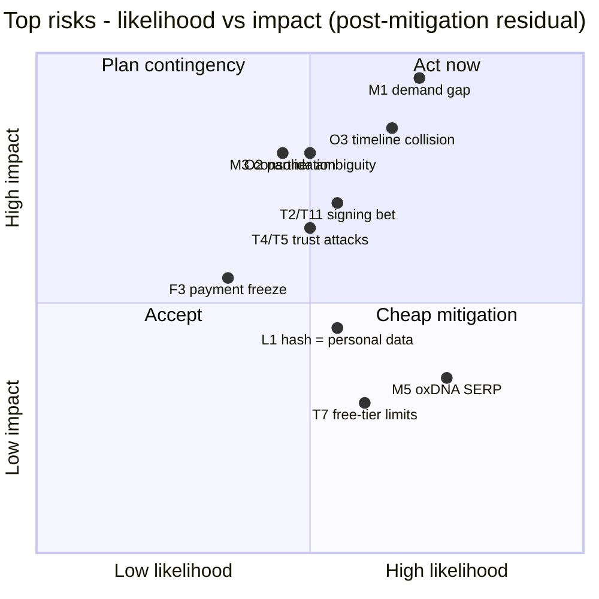
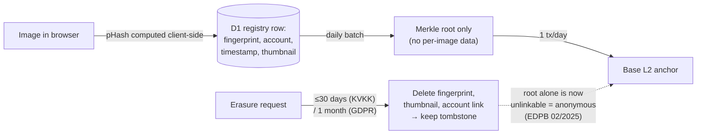

# 05 — OzDNA Risk Register

> **Changelog**
> 2026-07-06 · ratification pass — M1 gate now defers to 07 §2.3

*Written July 6, 2026 · Find Below Ventures · Part of the pre-implementation planning corpus (`plan/00-INDEX.md`). Audience: future Claude Code sessions and the (non-engineer) founder. All volatile facts below were re-verified on July 6, 2026 with sources inline; anything that could not be verified is prefixed **UNVERIFIED:**.*

**Cross-document ownership:** stack choices live in `02-TECH-STACK.md`, algorithm thresholds in `03-ALGORITHMS.md`, API schemas / MVP scope in `04-MVP-SPEC.md`, cost numbers in `06-COST-MODEL.md`, GTM/SEO/PR in `07-GTM-SEO-PR.md`, gates and dates in `08-ROADMAP-GATES.md` (real filenames on disk; `plan/00-INDEX.md` is not yet written as of 2026-07-06). This document owns: the risk list, tripwires, kill thresholds, and the legal analyses.

---

## How to read this register

| Field | Meaning |
|---|---|
| **ID** | `T` technical, `M` product/market, `L` legal/regulatory, `O` operational, `F` financial |
| **L / I** | Likelihood / Impact, each Low–Med–High. Score = L×I with L=1, M=2, H=3 (max 9) |
| **Tripwire** | The leading indicator. When you see it, the risk is materializing — act, don't debate |
| **Posture** | **DECIDE-NOW** = a design or business decision must be locked before/at MVP build. **MONITOR** = watch the tripwire, act if it fires |

**Review cadence:** re-read this register at every gate in `08-ROADMAP`, minimally: Aug 1 (pre-PR), Oct 1 (pre-build go/no-go), Dec 1 (pre-launch). Update statuses in place; don't fork the file.

---

## 1. TECHNICAL

| ID | Risk | L | I | Tripwire | Mitigation (summary) | Posture |
|---|---|---|---|---|---|---|
| T1 | Browser WASM bundle too heavy / fails on mobile | M | M | >20% of beta users fail to complete signing on mobile; WASM payload >8 MB brotli | Lazy-load WASM only on sign click; cap uploads (25 MB / ~50 MP); device test matrix in week 1 of build | DECIDE-NOW (spike) |
| T2 | In-browser C2PA signing immaturity (`@contentauth/c2pa-web` is pre-1.0) | M | H | Spike fails; breaking API change; repo goes quiet >90 days | Pin exact version; wrap behind our own adapter; 2-day signing spike BEFORE building UI; documented fallback path | DECIDE-NOW (spike) |
| T3 | Perceptual-hash false positives at scale | M | H | FP rate >0.1% on 10k-image test corpus; any wrong-attribution complaint | Multi-hash agreement before showing a match; tiered verdict language; never present a fingerprint match as proof | DECIDE-NOW (verdict language) |
| T4 | Adversarial second-preimage crafting (attacker forges an image that matches a real record) | M | H | Public pHash-forgery tooling appears; oracle-style query patterns against verify API | Fingerprint match alone NEVER yields "authentic"; side-by-side thumbnails; rate-limit + coarse similarity buckets on the public matcher | DECIDE-NOW (verdict language) |
| T5 | Registry spam / poisoning (mass-registering other people's images) | M | H | One account >500 registrations/day; first rights-holder complaint | Honest first-registration semantics in ALL copy; no exclusivity claims; rate limits, abuse reporting, tombstones; ToS prohibition | DECIDE-NOW (semantics) |
| T6 | Key compromise (gas wallet, Cloudflare account, and any OzDNA-held signing cert — **scope depends on T11**) | L | H | Any secret in a commit (gitleaks in CI); anomalous signing volume | Secrets only in Cloudflare secrets/password manager — note an OzDNA cert can never be shipped to browsers (see T11); revocation & re-key runbook written before launch; gas wallet ≤$50; 2FA everywhere | DECIDE-NOW (runbook) |
| T7 | D1/Workers free-tier exhaustion or Cloudflare account suspension | M | M | Any daily quota >50% for 3 consecutive days | Budget Workers Paid $5/mo from launch month; Turnstile + per-IP rate limits; CDN-cache verify pages; portable infra (wrangler config + nightly export) | DECIDE-NOW ($5/mo) |
| T8 | Data loss — the registry DB **is** the moat | L | H | Backup job failure alert; failed quarterly restore drill | Nightly D1 export to R2 + weekly off-Cloudflare copy; on-chain merkle roots double as integrity check of restores; quarterly restore drill | DECIDE-NOW (backup job in MVP scope) |
| T9 | Anchor-chain reorg / sequencer outage delays anchoring | M | L | Anchor queue age >24 h | Anchoring is async by design; mark "anchored" only after L1 finality; queue-and-retry; ToS promises "within 7 days", not instant | DECIDE-NOW (async design) |
| T10 | Base network dependency (Coinbase-run L2) | L | M | Base fee/policy change; "crypto" association becomes a PR liability | `AnchorProvider` abstraction + `chain_id` column from day 1; optional free OpenTimestamps (Bitcoin) redundancy for neutrality | DECIDE-NOW (schema) |
| T11 | Signing key model undefined — whose key signs? An OzDNA-held cert cannot sign in the browser without shipping the private key to every client (instant compromise); per-user browser keys change what a Tier A verdict asserts | H | H | The August spike (T2) finds no fully client-side signing call in v0.12.0 | Lock the key model at the spike, before any UI: option A (per-user keys, self-signed) or option B (OzDNA cert + remote-signing Worker) — deep dive below | DECIDE-NOW (spike answers it) |

### T1/T2 deep dive — the WASM signing bet

The whole zero-cost architecture rests on hard rule 6: the client's browser does the signing. Verified July 6, 2026:

- `@contentauth/c2pa-web` current documented version is **v0.12.0** — pre-1.0, API still moving. The typedoc shows both a **Reader** API (`c2pa.reader.fromBlob()`) and a **Builder** API (`c2pa.builder.new()`, `setIntent()`, `addIngredientFromBlob()`, `toArchive()`/`fromArchive()`), i.e. manifest *construction* in the browser is real. Source: https://contentauth.github.io/c2pa-js/modules/_contentauth_c2pa-web.html (fetched Jul 6, 2026).
- The monorepo (https://github.com/contentauth/c2pa-js) is actively maintained (sibling release `@contentauth/c2pa-node@0.6.0` on June 17, 2026); the old `c2pa` npm package is deprecated in favor of `@contentauth/c2pa-web` (https://www.npmjs.com/package/c2pa).
- **UNVERIFIED:** whether the v0.12.0 Builder exposes a fully client-side *signing* call with a locally held key (vs. a remote-signer callback), and the actual WASM bundle size on the wire. Neither is published anywhere I could reach — and the typedoc documents **no `sign()` method at all**, so the spike will almost certainly force the T11 key-model decision rather than merely confirm a happy path.

**Plain-language rationale:** a pre-1.0 library is fine to build on *if* we (a) pin the exact version in `package.json` (no `^`), (b) put every call to it behind one adapter module of ours (`lib/signer.ts`) so swapping libraries touches one file, and (c) prove it works before writing any UI.

**The mandatory spike (2 days max, ideally one pre-build afternoon in August):** sign a JPG with `@contentauth/c2pa-web` on desktop Chrome, Android Chrome (mid-range device), and iOS Safari; validate the output with `c2patool` on the command line. The spike must answer three questions, not one: ① does signing complete on all three devices; ② **which key model does v0.12.0 actually support** — a locally held key (enables T11 option A) or only a remote-signer callback (forces T11 option B); ③ what is the real WASM wire size. Pass = key model locked under T11 and proceed. Fail after 2 days = fallback ladder, in order: ① `@trustnxt/c2pa-ts` (pure TypeScript, no native deps — runs in Workers and browsers; https://www.npmjs.com/package/@trustnxt/c2pa-ts) for a server-assisted signing path on a Worker — **itself pre-1.0 (v0.14.0 as of 2026-07-06 per 02-TECH-STACK §2, implements spec v2.1 where we cite v2.4, and its README self-describes as "under active development and not fully functional yet"); spend 30 minutes of this same spike smoke-testing its signing path so the fallback is validated now, not discovered broken under October time pressure**; ② server-side `@contentauth/c2pa-node` — but that needs a Node host, which breaks Cloudflare-first, so it is last. Exact stack call and adapter shape: `02-TECH-STACK.md`.

### T11 deep dive — whose key signs? (decide at the spike, not in October)

The register cannot stay silent here: T6 as first drafted treated "the signing cert" as a server-side secret, while hard rule 6 and K2 assume signing happens entirely in the user's browser. Those are incompatible until the key model is chosen — an OzDNA-held certificate can never sign in the browser without being shipped inside the page to every client, which is instant, unrecoverable compromise. Two coherent options, both consistent with hard rule 5's "unknown source" posture:

- **Option A — per-user keys, generated in-browser, self-signed certs.** Fully client-side; the only server-side secrets left are the gas wallet and the Cloudflare account (T6 shrinks to exactly that). The trade: Tier A then asserts only *"signed with the key the registrant used"* — OzDNA vouches for nothing about the signer's identity, and the Tier A wording in the T3/T4/T5 deep dive must say so explicitly.
- **Option B — one OzDNA cert held server-side, applied by a remote-signing endpoint on a Worker.** The browser builds the manifest; the Worker signs it. Consistent with T6 as originally written, but it **partially breaks "client pays compute"** — the per-signature Worker CPU cost must be added to `06-COST-MODEL`, and the signing endpoint becomes an abuse target (rate limits per T5).

**The August spike decides which options are even available** (see the UNVERIFIED note above — v0.12.0's typedoc documents no signing call). Record the answer here, under this heading, the day the spike ends; every downstream document (`02-TECH-STACK` adapter shape, `04-MVP-SPEC` verdict copy, `06-COST-MODEL`) keys off it.

> **Consistency-pass update (2026-07-06):** `02-TECH-STACK.md` §1 subsequently verified, from the published 0.12.0 tarball typings, that `Builder.sign(signer, format, blob)` **does exist**, with a callback `Signer` interface (`{sign, reserveSize, alg}` — no certificate field) — i.e. the remote-signer path (**T11 option B**) is confirmed available, and `03-ALGORITHMS.md` §4.2 has locked the hybrid remote-signing design on that basis (option A is rejected there as key-shipping). The spike's remaining job is the callback payload shape (raw ES256 signature vs full COSE_Sign1), device performance, and WASM wire size — not existence. Rule 6's 2026-07-06 ratification settles the last open tension in option B: the free flow signs client-side (client pays compute), while paid API tenants use metered server-side Worker signing priced into their tier — so the remote-signing endpoint is the sanctioned paid path, not a violation of "client pays compute" (per-signature Worker cost is 06's to price, not a blocker here).

### T3/T4/T5 deep dive — the three trust attacks

These three risks share one root: **people will try to make our verify page lie.** The defense is layered verdict semantics, owned here, with numeric thresholds owned by `03-ALGORITHMS`:

1. **Verdict tiers (locked wording policy, not UI copy):**
   - Tier A — "Cryptographic signature valid" (C2PA manifest verifies) → strongest claim we make. Exact wording depends on the T11 key model: under per-user keys (option A) it must read *"signed with the registrant's key"* — OzDNA never vouches for the signer's identity, consistent with hard rule 5's "unknown source" posture.
   - Tier B — "Anchored in registry on {date}" (hash inclusion-proof against an on-chain merkle root) → proves *when*, not *who*.
   - Tier C — "Visually similar to registered record #N" (perceptual match) → explicitly labeled *similarity, not proof*, always with side-by-side thumbnails so a human confirms.
   - A fingerprint match must NEVER escalate the verdict to "authentic". This single rule defuses most of T4.
2. **False positives (T3):** a 64-bit DCT pHash at typical Hamming thresholds *will* collide at registry scale — this is math, not a bug. Require agreement of two independent fingerprints (e.g., pHash + PDQ; final choice and thresholds in `03-ALGORITHMS`) before surfacing a Tier C match, and tighten thresholds as the registry grows.
3. **Adversarial crafting (T4):** collision attacks on perceptual hashes are established literature (the 2021 NeuralHash collisions are the famous precedent). Attackers iterate against a public matcher, so: per-IP rate limits + Cloudflare Turnstile on the verify endpoint, return coarse buckets ("high/medium similarity") instead of raw scores, and log query patterns.
4. **Spam/poisoning (T5):** someone bulk-registers scraped Getty images, then "proves" ownership. The honest answer is built into the product language: a registry record means *"this account was first to register this fingerprint with OzDNA at this time"* — never "this account owns/created this". No exclusivity claim, ever. Plus: email verification before registering, free-tier rate caps (e.g., 20 images/day — final number in `04-MVP-SPEC`), bulk only on paid tiers (payment identity = accountability), abuse-report button, and tombstoning of confirmed-abusive records. C2PA-signed-at-creation records get a visually distinct badge vs. bare fingerprint registrations, so honest records outrank squatters.

**Why this framing is also the legal shield:** if we never claim exclusivity or ownership, a squatter registering someone else's photo has not caused us to publish a false statement — the record remains literally true. See L5 for ToS language.

### T7/T8 deep dive — Cloudflare free-tier numbers (verified Jul 6, 2026)

| Service | Free tier | What breaks first |
|---|---|---|
| Workers | 100,000 requests/day, 10 ms CPU/invocation | One HN-frontpage day or one scraper exhausts it; requests then fail |
| D1 | 5 GB total, 500 MB/database, 10 databases, 5M rows read/day, **100K rows written/day**, resets 00:00 UTC; queries **error** once the cap is hit | Row-writes cap registrations (each registration = several writes) |
| KV | 1 GB, 100K reads/day, 1K writes/day | The 1K writes/day makes KV unusable for anything write-y |
| R2 | 10 GB-month, 1M Class A + 10M Class B ops/month, zero egress fees | Comfortable for backups + thumbnails |

Sources: https://developers.cloudflare.com/workers/platform/pricing/, https://developers.cloudflare.com/d1/platform/limits/, https://developers.cloudflare.com/kv/platform/limits/ (all fetched Jul 6, 2026).

**Mitigation economics:** Workers Paid is **$5/mo minimum** and converts daily caps into monthly ones (10M requests/mo, 30M CPU-ms/mo included; overage $0.30/M requests) — it fits inside the pre-approved ~$20/mo and should simply be budgeted from launch month (`06-COST-MODEL` owns the final number). The graver risk is **account suspension** (rare, but Cloudflare is a single point of failure): keep everything reproducible (`wrangler.toml` + migrations in repo) and backups off-Cloudflare so a re-host takes days, not weeks.

**Backup strategy (T8):** D1 Time Travel gives point-in-time restore — **7 days on Free, 30 days on Paid** (https://developers.cloudflare.com/d1/reference/time-travel/, fetched Jul 6, 2026). Time Travel is not a backup (it dies with the account), so: nightly `wrangler d1 export` (or REST-API export per Cloudflare's "Export and save D1 database" guide) to R2, plus a weekly copy pulled to the founder's machine. The on-chain merkle roots are a free integrity check: after any restore, recompute batch roots and compare to chain — mismatch means the restore is incomplete. Quarterly restore drill goes in the ops checklist (`04-MVP-SPEC`).

### T9/T10 deep dive — chain dependency

Base transactions cost well under a cent (typical tx <$0.01; simple ops $0.002–0.02; minimum base fee 0.005 gwei — https://docs.base.org/base-chain/network-information/network-fees, https://openliquid.io/blog/base-chain-gas-fees-explained/, fetched Jul 6, 2026). Batched daily anchoring (one tx carrying one merkle root for the whole day) costs effectively $0 — the $0.0001/asset benchmark from the blueprint is conservative. The real risks are availability and optics, not cost:

- Base is run by Coinbase with a centralized sequencer; pre-confirmation reordering and occasional outages are possible. Design answer: **anchoring is asynchronous**. Registration succeeds instantly (record + fingerprint stored); anchoring happens in a queue; a record shows "anchor pending" until the batch tx reaches L1 finality; retries are idempotent. Never block the user path on the chain, and never promise anchor latency tighter than "within 7 days" in ToS (in practice it will be daily).
- Chain-agnosticism is a grant strategy AND a hedge: the `anchors` table carries `chain_id`, `tx_hash`, `merkle_root`, `batch_date` — adding a second chain is a config change (schema owned by `04-MVP-SPEC`). Optionally also stamp weekly roots with OpenTimestamps (free, Bitcoin-anchored) so no single chain — and no "crypto company" narrative — can hold the product hostage.

---

## 2. PRODUCT / MARKET

| ID | Risk | L | I | Tripwire | Mitigation (summary) | Posture |
|---|---|---|---|---|---|---|
| M1 | Demand gap — no SME procurement evidence yet; the waitlist IS the test | H | H | Sept 30 BUILD gate (`07-GTM-SEO-PR` §2.3) not met | Instrumented, segmented waitlist + outbound validation; single binding gate ratified 2026-07-06 in `07-GTM-SEO-PR` §2.3 (GO/PIVOT/KILL framing below defers to it) | DECIDE-NOW (gate ratified 2026-07-06 → 07 §2.3) |
| M2 | Adobe expands its free app (video, API, non-Adobe accounts) | M | M | Adobe ships a public API or video signing | Differentiate on neutrality + API-first + registry; never compete on free signing | MONITOR |
| M3 | OpenAI/Google platform-level marking consolidates the market | M | H | OpenAI API image outputs ship C2PA-signed by default with trusted certs | The registry (stripped-copy matching) is the piece their signing doesn't solve — keep it the core; target open-weight/long-tail GenAI apps | MONITOR |
| M4 | C2PA conformance cost shock | M | M | Reply from conformance@c2pa.org quotes ≥$5k/yr | Already the posture: own verify page + anchor needs no trust list; conformance becomes a grant-funded milestone | MONITOR (email sent = action ①) |
| M5 | oxDNA (Oxford simulation tool) dominates the SERP | H | L→M | GSC shows "ozdna" queries autocorrected to "oxdna"; brand CTR <30% on brand queries | Never rely on brand SEO for acquisition — intent queries carry GTM; distinctive collocations ("OzDNA proof of origin"); Organization schema markup | MONITOR |
| M6 | Partner-site migration slips past mid-July, compressing the Aug 2 window | M | H | Jul 15: no agreed migration date | Hard fallback: deploy waitlist on a fallback domain by Jul 18 regardless; 301 to ozdna.com later | DECIDE-NOW (fallback domain) |
| M7 | Etsy enforcement figures are single-sourced | M | M | No second source found before seller-wedge activation | Use only the multi-source fact (mandatory disclosure since Jan 14, 2026) in copy; never put the 12k/8.5k numbers in the whitepaper | DECIDE-NOW (copy rule) |

### M1 deep dive — the demand test, with numbers

This is the #1 risk in the register. The legal duty (EU AI Act Art. 50, applying Aug 2, 2026, grace to Dec 2, 2026 for existing systems) falls on GenAI *providers* — but there is **zero procurement evidence** yet that small GenAI companies buy third-party marking tools rather than ignoring the duty, waiting for enforcement, or getting marking free from their model API vendor. The waitlist is the test, and a test without pre-committed thresholds is theater. **The Sept-30 gate is RATIFIED (2026-07-06) and lives in `07-GTM-SEO-PR` §2.3 as the single binding gate — BUILD only if waitlist total ≥75 AND AI-company segment ≥25 AND ≥5 discovery calls.** The GO/PIVOT/KILL framing below is retained, but every binding number is 07 §2.3's; this table no longer sets its own:

**Instrumentation (build into the landing page, action ③):** segment selector (AI company / marketplace seller / legal-evidence / creator-other), work-email detection (flag free-mail domains), one qualifying checkbox ("we need to comply with EU AI Act marking by Dec 2"), one price-anchor question ("would you pay $49/mo for this?" yes/no/maybe).

**Active validation (not just passive signups):** after Jul 22, the EU Code of Practice signatory list is a lead list (CLAUDE.md clock). Send 20 personalized outbound emails to small GenAI signatories + 20 to non-signatory small GenAI apps; book 5 discovery calls.

> **Precedence note (ratified 2026-07-06):** the Sept 30 gate is owned by `07-GTM-SEO-PR` §2.3 and was ratified there as the single binding gate — **BUILD at ≥75 total AND ≥25 AI-company segment AND ≥5 discovery calls** (07 also owns any PARK/EXTEND branch). The old 05 M1 variant (the ≥150 / ≥30 numbers) is retired; the table below is risk-register framing that defers to 07 §2.3 for every binding number.

| Verdict (evaluate Sept 30, 2026) | Condition | Action |
|---|---|---|
| **GO** — build full MVP in October | The `07-GTM-SEO-PR` §2.3 BUILD gate is met: waitlist total ≥75 AND AI-company segment ≥25 AND ≥5 discovery calls confirming Dec 2 pain + willingness to pay $49+/mo | Proceed per `08-ROADMAP` |
| **PIVOT** — lead with wedge #2 | 07 §2.3 gate missed on the AI-company axis but marketplace-seller demand is clearly present, or discovery calls reveal a different buyable pain | Re-scope MVP around the seller badge; API becomes phase 2 |
| **KILL / PARK** | 07 §2.3 gate missed on total demand, *despite* the Aug 2 PR wave performing (≥3 press mentions or ≥5,000 landing-page visits) | Do not build. Keep the landing page + content as an SEO asset; re-evaluate at the Feb 2, 2027 consortium wave |

Two rules close the gaps where renegotiation lives (pre-mortem Story 1):

1. **Default branch — every outcome partitions cleanly around the 07 §2.3 gate.** Any Sept 30 result that does not fully meet the `07-GTM-SEO-PR` §2.3 BUILD gate is, by definition, not GO: the founder writes a PIVOT-or-KILL decision down on Oct 1, **with GO off the table**. A near-miss (e.g., 120 signups, 25 AI-segment cleared, but only 4 discovery calls — one axis short) still fails the gate and may not be argued back into GO; that exact argument is how thresholds die.
2. **The PR-performance test is binary.** "PR performing" = ≥3 press mentions OR ≥5,000 landing-page visits — meeting either one counts. Anything below that (including the 1,000–4,999-visit / <3-mention band) means the demand test was inconclusive rather than failed — distribution, not the product, was the bottleneck. Whether that buys a one-time extension or triggers PARK follows `07-GTM-SEO-PR` §2.3's EXTEND/PARK branch; 05 sets no deadline number of its own here, and rule 1's default branch still governs the gate outcome itself.

### M3 deep dive — consolidation

OpenAI and Google announced a joint dual-layer marking system May 19, 2026 (blueprint §7). If model-level marking with trusted certificates becomes a default of the big APIs, wedge #1 shrinks to GenAI apps NOT built on those APIs — open-weight image models (SD forks, Flux), on-prem deployments, and apps that post-process outputs (which breaks upstream signatures — a fact that works in our favor). The registry stays valuable in every scenario because platform stripping (blueprint §2, RAND) is unsolved by signing alone. Response if the tripwire fires: reposition copy from "get marked" to "keep your marking verifiable after platforms strip it", and double down on wedges #2/#3 which consolidation doesn't touch.

### M5 deep dive — the oxDNA name collision (verified)

"oxDNA" is a well-established University of Oxford coarse-grained DNA/RNA simulation framework with an academic paper, a public webserver (oxdna.org), active GitHub tooling, and years of citations (https://dna.physics.ox.ac.uk/, https://academic.oup.com/nar/article/49/W1/W491/6261791 — confirmed dominating the SERP Jul 6, 2026). One letter separates the brands and Google will fuzzy-match. Consequences and posture:

- Brand-query SEO will bleed for years. Accept it: acquisition runs on **intent queries** ("EU AI Act content marking", "Etsy AI disclosure badge" — `07-GTM` owns the query map), not brand queries.
- Always use collocations in titles/anchors: "OzDNA proof of origin", "OzDNA provenance" — never bare "ozdna" in a title tag. Ship `Organization` structured data early. The Turkish word *öz* ("origin/essence") is a PR story that also disambiguates.
- Do not rename. The domain is owned, the pun is good, and the colliding entity is non-commercial academic software in a different universe — confusion risk is SEO-only, not legal (**UNVERIFIED:** no trademark search performed on "oxDNA"/"ozDNA"; do a 15-minute EUIPO/TÜRKPATENT/USPTO screen before the whitepaper ships).

### M6 deep dive — domain fallback (decide now)

The Aug 2 PR moment needs a live capture surface. The partner conversation about migrating the LLM-cost site off ozdna.com is pending (CLAUDE.md, target mid-July). **Rule: the PR calendar does not depend on the partner's calendar.** If by **Jul 15** there is no agreed migration date, deploy the waitlist by **Jul 18** on a fallback (a Cloudflare Pages `*.pages.dev` URL is $0; a throwaway domain like `getozdna.com` is ~$10 one-time if a real domain is wanted) and 301 to ozdna.com after migration. Redirects preserve most SEO value; a missed news cycle preserves nothing. Interacts with O2 — see below.

---

## 3. LEGAL / REGULATORY

| ID | Risk | L | I | Tripwire | Mitigation (summary) | Posture |
|---|---|---|---|---|---|---|
| L1 | Perceptual hash of a personal photo = personal data (GDPR/KVKK) → erasure vs immutable anchor | M | M | First data-subject request; final EDPB blockchain guidelines diverge from draft | Tombstone design (below) — only merkle roots on-chain, everything personal deletable off-chain; DPA for API customers | DECIDE-NOW (design constraints) |
| L2 | EU AI Act obligations on US as a tool vendor | L | M | We add any AI/ML feature; a customer claims our marketing promised "compliance" | v1 has no AI system → no direct Art. 50 duties; copy says "helps you meet Art. 50(2) machine-readable marking", never "makes you compliant" | DECIDE-NOW (copy rule) |
| L3 | Turkey Law 7518 CASP boundary for our own gas wallet | L | H | Any suggestion of holding/moving crypto for users; SPK guidance expanding "service" definition | Gas wallet = own operational asset of the UAE entity, ≤$50, fiat-only customer payments; one-page counsel memo | DECIDE-NOW (wallet ownership) |
| L4 | UAE FZE selling into EU — VAT/OSS burden | H (without MoR) | M | Paddle account rejected/delayed; first EU B2C sale without VAT handling | Merchant of record (Paddle — verified supports UAE + TR sellers) from day 1; revisit at ~$5k MRR | DECIDE-NOW (MoR) |
| L5 | Liability for wrong verify verdicts | M | M | First legal threat / takedown demand over a verdict | Tiered verdict language (T3/T4) + as-is warranty disclaimer + liability cap in ToS; no consumer-rights overreach in EU | DECIDE-NOW (ToS at launch) |
| L6 | C2PA/CAI trademark misuse in marketing | M | M | Any use of the CR pin or "Content Credentials" as our badge before conformance | Say "implements the open C2PA specification" + "CAI member" (once joined); no CR pin, no "certified/conformant" until conformance passed | DECIDE-NOW (copy rule) |
| L7 | California SB 942 / AB 853 duties applying to us | L | L | CA amends definitions again (annual legislative cycle) | Verified: we are not a "covered provider" (not a GenAI system) nor a large platform nor a device maker — no direct duties | MONITOR |

### L1 deep dive — KVKK + GDPR analysis (the erasure-vs-immutability question)

**Is a perceptual hash of a personal photo personal data? Almost certainly yes, when linkable.**

- GDPR Art. 4(1) / KVKK Art. 3: personal data = any information relating to an identified or *identifiable* natural person (KVKK Law 6698 uses the same definition — https://www.kvkk.gov.tr/Icerik/7456/Purpose-and-Scope-of-The-Personal-Data-Protection-Law-No-6698).
- EDPB Guidelines 01/2025 on pseudonymisation (adopted Jan 16, 2025) treat hashed personal data as **pseudonymized, therefore still personal data** — hashing alone is essentially never anonymization (https://www.edpb.europa.eu/system/files/2025-01/edpb_guidelines_202501_pseudonymisation_en.pdf; analysis: https://www.stibbe.com/publications-and-insights/key-takeaways-and-insights-from-the-edpb-pseudonymisation-guidelines).
- A perceptual hash is *stronger* evidence of personal data than a cryptographic hash: it is **designed to be matchable** — its entire purpose is to link a stripped/re-encoded copy back to the original record. If the photo depicts a person and the registry links hash → account → image metadata, the hash "relates to" that person by means we ourselves provide.
- It is, however, most likely **not biometric/special-category data**: GDPR Art. 4(14) requires processing "for the purpose of uniquely identifying a natural person" from physical characteristics. A pHash fingerprints *the image file*, not the face; we never do face matching. Keep it that way — any face-recognition feature would flip this analysis (and KVKK treats biometric data as special-category with heavier duties). This distinction is our analysis, not counsel's — flag for the one-time legal review.

**Roles:** (a) Self-serve users signing/registering their own images → OzDNA is **controller** (KVKK: *veri sorumlusu*) for account + registry data; lawful basis = contract (GDPR Art. 6(1)(b) / KVKK Art. 5(2)(c)). (b) Compliance-API customers sending end-user content → the customer is controller of the content; we are **processor** for the processing itself → a signable DPA (Art. 28) must exist at API launch (template task in `04-MVP-SPEC`); for the minimal registry entry (fingerprint + customer ID + timestamp) we act as controller for the service's core purpose. (c) Verify-page matching of uploaded images → legitimate interest (Art. 6(1)(f)) with a documented balancing test: the match serves the *data subject's own* protection against impersonation.

**The design answer to right-to-erasure vs immutable anchors — verified against EDPB Guidelines 02/2025 on blockchain** (adopted for consultation April 2025, consultation closed June 9, 2025 — https://www.edpb.europa.eu/our-work-tools/documents/public-consultations/2025/guidelines-022025-processing-personal-data_en). The EDPB's position: store personal data **off-chain**; on-chain data can be rendered effectively anonymous if it does not allow direct identification *and* the off-chain data enabling indirect identification is erased on request. That is exactly our architecture, with three constraints that MUST hold:

1. **Never put per-image hashes on-chain** — only the merkle root of a batch. A root over thousands of leaves reveals nothing without the leaves.
2. **Merkle proofs are served from our DB, not published to any permanent archive.** On erasure, the leaf (fingerprint + record) and its proof path are deleted; the registrant is warned in the erasure flow that their inclusion proof dies with the record.
3. **Thumbnails and any stored image derivatives are personal data** with the same deletion path. (Cheapest compliant option: store no thumbnails of human-depicting images at all in v1 — `04-MVP-SPEC` decides.)

The registry row becomes a **tombstone**: `{record_id, created_at, deleted_at, reason}` with all content fields nulled — the verify page then answers "a record existed here and was deleted", which is honest and preserves referential integrity. Residual risk: the EDPB blockchain guidelines are still draft; the final text could harden (tripwire: final adoption — check quarterly). Note also the EDPB's pointed advice that if you don't need blockchain's integrity property, don't use blockchain — our answer is that a *public, no-trust-list-needed timestamp* is precisely the integrity property v1 sells (hard rule 5).

**KVKK specifics:** data-subject requests must be answered within **30 days** (By-Law on Erasure, Destruction or Anonymization — https://www.kvkk.gov.tr/Icerik/6636/By-Law-on-Erasure-Destruction-or-Anonymization-of-Personal-Data). **UNVERIFIED:** whether a UAE-established entity serving Turkish users must register with VERBIS (the TR data-controller registry), and the exact post-2024 KVKK Art. 9 cross-border transfer mechanics (SCC filing with the Board) as they apply to Cloudflare's global network — both are questions for the one-time TR counsel review (see L3).

**UNVERIFIED (same counsel memo) — GDPR Art. 27 EU representative.** The GDPR mirror of the VERBIS question: a non-EU (UAE-established) controller offering services to EU data subjects must generally appoint an **EU-based representative** under GDPR Art. 27. The Art. 27(2) exemption (occasional processing, no large-scale special-category data, low risk) might or might not fit once a registry of user images is the core service — "occasional" is exactly the kind of call this register must not make alone, and representative services cost real money at this budget. Get the duty confirmed or the exemption analysis documented in the L3 memo before selling the compliance API into the EU.

### L3 deep dive — Turkey Law 7518 and our gas wallet (now research-backed)

**What the law actually says (verified Jul 6, 2026):** Law No. 7518, amending Capital Markets Law No. 6362, was passed June 26, 2024 and published in the Official Gazette July 2, 2024. It defines a Crypto Asset Service Provider as "platforms, institutions providing crypto asset custody services, and other institutions designated to provide services related to crypto assets, including the initial sale or distribution of crypto assets", requires an SPK (Capital Markets Board) license to operate as one, and makes **unlicensed CASP activity punishable by 3–5 years' imprisonment plus a judicial fine of 5,000–10,000 days**. Sources: https://kesikli.com/news-insight/2024-07-26-turkiyes-new-crypto-law-transforming-the-turkish-crypto-market/, https://www.legal500.com/developments/thought-leadership/the-legal-regime-of-crypto-assets-in-turkey-and-the-role-of-regulatory-institutions/, https://www.admdlaw.com/the-legal-regime-of-crypto-assets-in-turkey-and-the-role-of-regulatory-institutions/. This confirms the severity behind hard rule 2, previously cited without direct backing.

**Why our gas wallet is outside the perimeter (analysis):** every limb of the CASP definition describes providing crypto-asset services *to others* — operating a platform, custodying *clients'* assets, intermediating purchase/sale, conducting initial sale/distribution. OzDNA does none of these: the company holds a de-minimis amount of ETH in **its own** wallet and spends it on network fees for **its own** transactions (writing merkle roots). Customers pay in fiat via a merchant of record; no customer ever touches, owns, sends, or receives a crypto asset through us; we distribute no token (hard rule 1). Buying a small amount of ETH for operational use is analogous to a company buying any foreign currency to pay a foreign supplier.

**Residual exposure and the guardrails that keep it near zero:**

1. **Wallet is owned and funded by the UAE entity** (Find Below Ventures, Sharjah), not the founder personally and not any TR entity. Balance kept ≤$50 (a year of daily anchoring costs under $5 at verified Base fees — see T9/T10).
2. **Never accept crypto as payment** — independent reason: **UNVERIFIED (verify with counsel):** Turkey's Central Bank regulation of April 2021 is widely reported to prohibit the use of crypto assets in payments; regardless of verification, fiat-only via MoR is already the plan.
3. **No feature may ever let users deposit, withdraw, or hold value** — this is hard rule 2 restated as a product-review checklist item for every future feature (watch: anything called "credits" that becomes transferable).
4. **UNVERIFIED:** whether UAE/Sharjah Publishing City FZ rules impose anything on a free-zone company holding a trivial operational crypto balance (SPC is not a VASP regime; VARA is Dubai-specific). One question for a UAE corporate services provider.
5. **Decide-now:** commission a one-page memo from a TR fintech lawyer covering: (a) gas-wallet-out-of-CASP-scope confirmation, (b) VERBIS/KVKK Art. 9 questions from L1, (c) the crypto-payments ban, (d) GDPR Art. 27 — whether OzDNA needs an EU-based representative or can document the Art. 27(2) exemption (from L1; if the TR lawyer won't opine on GDPR, this one question goes to whichever counsel reviews the DPA template). This is the single place in the plan where spending ~$300–500 on counsel is justified before launch; if the budget truly cannot bear it, the fallback is to route all chain interactions through a third-party anchoring API so the company never holds crypto at all (at the cost of a new dependency).

### L4 deep dive — selling from a UAE FZE into the EU

Verified (Jul 6, 2026): non-EU businesses selling B2C digital services to EU consumers owe **destination-country VAT from the very first sale — the €10,000 micro-threshold applies only to EU-established businesses** — via the non-Union OSS scheme with quarterly returns (https://europa.eu/youreurope/business/taxation/vat/one-stop-shop/index_en.htm, https://support.taxually.com/support/solutions/articles/80001155457-digital-services-vat-in-the-eu-non-union-oss). Doing this ourselves means an OSS registration in a member state, 27-country rate handling, and quarterly filings — absurd overhead at our scale.

**Decision: use a merchant of record.** Paddle acts as reseller (they are the seller of record and handle EU VAT entirely) and **supports sellers in both the UAE and Turkey** — neither is on their 28-country exclusion list (https://www.paddle.com/help/start/intro-to-paddle/which-countries-are-supported-by-paddle, fetched Jul 6, 2026). **UNVERIFIED:** Lemon Squeezy's supported-countries list (page returned 403; LS is also mid-migration to "Stripe Managed Payments" per their 2026 update — https://www.lemonsqueezy.com/blog/2026-update) — treat Paddle as primary, Polar.sh as backup candidate. MoR fees (~5% + fixed) are the cost of not thinking about VAT; revisit at ~$5k MRR. Apply for the Paddle account in **September** (KYC on a UAE FZE may be slow — see F3). B2B sales to VAT-registered EU businesses would be reverse-charge anyway, but self-serve checkout mixes B2C, so MoR covers the whole surface. UAE-side corporate tax treatment (9% CIT, free-zone qualifying income rules) is the accountant's domain — out of scope here.

### L5 deep dive — wrong-verdict liability and ToS design

Two failure directions: (a) **false negative** — an authentic, registered image shows "no record found" (bug, DB restore gap, hash drift after heavy re-encode) and the owner claims reputational damage; (b) **false positive** — T4's forged match lends our credibility to a fake. Design answers:

- The verdict tiers (T3/T4) are worded as **statements of registry fact**, not truth claims: "signature valid per C2PA spec", "record found/not found *in the OzDNA registry*", "visually similar to record #N — similarity is not proof of origin". A statement about our own database can be true even when the world disagrees.
- ToS (shipped at launch, not after — text lives with `04-MVP-SPEC` deliverables): service provided "as is"; no warranty that absence of a record means inauthenticity or that a match proves origin; aggregate liability capped at fees paid in the preceding 12 months (i.e., $0 for free users); explicitly "not legal advice, not a conformity assessment under the EU AI Act"; indemnity from users who register content they lack rights to (backs T5); abuse/appeal process for tombstoning.
- Caveat: liability caps and venue clauses have limited enforceability against EU **consumers** (unwaivable consumer rights); the cap protects against B2B claims, the honest verdict wording protects against everything else. TrueScreen/Truepic ToS are the structural references.

### L6 deep dive — what we may call ourselves (C2PA/CAI)

Verified: the C2PA Conformance Program page links Trademark Guidelines (hosted via jointdevelopment.org), the Interim Trust List **froze Jan 1, 2026 and is retired** (no new entries; legacy certs valid until expiry), and no fee schedule is published (https://c2pa.org/conformance/, fetched Jul 6, 2026). **UNVERIFIED:** the Trademark Guidelines' specific terms (the document itself was not retrievable today). Until read and until conformance is passed, the safe posture — consistent with hard rule 5:

| Allowed (factual, nominative) | Forbidden until conformance |
|---|---|
| "implements the open C2PA specification (v2.4)" | The CR "pin" icon anywhere in our UI or marketing |
| "member of the Content Authenticity Initiative" (after joining — action ②) | "Content Credentials" used as our product/badge name |
| "signatures verifiable on our own verify page + public chain anchor" | "C2PA certified / conformant / trusted", "appears as trusted in Verify" |

Decide-now: when joining CAI, download and file the Trademark Guidelines in `docs/` and adjust this table if it conflicts.

### L7 — SB 942 / AB 853 (verified: no direct duties on us)

AB 853 (signed Oct 13, 2025) delayed the California AI Transparency Act to **Aug 2, 2026** and extended it. A "covered provider" is a person that *creates a generative AI system* with >1,000,000 monthly visitors/users publicly accessible in California — that is our customers, not us. AB 853's new duties hit "large online platforms" (provenance *retention*) and capture-device manufacturers — also not us. Sources: https://www.troutmanprivacy.com/2025/10/california-ai-transparency-act-amendments-signed-into-law/, https://hintzelaw.com/blog/2025/10/19/california-amends-artificial-intelligence-transparency-act-and-passes-ai-defenses-act, https://infobytes.orrick.com/2025-10-17/california-delays-its-ai-transparency-act-and-passes-new-content-laws/. Marketing note: SB 942's free "AI detection tool" duty belongs to covered providers (checking *their own* systems' latent disclosures) — do not let copy imply we must or do provide AI detection (hard rule 3). California re-legislates annually — re-check definitions each January.

Similarly, the **EU AI Act imposes no direct duties on OzDNA in v1** (L2): we provide no AI system — perceptual hashing is deterministic signal processing, and hard rule 3 keeps classifiers out. Duties are our customers'; our copy sells help with Art. 50(2) machine-readable marking, never "compliance as a product". Re-assess instantly if any ML-based feature (including Feb 2027 detection-consortium work) enters the roadmap.

---

## 4. OPERATIONAL

| ID | Risk | L | I | Tripwire | Mitigation (summary) | Posture |
|---|---|---|---|---|---|---|
| O1 | Solo-founder bus factor; afternoons-only slippage | H | M | Two consecutive weeks with zero OzDNA afternoons; action-plan items slipping >2 weeks | Everything resumable from repo (this corpus is the mitigation); every session ends with committed state + `ACTION_PLAN.md` status update; each pre-build task timeboxed ≤1 afternoon | DECIDE-NOW (working agreement) |
| O2 | Partner relationship / equity ambiguity over the ozDNA brand & domain | M | H | Jul 15 passes with nothing in writing; migration date slips twice | **Formalize in writing before the Aug 2 PR** — see below | DECIDE-NOW (flagged hard) |
| O3 | MetalTakip priority collision in October | M | H | Oct 1: MetalTakip still demanding >50% of work time | Hard checkpoint Oct 1: cut MVP scope (per `04-MVP-SPEC` priority order), never slip the Dec 2 launch | DECIDE-NOW (calendar block) |
| O4 | Founder PR commitments eat build time | M | M | PR activity before landing page is live; >2 afternoons/week on press in October | Sequence rule: waitlist page (③) before PR push (⑤); every appearance must link the waitlist; PR capped during build weeks | DECIDE-NOW (sequence rule) |

### O2 deep dive — put the partner agreement in writing (the register's loudest flag)

Current state: the partner independently built the unrelated LLM-cost site now living on ozdna.com; the ozDNA name/domain is supposed to stay with this provenance product; the migration conversation is *pending*. Nothing is in writing. Every week of ambiguity compounds three risks at once: the domain becomes hostage (M6), brand equity from the Aug 2 PR accrues to an unowned asset, and a later success turns an informal understanding into an equity dispute — the classic startup killer.

**Minimum viable agreement (one page, before Aug 2):** ① ozdna.com domain registration transfers to (or is confirmed as held by) Find Below Ventures; ② the partner's product vacates the domain by a named date; ③ the partner's role in OzDNA, if any, and any equity/revenue expectation stated explicitly — including "none"; ④ who may sign for the brand publicly. If the partner is to be a co-founder, that is a bigger (vesting) conversation — have it *now*, not after traction. Only the founder can execute this; Claude's job is to keep flagging it until `ACTION_PLAN.md` marks it done.

### O1/O3 — the calendar is the strategy

The entire plan is a bet on three dates (Aug 2 / Dec 2 / Feb 2). A solo founder on afternoons, with MetalTakip primary until ~October, has zero schedule slack. Standing rules: (a) the **Oct 1 go/no-go** evaluates M1 thresholds AND MetalTakip load together; (b) if time is short, **cut scope, never the date** — the MVP priority order in `04-MVP-SPEC` exists precisely so the cut line is pre-decided; (c) "minimum viable Aug 2" is just a live landing page + one commentary pitch — two afternoons — and everything beyond is bonus; (d) credentials (registrar, Cloudflare, GitHub, Paddle) live in a password manager with a documented recovery path so illness or emergency doesn't strand the project.

---

## 5. FINANCIAL

| ID | Risk | L | I | Tripwire | Mitigation (summary) | Posture |
|---|---|---|---|---|---|---|
| F1 | Free-tier overrun costs | M | L | Any Cloudflare invoice >$10/mo | Bounded by design: Workers Paid $5/mo covers realistic 10× growth; R2 has zero egress fees; caps + alerts on | MONITOR |
| F2 | Gas price spikes | L | L | Anchoring cost >$5/mo | Daily→weekly batch frequency knob; ToS already promises ≤7 days (T9); even 100× spike ≈ <$30/mo | MONITOR |
| F3 | Payment-provider freeze / onboarding failure (UAE FZE + crypto-adjacent smell) | M | M | Paddle KYC stalls >3 weeks; first payout hold | Apply in September (buffer before Dec); zero crypto vocabulary in payment descriptions ("compliance & timestamping SaaS"); Polar.sh as backup; manual B2B invoice fallback | DECIDE-NOW (apply early) |
| F4 | Grants slower than needed | H | L | No grant decision by Q1 2027 | Plan already assumes $0 external money for MVP; grants fund conformance + growth, never survival; retro grants (Base) require shipped product — shipping is the application | MONITOR |

Cost math backing F1/F2 (details in `06-COST-MODEL`): fixed floor at launch ≈ **$5/mo** (Workers Paid) + domain renewal; anchoring at one Base tx/day ≈ **<$0.50/mo** at verified fees (<$0.01/tx — see T9/T10 sources); the pre-approved ~$20/mo ceiling holds roughly 4× headroom. The only fast way to lose real money in this architecture is holding a large gas balance (capped at $50, see L3) or a payout freeze after revenue starts (F3) — which is a cash-flow delay, not a loss, at MoR scale.

---

## Top 10 risks, ranked

| # | ID | Risk | L×I | Why it ranks here |
|---|---|---|---|---|
| 1 | M1 | Demand gap — nobody buys before Dec 2 | H×H=9 | The only risk that kills the thesis itself; everything else kills a component. The waitlist test with pre-committed thresholds is the whole pre-build phase |
| 2 | O3 | Timeline collision — MVP slips past the Dec 2 wave | M×H=6 | A January launch loses the news cycle AND the deadline urgency that powers wedge #1; the date is the moat a solo founder actually has |
| 3 | O2 | Partner/brand/domain ambiguity | M×H=6 | Unwritten agreements about the exact asset the Aug 2 PR will pump; compounding, and only the founder can fix it |
| 4 | M3 | Platform-level marking consolidation | M×H=6 | Could shrink wedge #1 structurally; the registry-not-signing focus is the hedge and must stay the core |
| 5 | T2 | In-browser signing library immaturity (v0.12.0) + T11 key-model unknown | M×H=6 | The architecture's free-compute premise rests on one pre-1.0 library that documents no signing call; a 2-day spike converts both this and the T11 whose-key-signs question from unknown to known |
| 6 | T4/T5 | Trust attacks — forged matches, registry squatting | M×H=6 | One credible "the proof site proved a fake" story at launch is unrecoverable for a trust product; verdict semantics defuse it in advance |
| 7 | L1 | Fingerprints are personal data; erasure vs anchors | M×M=4 | Fully answerable by design (tombstones + roots-only on-chain, EDPB-aligned) — ranks high only because the design constraints must be locked before schema work |
| 8 | M6 | Domain migration slip compresses Aug 2 window | M×H=6 (time-boxed) | Acute but cheaply hedged: the Jul 18 fallback-deploy rule removes most of it |
| 9 | F3 | Payment onboarding/freeze (UAE FZE) | M×M=4 | Only revenue-blocking failure mode not under our control; early application + backup provider bound it |
| 10 | T7/F1 | Cloudflare limits / account dependency | M×M→L | Cheap to bound ($5/mo + portable infra + off-Cloudflare backups); listed because the registry DB is existential (T8) even when the bill is not |

---

## The 3 kill-assumptions

If any of these is false, the project as designed dies. Each gets the cheapest, fastest test that could falsify it.

**K1 — "Small GenAI companies will pay $49–199/mo to a third party for Art. 50 marking before Dec 2, 2026."**
*If false:* wedge #1 evaporates; the compliance API has no buyers; grants and PR can't fix absent demand.
*Cheapest test ($0, ~3 afternoons, verdict by Sept 30):* the instrumented segmented waitlist (M1) + 40 outbound emails (20 to small EU Code of Practice signatories after the Jul 22 list closes — they've *publicly committed* to marking — and 20 to non-signatory small GenAI apps) + 5 discovery calls asking one question: "what's your plan for the Dec 2 machine-readable marking deadline, and would you pay $49/mo to close it this week?" The Sept-30 BUILD gate (`07-GTM-SEO-PR` §2.3), which the M1 GO/PIVOT/KILL framing defers to, is pre-committed.

**K2 — "C2PA signing runs acceptably in real browsers, including mid-range mobile, so clients pay the compute."**
*If false:* the zero-cost architecture breaks; server-side signing puts compute on our bill and off Cloudflare-first.
*Cheapest test ($0, ≤2 days, do it in August rather than waiting for October):* the T2 spike — sign a JPG with `@contentauth/c2pa-web@0.12.x` on desktop Chrome, a mid-range Android Chrome, and iOS Safari; validate output with `c2patool`; measure WASM download size and sign time. The same spike must lock the T11 key model (whose key signs — local per-user key vs. remote-signer Worker). Pass/fail criteria and the fallback ladder are written in T1/T2 and T11 above.

**K3 — "A fingerprint that survives platform stripping, matched against our registry, is valuable even without C2PA trust-list status."**
*If false:* the moat ("remember") is decoration, and v1 is just an unsigned-cert signing tool nobody trusts (hard rule 5 already concedes the trust list).
*Cheapest test ($0, ~2 afternoons):* run 20 test images through real Instagram/X/WhatsApp upload→download cycles; confirm C2PA metadata is stripped AND our perceptual match still hits within threshold (thresholds per `03-ALGORITHMS`); package the before/after as a one-page demo and show it to 5 fact-checkers (Teyit network) and 5 waitlist prospects. If neither audience leans in — the survival property doesn't sell — the registry needs re-positioning before a line of MVP code is written.

---

## Pre-mortem — July 2027, OzDNA is dead. What happened?

**Story 1 — the deadline that wasn't.** Dec 2 came and went. Enforcement didn't materialize in the first quarter, the big model APIs shipped default marking upstream, and small GenAI apps either ignored the duty or inherited compliance for free. The waitlist had told us this in September — 60 signups, 8 in the AI segment, discovery calls full of "we'll wait and see" — but the founder had already fallen in love, the kill thresholds got renegotiated instead of enforced, and October–December were spent building an MVP for a customer who never existed. *The register's answer: the Sept-30 gate was ratified 2026-07-06 (`07-GTM-SEO-PR` §2.3) and is binding — not renegotiable in October — and the KILL branch has a dignified exit (park as SEO asset, re-evaluate at the Feb 2027 consortium wave).*

**Story 2 — the missed window.** MetalTakip's 90-day plan ran long, the partner-domain conversation dragged into September with nothing in writing, the WASM spike waited until October and failed, and the fallback ate three weeks. Launch slipped to February 2027 — no news cycle, no deadline urgency, and two funded competitors had claimed the "EU AI Act content marking" SERP throughout the autumn. The product eventually shipped, fine and irrelevant. *The register's answer: the Jul 18 domain fallback rule, the August spike, the written partner agreement before Aug 2, and the Oct 1 cut-scope-never-the-date checkpoint exist precisely to break this chain at four separate links.*

**Story 3 — the trust product that broke trust.** Launch PR landed. Within weeks someone mass-registered scraped artist portfolios, a security researcher crafted a collision that our verify page blessed as a match, and a journalist wrote "the proof-of-origin site that proves nothing" — quoting our own overclaiming copy ("verified authentic") back at us. Refuting it took a month; the register never got a second first impression. *The register's answer: the tiered verdict language (T3/T4), honest first-registration semantics with no exclusivity claims (T5), rate-limited coarse-bucket matching, the abuse/tombstone flow, and L5's ToS are launch-blocking deliverables, not post-launch polish — a trust product's risk register is mostly about never needing benefit of the doubt.*

---

## Source list (all fetched/verified July 6, 2026)

- Law 7518 / TR CASP: https://kesikli.com/news-insight/2024-07-26-turkiyes-new-crypto-law-transforming-the-turkish-crypto-market/ · https://www.legal500.com/developments/thought-leadership/the-legal-regime-of-crypto-assets-in-turkey-and-the-role-of-regulatory-institutions/ · https://www.admdlaw.com/the-legal-regime-of-crypto-assets-in-turkey-and-the-role-of-regulatory-institutions/
- EDPB pseudonymisation (01/2025): https://www.edpb.europa.eu/system/files/2025-01/edpb_guidelines_202501_pseudonymisation_en.pdf · https://www.stibbe.com/publications-and-insights/key-takeaways-and-insights-from-the-edpb-pseudonymisation-guidelines
- EDPB blockchain (02/2025): https://www.edpb.europa.eu/our-work-tools/documents/public-consultations/2025/guidelines-022025-processing-personal-data_en · https://www.edpb.europa.eu/system/files/2025-04/edpb_guidelines_202502_blockchain_en.pdf
- KVKK 6698: https://www.kvkk.gov.tr/Icerik/7456/Purpose-and-Scope-of-The-Personal-Data-Protection-Law-No-6698 · https://www.kvkk.gov.tr/Icerik/6636/By-Law-on-Erasure-Destruction-or-Anonymization-of-Personal-Data
- SB 942 / AB 853: https://www.troutmanprivacy.com/2025/10/california-ai-transparency-act-amendments-signed-into-law/ · https://hintzelaw.com/blog/2025/10/19/california-amends-artificial-intelligence-transparency-act-and-passes-ai-defenses-act · https://infobytes.orrick.com/2025-10-17/california-delays-its-ai-transparency-act-and-passes-new-content-laws/
- Cloudflare limits/pricing: https://developers.cloudflare.com/workers/platform/pricing/ · https://developers.cloudflare.com/d1/platform/limits/ · https://developers.cloudflare.com/kv/platform/limits/ · https://developers.cloudflare.com/d1/reference/time-travel/
- c2pa-js: https://contentauth.github.io/c2pa-js/modules/_contentauth_c2pa-web.html (v0.12.0) · https://github.com/contentauth/c2pa-js · https://www.npmjs.com/package/c2pa (deprecation) · https://www.npmjs.com/package/@trustnxt/c2pa-ts
- Base fees: https://docs.base.org/base-chain/network-information/network-fees · https://openliquid.io/blog/base-chain-gas-fees-explained/
- Paddle countries: https://www.paddle.com/help/start/intro-to-paddle/which-countries-are-supported-by-paddle · Lemon Squeezy 2026 transition: https://www.lemonsqueezy.com/blog/2026-update
- EU non-Union OSS: https://europa.eu/youreurope/business/taxation/vat/one-stop-shop/index_en.htm · https://support.taxually.com/support/solutions/articles/80001155457-digital-services-vat-in-the-eu-non-union-oss
- C2PA conformance/ITL: https://c2pa.org/conformance/
- oxDNA collision: https://dna.physics.ox.ac.uk/ · https://academic.oup.com/nar/article/49/W1/W491/6261791
- Etsy figures (single-sourced caveat): `docs/research-2026-07-06.json`, wedge dimension (rewarx.com / artomate.app, enforcement figures single-sourced, confidence medium)
