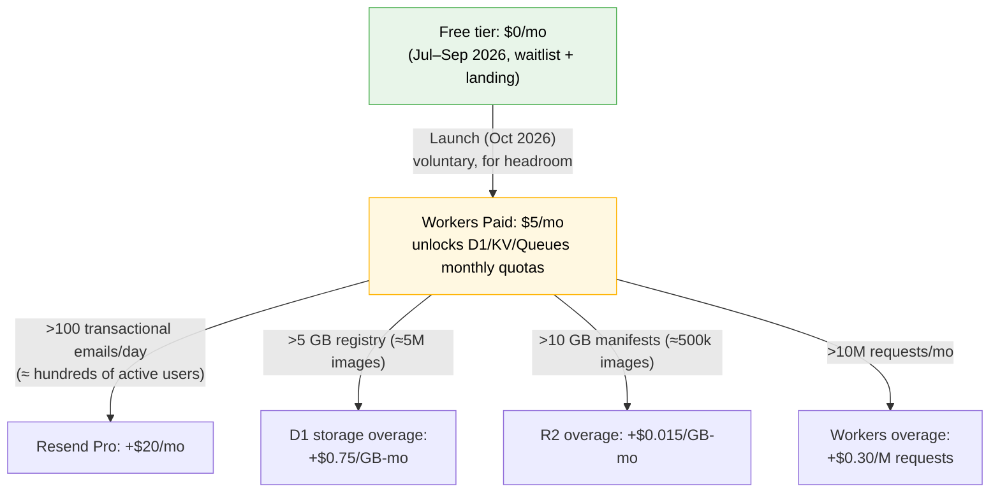

# 06 — OzDNA Cost Model & Unit Economics

> Changelog
> 2026-07-06 · ratification pass — cron anchoring, badge upside, Workers hosting

*Written July 6, 2026. All prices verified on that date against the cited source URLs. Anything not verifiable is prefixed `UNVERIFIED:` or labeled **ASSUMPTION**. Audience: future Claude Code sessions + a non-engineer founder. Read `docs/BLUEPRINT.md` first.*

**Cross-document ownership:** final stack and payment-provider pick → `plan/02-TECH-STACK.md`. Perceptual-hash algorithm, Merkle-batch design, matching thresholds → `plan/03-ALGORITHMS.md`. API shapes and exact tier quotas → `plan/04-MVP-SPEC.md`. Waitlist targets → GTM doc. Where this document needs one of those numbers, it states an **ASSUMPTION** and marks it; the consistency pass reconciles.

---

## 0. The one-paragraph version

OzDNA's marginal cost per registered image is roughly **$0.000022 up front plus ~$0.000001 per month in cumulative storage** (well under a hundredth of a cent for an image's entire first year) on Cloudflare paid-tier unit prices, and the blockchain anchor adds effectively nothing because one ~$0.001 Base transaction covers an entire batch regardless of batch size. Fixed costs are **~$1/mo pre-revenue** and **~$6/mo post-launch**. Gross margin is **~90–93% at every price point**. One paying customer of any tier — a single $49 compliance-API customer, or even the post-MVP $10 badge — covers all infrastructure (entity-level costs — free-zone license, accounting, payment-payout fees — are portfolio overhead excluded the same way founder salary is; boundary stated in §7). The business does not have a cost problem at any volume the 18-month plan can produce; the only real spend decisions are grant-funded one-offs (C2PA conformance, security audit).

---

## 1. Price basis (verified July 6, 2026)

| Input | Value | Source |
|---|---|---|
| ETH price | **$1,746.70** (Jul 6, 2026, 8:45am ET) | https://fortune.com/article/price-of-ethereum-07-06-2026/ |
| Base L2 gas price | **0.005 gwei** (minimum base fee; live tracker showed 0.005 gwei) | https://basescan.org/gastracker · https://docs.base.org/base-chain/network-information/network-fees |
| Workers Paid | **$5/mo** | https://developers.cloudflare.com/workers/platform/pricing/ |
| Paddle (merchant of record) | **5% + $0.50** per transaction, no monthly fee | https://www.paddle.com/pricing |
| .com renewal (Cloudflare Registrar, at cost) | **$10.44/yr** ($10.26 wholesale + $0.18 ICANN) | https://www.cloudflare.com/products/registrar/ · https://tldprice.org/registrar/cloudflare |
| Resend transactional email, free tier | 3,000/mo (100/day), 1 domain | https://resend.com/pricing |
| Zoho Mail Forever Free (founder mailbox) | 5 users, 5 GB each, 1 domain, web-only | https://www.zoho.com/mail/custom-domain-email.html |

All USD. Where math needs rounding, it rounds **against** us (costs up, revenue down).

---

## 2. (a) Cloudflare free-tier map — every limit we touch

Everything below sits on one Cloudflare account. The single escalation that matters is **Workers Paid, $5/mo**, which upgrades Workers, D1, KV, and Queues to monthly quotas simultaneously. Source URLs per row; all fetched 2026-07-06.

| Service | Free-tier limit | What consumes it in OzDNA | Breaks at (traffic level) | Paid next step |
|---|---|---|---|---|
| **Workers requests** ([pricing](https://developers.cloudflare.com/workers/platform/pricing/)) | 100,000 req/day | Register API (~3 req/image), verify page (~1–2 req/view) | ~30–50k combined user actions/day; e.g. 20k registrations (60k req) + 20k verify views (40k req) | Workers Paid $5/mo → 10M req/mo incl., +$0.30/M |
| **Workers CPU** (same URL) | 10 ms CPU per invocation | DB lookups, Merkle building, API auth. Free-tier hashing/signing runs in the customer's browser (WASM, hard rule 6) — which is why the *free* tier survives. **Paid-tier server compute (01-ARCHITECTURE §3.2 — ratified 2026-07-06 as the sanctioned primary revenue mode, not an exception):** paid API tenants' full-image mode (`POST /v1/marks`-style) decodes + hashes + assembles the manifest on OUR Worker — only viable on Workers Paid. Unit math: at ~50–200 CPU-ms/image (UNVERIFIED until the week-1 spike), the $199 tier's 50k marks/mo (quota per 04-MVP-SPEC §3.6) ≈ 2.5–10M CPU-ms, inside the 30M CPU-ms/mo Workers Paid includes; overage is $0.02/M ms ⇒ ≤ ~$0.000004/image — invisible inside the $0.0001/image planning number (§4.1) | Hamming-distance fingerprint matching over a large table inside one request. Threshold depends on index design (owned by `03-ALGORITHMS.md`) | Workers Paid → 30s default / 5 min max CPU, 30M CPU-ms/mo incl., +$0.02/M ms |
| **Pages** ([limits](https://developers.cloudflare.com/pages/platform/limits/)) | 500 builds/mo, 20,000 files/site, 25 MiB/file; static requests & bandwidth unmetered | July throwaway landing page only (the October product runs on Workers static assets — see hosting note below) | Effectively never (hard rule 8 says batch deploys anyway; ~10–20 builds/mo realistic) | Pages Pro not needed |
| **D1** ([pricing](https://developers.cloudflare.com/d1/platform/pricing/)) | 5M rows read/day; **100k rows written/day**; 5 GB storage | Registry rows: ~11–15 **billed** row-writes/registration once index rows are counted (D1 bills each indexed-column write as an extra row — arithmetic owned by 04-MVP-SPEC §5), ~1 KB/registration; verify lookups ~5–10 reads/view | Writes: **~7–9k registrations/day**. Storage: ~5M registrations total. Reads: ~500k–1M verify views/day | Workers Paid → 25B reads + 50M writes/mo incl.; overage $0.001/M reads, $1.00/M writes, $0.75/GB-mo past 5 GB |
| **R2** ([pricing](https://developers.cloudflare.com/r2/pricing/)) | 10 GB-mo storage, 1M Class A (writes), 10M Class B (reads)/mo; **egress free** | Signed C2PA manifests (~20 KB each; v1 stores manifests, NOT original images — retention policy owned by `04-MVP-SPEC.md`) | Class A: **1M registrations/mo**. Storage: ~500k manifests (10 GB) | No plan gate: pay-as-you-go. $0.015/GB-mo, $4.50/M Class A, $0.36/M Class B. Egress stays free (verify page can serve manifests at zero bandwidth cost) |
| **KV** ([pricing](https://developers.cloudflare.com/kv/platform/pricing/)) | 100k reads/day, **1,000 writes/day**, 1 GB | Config, API-key cache, rate-limit state ONLY. The 1k writes/day is a trap — never put per-registration writes in KV; that's D1's job | 1k writes/day if misused | Workers Paid → 10M reads + 1M writes/mo incl. |
| **Queues** ([pricing](https://developers.cloudflare.com/queues/platform/pricing/)) | 10,000 operations/day on Workers Free (~3 ops/message → ~3,300 messages/day) | Anchor-batch scheduler (a few messages/day), webhook retries | ~3,300 queued messages/day — only if we queue per-registration instead of per-batch | Workers Paid → 1M ops/mo incl., +$0.40/M |
| **Turnstile** ([plans](https://developers.cloudflare.com/turnstile/plans/)) | Free: 20 widgets, 10 hostnames/widget; no published siteverify cap | Bot protection on waitlist form + free-tier signup | Effectively never (we need 2–3 widgets) | Enterprise only adds branding removal etc. — never needed |
| **Email Routing** ([limits](https://developers.cloudflare.com/email-routing/limits/)) | Free inbound + forwarding; 200 rules, 200 destination addresses, 25 MiB/message. **Receive/forward only — no outbound sending** | hello@ozdna.com → founder's Gmail | Effectively never | Outbound = separate product. UNVERIFIED: Cloudflare's own "Email Sending" service is paid and its pricing was not public on the docs page fetched — use Resend instead (see §6) |

**Hosting split (owned by `02-TECH-STACK.md` §4):** the October product — verify page, docs, dashboard/API shell — is served from **Workers static assets**, not Pages. Cloudflare Pages is used **only** for the throwaway July landing page (interim demand-validation site); once the product ships, the product's own static shell lives on Workers. Pages keeps its own row above only because that July landing page still draws the free Pages quota through launch.

**Plain-language summary for the founder:** the free tier comfortably carries the entire pre-launch phase and roughly the first ~7–9k registered images *per day* (counting D1's index-write billing, 04-MVP-SPEC §5). The first dollar Cloudflare ever takes from us is the $5/mo Workers Paid plan, and we should switch it on **at launch** (October 2026) voluntarily — not because we'll hit limits on day one, but because free-tier limits are *hard daily caps*: one HackerNews spike would take the verify page down at 100k requests. $5/mo is outage insurance and sits well inside the pre-approved $20/mo.

### Spend-trigger flow

Every arrow past $5/mo is triggered only by usage levels that imply paying customers already exist.

---

## 3. (b) Anchoring economics — the blockchain line item

**Design recap** (mechanism owned by `03-ALGORITHMS.md` §3.4): registrations accumulate; a **15-minute cron** builds a Merkle tree of the pending hashes and sends **one transaction** to a minimal contract on Base — storing the 32-byte root and emitting an event — but only when a batch is actually due. The cron anchors a batch **iff** (pending ≥ 100) OR (oldest pending ≥ 23h) OR (any paid-tier item ≥ 40min old); otherwise the slot skips and costs nothing. Those thresholds deliver the public anchoring SLA — **"within 24h (free) / within 1h (paid)"** — while the ToS legal floor stays no tighter than 7 days (`05` T9). Batch size does not change transaction cost — that is the entire point of Merkle batching. We pay gas from our own wallet (hard rule 2: our gas wallet is fine; user funds never).

### 3.1 Cost per batch transaction — arithmetic shown

- UNVERIFIED (first-principles estimate; no contract deployed yet): anchor tx gas ≈ **50,000 gas** (21,000 base tx + ~22,100 SSTORE of a new storage slot + ~2,000 event + calldata & overhead). A leaner event-only design is ~30k; 50k is the conservative planning number.
- L2 execution fee = 50,000 gas × 0.005 gwei = 250,000,000,000 wei = **0.00000025 ETH** → × $1,746.70 = **$0.000437**.
- L1 data-availability fee: UNVERIFIED estimate **~$0.0003–0.0005** for a ~150-byte tx in the post-blob era (Base docs confirm the L1 fee usually exceeds the L2 fee for small txs but publish no fixed number; their own example prices a 200k-gas tx at ≈$0.002 total at ETH $2,000 — https://docs.base.org/base-chain/network-information/network-fees).
- **Planning number: $0.001 per anchor transaction.** Conservative planning: $0.005.

### 3.2 Per-asset anchor cost by batch size

One tx per batch, so per-asset cost = tx cost ÷ batch size:

| Batch size | Per-asset @ $0.001/tx | Per-asset @ $0.005/tx (conservative) |
|---|---|---|
| 100 | $0.00001 | $0.00005 |
| 10,000 | $0.0000001 | $0.0000005 |
| 1,000,000 | $0.000000001 | $0.000000005 |

Capture/Numbers Protocol's published benchmark is $0.0001/asset (BLUEPRINT §2); Merkle batching beats it by 1–4 orders of magnitude at any real batch size.

### 3.3 Annual anchoring cost — bounded by the threshold cron

Because cost scales with *transactions*, not *registrations*, the ceiling is set by the cron, not by volume. The 15-minute cron has **96 slots/day**, and it only transacts on a slot when a batch is due (§3 thresholds), so most slots skip. Transactions are therefore capped at 96/day and in practice run far fewer:

| Registrations/mo | Typical tx/mo | Cost/mo @ $0.001/tx |
|---|---|---|
| 1,000 | a few–dozens | < $0.05 |
| 100,000 | dozens–hundreds | < $0.30 |
| 10,000,000 | up to ~2,880 (96/day cap) | ≤ ~$2.90 |

**Canonical worst case — every one of the 96 daily slots fires: ~96 tx/day ≈ $53/yr** (figure owned by `03-ALGORITHMS.md` §3.6 — reuse it; do not recompute gas here). That $53/yr is the entire blockchain line item for a full year. At 06's own $0.001/tx planning number the same 96-tx/day ceiling is ≤ ~$35/yr; 03's $53/yr uses a more conservative per-tx gas assumption and is the number to quote.

### 3.4 Gas sensitivity

Two columns: typical low-volume operation (a handful of tx/day, because most cron slots skip) vs. the cron's hard ceiling of 96 tx/day. Worst-case figures scale 03 §3.6's ~$53/yr.

| Scenario | Typical (~a few tx/day) | Worst case (96 tx/day ceiling) |
|---|---|---|
| Today (0.005 gwei, ETH $1,747) | ~$1–2/yr | **~$53/yr** (03 §3.6) |
| Gas ×10 (0.05 gwei or ETH+gas combo) | ~$10–20/yr | ~$530/yr |
| Gas ×100 (sustained congestion, 0.5 gwei) | ~$100–200/yr | ~$5,300/yr |

The ceiling only bites when *both* gas is 100× **and** every 15-min slot fires all year (i.e., sustained 10M+ registrations/mo). Even then the lever is trivial: raise the pending-batch threshold so batches grow and transaction count falls proportionally. The cron self-throttles — the three trigger conditions mean quiet periods simply don't transact, so real spend tracks volume, not the cap. **Anchoring can never become a business-relevant cost.** The SLA the cron delivers is **"within 24h (free) / within 1h (paid)"** (tier promises owned by `04-MVP-SPEC.md`; ToS legal floor stays no tighter than 7 days, `05` T9).

**Gas wallet funding:** 0.01 ETH (~$17) covers ~17,000 anchor txs at the $0.001/tx planning number (rounding against us per §1; the optimistic actual-cost estimate stretches this, but we don't plan on it) — **years of typical operation**, and still ~6 months even if every one of the 96 daily cron slots fired continuously, or ~2 months at ×10 gas. One ~$20 top-up per year is the realistic budget line. Note for `02-TECH-STACK.md`: acquiring that first 0.01 ETH from Turkey must go through a licensed exchange to the founder's own wallet — trivial in practice, but it's a founder to-do, not a code to-do.

---

## 4. (c) Per-customer serving cost and gross margin by tier

### 4.1 Marginal cost per registered image (Cloudflare paid-tier unit prices)

**ASSUMPTION** on mechanics (reconciled with `04-MVP-SPEC.md` §5, 2026-07-06): one registration = 3 Worker requests (auth/presign, register, confirm), 15 CPU-ms total, ~15 **billed** D1 row-writes (row + index writes, per 04's arithmetic) + ~1 KB of D1 registry rows, 1 R2 Class A op, ~20 KB manifest stored, 3 Queue ops, ~20 D1 reads/mo of later verify traffic, anchor share at 10k batch.

| Component | Math | Cost |
|---|---|---|
| Worker requests | 3 × $0.30/M | $0.0000009 |
| Worker CPU | 15 ms × $0.02/M ms | $0.0000003 |
| D1 writes | 15 × $1.00/M | $0.0000150 |
| D1 reads (verify, monthly) | 20 × $0.001/M | $0.0000000 |
| R2 Class A | 1 × $4.50/M | $0.0000045 |
| Queue ops | 3 × $0.40/M | $0.0000012 |
| Anchor share | $0.001 ÷ 10,000 | $0.0000001 |
| **One-time subtotal** | | **≈ $0.0000220** |
| R2 storage (20 KB manifest) | 0.00002 GB × $0.015/GB-mo | $0.0000003 **/mo held** |
| D1 storage (~1 KB registry rows) | 0.000001 GB × $0.75/GB-mo | $0.0000008 **/mo held** |
| **Recurring subtotal** | | **≈ $0.0000011/mo per stored image, cumulative** |

**Storage is cumulative, not one-time.** The registry keeps every manifest and row indefinitely, so each stored image costs ~$0.000001/mo *in perpetuity* — N months of retained history ≈ N× the monthly figure. At 1M stored images that's ~$1.10/mo; at 100M, ~$110/mo. Two cheap levers if the line ever matters: move old manifests to R2 Infrequent Access (UNVERIFIED: ~$0.01/GB-mo plus retrieval fees — verify before implementing) and prune anchored D1 rows down to a compact index (D1 storage at $0.75/GB-mo is 50× R2's rate; D1 should hold indexes, not history). The retention/archival policy — which must also cover free-forever users, whose storage accrues identically — is owned by `04-MVP-SPEC.md` and needs to exist by launch.

**Planning number: $0.0001 per registered image** — covers the one-time cost plus ~6 years of storage accrual ($0.0000220 + 70 × $0.0000011 ≈ $0.0001), all rounding against us. Verify-page views cost ~$0.0000006 each (1 request + a few reads) and are ignored below except as noted.

### 4.2 Cost and margin per tier

Quotas (owned by `04-MVP-SPEC.md` §3.6, adopted here 2026-07-06): $49/mo Starter → 2,000 marks/mo; $99/mo Growth → 10,000; $199/mo Scale → 50,000. These three compliance-API tiers are the **base-case** revenue product. The $10/mo seller badge (wedge 2, BLUEPRINT §4) is a **post-MVP UPSIDE SKU** — SECONDARY per CLAUDE.md, **not** on 04's MVP pricing page and **not** in the base-case launch mix; its unit economics are shown separately below.

Payment fee: Paddle 5% + $0.50 (§5). B2B reverse-charge case (no VAT hit) shown here; VAT-inclusive consumer case in §5.

| Tier | List | Net after Paddle (×0.95 − $0.50) | Serving cost/mo (planning, 8× margin) | Gross profit | **Gross margin (of list)** |
|---|---|---|---|---|---|
| Compliance API | $49 | $46.05 | 2,000 × $0.0001 = **$0.20** | $45.85 | **93.6%** |
| Compliance API | $99 | $93.55 | 10,000 × $0.0001 = **$1.00** | $92.55 | **93.5%** |
| Compliance API | $199 | $188.55 | 50,000 × $0.0001 = **$5.00** | $183.55 | **92.2%** |

**Post-MVP upside SKU (not in base case):**

| Tier | List | Net after Paddle (×0.95 − $0.50) | Serving cost/mo (planning) | Gross profit | **Gross margin (of list)** |
|---|---|---|---|---|---|
| Seller badge *(post-MVP, wedge 2)* | $10 | $9.00 | 500 × $0.0001 + views ≈ **$0.06** | $8.94 | **89.4%** |

At the *computed* (non-padded) year-one serving cost the margins are higher still. Either way: **every tier is ~90%+ gross margin, and the $199 tier is not meaningfully more expensive to serve than the $49 tier.** Free-tier users (fact-checkers, creators — free forever per BLUEPRINT §4) cost ~$0.01–0.10/mo each at a few hundred images; 1,000 free users ≈ $10–100/mo worst case, comfortably a marketing expense.

The reason margins are this shape (plain language): for the free tier, the customer's own browser does the expensive work — C2PA signing and perceptual hashing run in WASM on their machine (hard rule 6). Paid API tenants using full-image mode DO burn our Worker CPU (01-ARCHITECTURE §3.2, the ratified rule-6 amendment: the free flow signs client-side, paid tenants use our metered server-side compute priced into their tier) — but Workers Paid CPU is priced at $0.02 per *million* CPU-milliseconds, so even ~100 CPU-ms/image adds ≤ ~$0.000004/image, already inside the padded $0.0001 planning number (§2 Workers CPU row has the arithmetic). Our servers otherwise only write a few database rows and store a small manifest file. We sell compliance and the registry, not compute.

---

## 5. (d) Payment fees and net revenue

**Provider decision is owned by `plan/02-TECH-STACK.md`.** This section prices the realistic candidates; the base-case math throughout this document uses **Paddle**, because a merchant of record (MoR) is the only sane path for a UAE free-zone entity selling into the EU.

| Option | Fee (verified 2026-07-06) | MoR / EU VAT handled? | UAE-seller eligible? | Notes |
|---|---|---|---|---|
| **Paddle** | **5% + $0.50**/transaction, no monthly fee — https://www.paddle.com/pricing | Yes — Paddle is seller of record, collects & remits EU VAT | Yes — UAE and Turkey are absent from Paddle's unsupported-countries list ("works with software businesses anywhere in the world with the exception of…") — https://www.paddle.com/help/start/intro-to-paddle/which-countries-are-supported-by-paddle | Products priced **under $10 need custom pricing** (contact Paddle) → price the badge at $10, not $9 |
| Stripe Managed Payments (ex-Lemon Squeezy) | 5% + $0.50 — https://www.lemonsqueezy.com/pricing · https://www.lemonsqueezy.com/blog/2026-update | Yes (MoR) | UNVERIFIED: public preview Feb 2026, "35+ countries," UAE not confirmed on the list | Watch-only — `02-TECH-STACK.md` §8 (the owner) locks **Polar** as the tested backup; same economics as Paddle |
| Stripe direct (UAE) | **2.9% + AED 1.00** domestic, **+1%** international cards, **+1%** FX — https://stripe.com/ae/pricing | **No** — we would self-manage EU VAT (non-Union OSS registration, quarterly filings) | Yes | Most customers are EU → effective ~4.9% + AED 1 + FX anyway, *plus* a VAT compliance burden a solo founder must not carry. Rejected as base case |

**Why the 5% MoR fee is cheap:** the EU customer base means VAT liability from the first sale. Paddle absorbing that is worth far more than the ~1–2 points of fee difference vs. bare Stripe.

### Net revenue per tier under Paddle

| Tier | B2B with VAT ID (reverse charge — expected for the compliance API) | B2C in a 20%-VAT country, VAT-inclusive pricing (expected for some post-MVP badge buyers) |
|---|---|---|
| $49 | 49 × 0.95 − 0.50 = **$46.05** | ex-VAT 40.83 → ≈ **$38.29** |
| $199 | 199 × 0.95 − 0.50 = **$188.55** | ex-VAT 165.83 → ≈ **$157.04** |
| $10 | 10 × 0.95 − 0.50 = **$9.00** | ex-VAT 8.33 → ≈ **$7.41** |

UNVERIFIED (minor): whether Paddle computes its 5% on the VAT-inclusive or VAT-exclusive amount — the B2C column assumes fee on the ex-VAT amount; worst case shifts it by cents. Decision for pricing pages: display "+ VAT where applicable" so B2B list prices hold.

---

## 6. (e) Fixed costs — itemized

### Pre-revenue (July–September 2026)

| Item | Monthly | Annual | Source |
|---|---|---|---|
| ozdna.com renewal (current registrar — UNVERIFIED rate, budgeted high; Cloudflare's at-cost $10.44/yr applies only after the transfer described below) | $1.08 | $13.00 | https://www.cloudflare.com/products/registrar/ (post-transfer rate) |
| Cloudflare free tier (Pages + Workers + D1 + Turnstile + Email Routing) | $0.00 | $0 | §2 |
| Founder mailbox hello@/press@ozdna.com — Zoho Mail Forever Free (web-only) + Cloudflare Email Routing forwarding | $0.00 | $0 | https://www.zoho.com/mail/custom-domain-email.html |
| Waitlist transactional email — Resend free (3,000/mo, 100/day) | $0.00 | $0 | https://resend.com/pricing |
| **Total pre-revenue** | **$1.08/mo** | **$13/yr** | |

**Domain control — founder to-do, before October launch:** ozdna.com currently sits in a partner's registrar/Netlify setup, not in the founder's own Cloudflare account (UNVERIFIED which registrar; the "partner" arrangement predates this plan — founder should document who controls the domain in one line in `docs/ACTION_PLAN.md`). A third party controlling the domain of a provenance/trust product is a control risk that costs ~$0 to fix: **transfer ozdna.com into the founder's own Cloudflare account.** Registrar transfers are locked for 60 days after registration or a previous transfer, so start by early August to be safely done for the October MVP. Until the transfer completes, renewal is budgeted at ~$13/yr (rounded against us); the $10.44 Cloudflare at-cost rate applies only after. (Netlify free tier for the interim landing page is $0 and acceptable pre-build; the launch stack itself is Cloudflare-first per hard rule 7.)

### Post-launch (October 2026 →)

| Item | Monthly | Trigger | Source |
|---|---|---|---|
| Workers Paid | $5.00 | Switch on at launch, voluntarily (§2 rationale) | https://developers.cloudflare.com/workers/platform/pricing/ |
| ozdna.com | $1.08 → $0.87 | $1.08 until the Cloudflare transfer completes, then at-cost | above |
| Anchoring gas, 15-min threshold cron (+annual wallet top-up amortized; worst case ~$53/yr, §3) | ~$0.10 | at launch | §3 |
| Cloudflare usage overages | ~$0.00–3.00 | only past ~5M stored registrations | §2 |
| Resend | $0 → $20.00 | only past 100 emails/day (≈ hundreds of active users) | https://resend.com/pricing |
| Zoho Mail Lite (only if IMAP/desktop mail needed) | UNVERIFIED: ~$1/user/mo | optional, cosmetic | zoho.com/mail/zohomail-pricing.html (not fetched) |
| **Core total at launch** | **≈ $6.18/mo** | | |
| **Worst case within 18mo** (Resend Pro + overages) | **≈ $30/mo** | implies hundreds of users → revenue exists | |

The pre-approved ~$20/mo line covers the core total 3× over. The only way to exceed $20/mo is Resend Pro — which triggers at an email volume that implies dozens-to-hundreds of paying customers (see §7). No other paid service enters the picture in v1: no VPS, no managed database, no monitoring SaaS (Cloudflare analytics + Workers logs suffice for MVP).

---

## 7. (f) Break-even

Founder salary is deliberately excluded — MetalTakip and the founder's other work carry living costs (per project framing). Entity-level costs are excluded on the same boundary: Find Below Ventures' free-zone license renewal (order of $1.5k+/yr ≈ $130/mo — UNVERIFIED, §10), UAE corporate-tax registration/filing and accounting, and Paddle payout/FX/wire fees to a UAE bank (UNVERIFIED, §10) are portfolio overhead shared with metaltakip.com and tezmakale.com and exist whether or not OzDNA does. They dwarf the ~$6/mo infrastructure line, so read every "break-even" below as **infrastructure break-even**: the point where OzDNA stops costing money to exist, OzDNA-attributable costs only.

| Cost block | $/mo | Covered by |
|---|---|---|
| Core post-launch stack (Workers Paid + domain + gas) | $6.18 | **0.14 × one $49 compliance customer** (nets $46.05) — or, post-MVP, ~0.7 × one $10 badge customer (nets $9.00) |
| + Resend Pro (if triggered) | +$20.00 | +0.44 × $49 customer (or +2.3 post-MVP badge customers) |
| + usage at ~10M images/mo scale | +$150–200 steady-state, growing with retained history (mostly R2 Class A ops ~$40, cumulative D1/R2 storage ~$120/mo by month 12, Workers/Queues overages ~$20 — §4.1 cumulative-storage note) | that volume ≈ 100× $199 customers ≈ $18,855/mo net — self-evidently covered (the $0.0001/image planning number budgets $1,000/mo for it) |

**Headline numbers:**
- **Infrastructure break-even = 1 paying customer of any tier.** A single $49 compliance-API customer makes OzDNA cash-positive on infrastructure ~7× over (and, post-MVP, even one $10 Etsy-seller badge would clear it).
- Full worst-case fixed stack ($30/mo) = **1 compliance customer** (or, post-MVP, ~4 badge customers).
- Every incremental paid service in §6 is usage-triggered, and the usage that triggers it arrives with more revenue than the service costs. There is no scale trap anywhere in the cost structure — the classic SaaS "success disaster" is structurally impossible here because signing compute lives in the customer's browser. The one cost that *compounds* is cumulative storage (§4.1, ~$0.000001 per image per month, forever), and even that grows two-plus orders of magnitude slower than the revenue creating it; the retention/archival policy owned by `04-MVP-SPEC.md` is the cap.

---

## 8. (g) Grant-budget scenarios — what $10k / $50k / $150k buys

Grants (Filecoin, Base, etc. — BLUEPRINT §6) fund one-off credibility milestones, not burn. Priority order is fixed: **conformance → security → keys → video → timestamps.** All service-price figures below are market estimates unless sourced — treat every one as UNVERIFIED until quoted.

### $10k — "credibility minimum"

| # | Item | Est. | Notes |
|---|---|---|---|
| 1 | C2PA Conformance Program, Level 1 fee reserve | $5,000 reserve | **The unknown number.** Fees unpublished; awaiting reply from conformance@c2pa.org (ACTION_PLAN item ①). If quote > reserve, roll to the $50k scenario. If it fits, this is purchase #1 — the *candidate* path off "unknown source," but only if three conditionals all hold: (a) the quote fits the reserve, (b) SSL.com's free Level 1 cert + 10k timestamps/yr offer still stands (UNVERIFIED beyond its June 2026 announcement — §10; requires a conformance record ID), and (c) OzDNA actually passes conformance and lands on a live trust list (the interim list has been frozen since Jan 1, 2026 — hard rule 5). Until all three, v1 keeps its own verify page + chain anchor and never promises trusted Content Credentials |
| 2 | Anchoring-contract review | $2,500 | UNVERIFIED estimate: free static analysis (Slither/Aderyn) + one boutique independent review of a ~50-line contract. Full audits don't fit $10k |
| 3 | 24 months of paid infra + gas + domain | $200 | §6, prepaid headroom |
| 4 | SEO/content production for the "EU AI Act content marking" cluster | $1,500 | Founder's wedge-1 channel |
| 5 | Contingency | $800 | |

### $50k — "institutional trust"

Everything above, plus:

| # | Item | Est. | Notes |
|---|---|---|---|
| 1 | Professional security audit (signing flow, key management, API) | $15,000–25,000 | UNVERIFIED market estimate for a small codebase. This is the Nikon-lesson line item (BLUEPRINT §3): key management is where provenance products die, and an audit is a sales asset for compliance buyers |
| 2 | Key-management hardening | $500/yr | Cloud KMS-class key storage (e.g., AWS KMS ~$1/key/mo class of pricing — UNVERIFIED); dedicated HSM rental (~$1k+/mo) explicitly NOT needed at this stage |
| 3 | Video signing R&D spike | $5,000 | Server-side c2pa-rs on a small VPS/container (browser WASM can't do video); contractor + compute. Explicitly post-v1 per hard rule 6 |
| 4 | C2PA/CAI ecosystem presence (event, membership upgrades if any) | $2,000 | |

### $150k — "category player"

Everything above, plus:

| # | Item | Est. | Notes |
|---|---|---|---|
| 1 | Part-time engineer, 6–9 months | $30,000–60,000 | Ships video/audio + TrustMark watermarking (BLUEPRINT §2) while founder does PR/sales |
| 2 | C2PA conformance, higher assurance level (Level 2) | reserve $10,000 | UNVERIFIED — same unpublished fee schedule |
| 3 | eIDAS qualified-timestamp partnership (QTSP) for the TR/MENA legal-evidence wedge | reserve $5,000 + per-stamp fees | UNVERIFIED per-stamp pricing (order of €0.01–0.10). Gate: only when wedge 3 activates (LATER per BLUEPRINT §4) |
| 4 | Trademark (ozDNA, EU + TR classes) + legal review of ToS/DPA | $3,000–6,000 | UNVERIFIED estimate |
| 5 | Runway for paid infra at 10× scale + marketing experiments | $10,000 | |

---

## 9. (h) 18-month P&L sketch — three scenarios

**Window:** October 2026 (MVP build) → March 2028. Launch/billing starts December 2026 into the Dec 2 marking-deadline wave. **Every number in the assumption table is an ASSUMPTION** — this is a planning sketch, not a forecast. The waitlist (ACTION_PLAN item ③) exists precisely to replace these assumptions with data before October. **The base case is compliance-API only** (wedge 1); the $10/mo seller badge (wedge 2) is post-MVP UPSIDE and is quantified separately after the three scenario tables — it is *not* in any base-case total below.

### Assumptions (all ASSUMPTION, stated once, used mechanically)

| Assumption | Conservative | Base | Optimistic | Basis |
|---|---|---|---|---|
| Segmented waitlist size on Dec 1, 2026 | 150 | 400 | 1,000 | Aug 2 PR moment + 4 months SEO; founder's distribution skill is the swing variable |
| Waitlist → paid conversion in launch wave (Dec–Jan), all SKUs | 2% → 3 total | 5% → 20 total | 10% → 100 total | 2–10% is the commonly cited waitlist-to-paid band for self-serve SaaS; deadline pressure argues high end |
| → of which base-case API (wedge 1) — **billed in the tables below** | 2 | 14 | 80 | compliance API is the base-case product |
| → of which post-MVP badge (wedge 2) — **excluded, see badge upside note** | 1 | 6 | 20 | SECONDARY per CLAUDE.md; not in the Dec launch mix |
| New paying customers/mo thereafter (SEO + Dec-2 stragglers) | +1 | +4 | +12 | wedge-1 query cluster ranking (all API) |
| Monthly churn | 6% | 4% | 3% | compliance tools are sticky after integration |
| Customer mix — base case, **API only** ($49 / $199) | 90/10% | 86/14% | 75/25% | badge excluded (post-MVP upside) |
| → Blended ARPU (list) | $64 | $70 | $86 | API mix × price |
| Net-revenue factor | ×0.95 − $0.50 per customer (Paddle, B2B reverse charge; §5) | same | same | verified fee |
| Serving cost | $0.0001/image planning number + §6 fixed costs | same | same | §4 |

### Scenario tables (customers = end of quarter; revenue = net of Paddle, quarterly; costs include fixed + usage)

**CONSERVATIVE** (API only) — infra break-even Dec 2026; ~$3.9k cumulative net revenue by Mar 2028

| Quarter | API customers | MRR (list) | Net rev (qtr) | Infra cost (qtr) | Net cash (qtr) |
|---|---|---|---|---|---|
| Q4-26 (launch Dec) | 2 | $128 | ~$115 | $21 | +$94 |
| Q1-27 | 3 | $192 | ~$450 | $18 | +$432 |
| Q2-27 | 4 | $256 | ~$630 | $18 | +$612 |
| Q3-27 | 5 | $320 | ~$810 | $18 | +$792 |
| Q4-27 | 5 | $320 | ~$900 | $18 | +$882 |
| Q1-28 | 6 | $384 | ~$990 | $18 | +$972 |
| **18-mo totals** | | | **≈ $3.9k** | **≈ $111** | **≈ +$3.8k** |

**BASE** (API only) — ~$2.8k MRR and ~$29k cumulative net revenue by Mar 2028; Alliance-application territory ("apply at first usage," BLUEPRINT §6)

| Quarter | API customers | MRR (list) | Net rev (qtr) | Infra cost (qtr) | Net cash (qtr) |
|---|---|---|---|---|---|
| Q4-26 (launch Dec) | 14 | $980 | ~$900 | $21 | +$879 |
| Q1-27 | 20 | $1,400 | ~$3,350 | $20 | +$3,330 |
| Q2-27 | 26 | $1,820 | ~$4,550 | $25 | +$4,525 |
| Q3-27 | 31 | $2,170 | ~$5,650 | $30 | +$5,620 |
| Q4-27 | 36 | $2,520 | ~$6,650 | $90 (Resend Pro triggers) | +$6,560 |
| Q1-28 | 40 | $2,800 | ~$7,550 | $95 | +$7,455 |
| **18-mo totals** | | | **≈ $29k** | **≈ $280** | **≈ +$28k** |

**OPTIMISTIC** (API only) — the Dec-2 wave is real and we own the SEO cluster; ~$14.5k MRR by Mar 2028

| Quarter | API customers | MRR (list) | Net rev (qtr) | Infra cost (qtr) | Net cash (qtr) |
|---|---|---|---|---|---|
| Q4-26 (launch Dec) | 80 | $6,880 | ~$6,400 | $30 | +$6,370 |
| Q1-27 | 101 | $8,686 | ~$22,000 | $90 | +$21,910 |
| Q2-27 | 120 | $10,320 | ~$26,900 | $110 | +$26,790 |
| Q3-27 | 138 | $11,868 | ~$31,400 | $130 | +$31,270 |
| Q4-27 | 154 | $13,244 | ~$35,600 | $150 | +$35,450 |
| Q1-28 | 168 | $14,448 | ~$39,200 | $170 | +$39,030 |
| **18-mo totals** | | | **≈ $161k** | **≈ $680** | **≈ +$161k** |

### Post-MVP badge UPSIDE (wedge 2, not in the base case)

The $10/mo Etsy-seller badge is SECONDARY per CLAUDE.md and is **not built for the Dec wave**, so none of the three tables above bill it. If it ships post-MVP it adds a separate low-ARPU cohort *on top of* the API base case — pure revenue upside, immaterial to costs (badge serving cost ≈ $0.06/mo/customer, §4.2; ~89% margin):

| Scenario | Badge cohort at launch → Mar 2028 | Net add at Mar 2028 (@ $9.00/mo) | Additive over 18 mo (approx) |
|---|---|---|---|
| Conservative | ~1 → ~3 | ~+$27/mo | ~+$0.4k |
| Base | ~6 → ~15 | ~+$135/mo | ~+$1.5–2k |
| Optimistic | ~20 → ~40 | ~+$360/mo | ~+$5k |

Badge cohorts grow only through organic/self-serve signups (no dedicated wedge-2 acquisition spend in v1), so they climb slowly; even the optimistic add is a rounding line beside the API revenue. This is why the badge is parked as upside rather than base-case revenue.

### How to read this

1. **Costs are a rounding error in all three scenarios** — 18-month infrastructure totals of ~$111 / ~$280 / ~$680 against API base-case net revenues of $3.9k / $29k / $161k (badge upside sits on top, above). The model's uncertainty lives entirely on the revenue line, which is why hard rule and blueprint both say: *validate demand with the waitlist before building* (BLUEPRINT §7 risk 1).
2. **The conservative case still pays for itself** ~35× over. There is no scenario where OzDNA loses money on infrastructure; the worst case is founder time.
3. **Decision thresholds to wire into the roadmap doc:** waitlist < 100 by Dec 1 → re-examine wedge 1 before building more; base case hit by Q1-27 → apply to Alliance; optimistic trajectory → bring the $150k grant plan (§8) forward.

---

## 10. Assumption & verification register

**Verified 2026-07-06 (source inline where cited above):** all Cloudflare limits/prices (developers.cloudflare.com, 8 pages fetched); Base minimum base fee 0.005 gwei + live tracker (docs.base.org, basescan.org); ETH $1,746.70 (fortune.com 2026-07-06); Paddle 5%+$0.50, no monthly, UAE/Turkey not on the unsupported list, sub-$10 products need custom pricing (paddle.com); Stripe Managed Payments 5%+$0.50 public preview Feb 2026 (lemonsqueezy.com); Stripe UAE 2.9%+AED 1 (+1% intl, +1% FX) (stripe.com/ae/pricing); .com at $10.44/yr via Cloudflare Registrar; Resend free 3k/mo & Pro $20/mo (resend.com); Zoho Mail free 5 users (zoho.com); Turnstile free 20 widgets; Queues 10k ops/day on free; Email Routing inbound-only.

**UNVERIFIED (flagged inline):** anchor tx ≈50,000 gas (estimate — measure on testnet in week 1 of build); L1 data fee ~$0.0003–0.0005; C2PA conformance fees (unpublished — THE unknown); Stripe Managed Payments UAE-seller eligibility; Paddle fee base (VAT-in vs VAT-ex) for B2C; **Paddle payout method & fees for UAE sellers** (payout currency, wire/FX charges to a UAE bank — verify before the first invoice); security-audit/boutique-review price ranges; Zoho Mail Lite ~$1/user/mo; eIDAS qualified-timestamp per-stamp cost; KMS pricing class; trademark/legal cost estimates; Cloudflare Email Sending pricing (docs say paid, no public number); R2 Infrequent Access ~$0.01/GB-mo + retrieval fees (not fetched — verify before any archival implementation); ozdna.com's current registrar and renewal price (domain still in the partner's setup, §6); Find Below Ventures free-zone license renewal cost (order $1.5k+/yr — portfolio overhead, §7); SSL.com free Level 1 cert offer continuing beyond its June 2026 announcement.

**Pure ASSUMPTIONS (replace with data):** tier quotas (10k/100k/500 images/mo); per-registration mechanics (3 requests, 5 writes, 20 KB manifest); verify-traffic ratios; all §9 waitlist sizes, conversion rates, churn, mix, and monthly adds.
