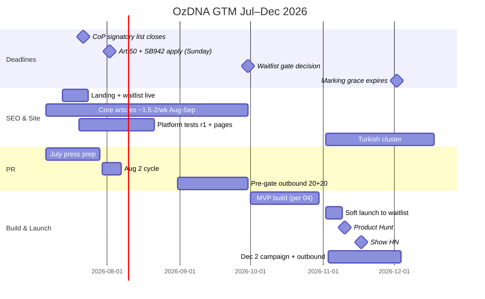
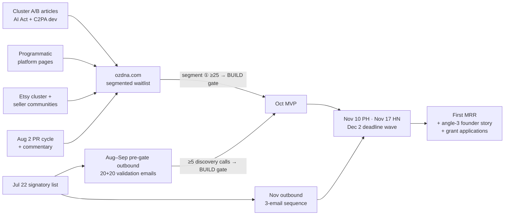

# 07 — OzDNA Go-To-Market: SEO, PR, Community

> Changelog
> 2026-07-06 · ratification pass — Sept-30 gate ratified; landing/product hosting split clarified

*Written July 6, 2026. Audience: future Claude Code sessions executing with the founder (PR/SEO/distribution-strong, not an engineer). This is the founder-superpower document — everything here is zero-budget, calendar-driven, and executable in afternoons until October.*

*Sibling docs own their decisions: hosting/stack → `02`, perceptual-hash/algorithm thresholds → `03`, API schemas → `04`. This doc owns: keywords, content, copy, press, community, competitive watch, and the waitlist validation gates.*

**Facts verified today (2026-07-06) unless marked `UNVERIFIED:`. Source URLs inline.**

---

## 0. Language guardrails (apply to every word we publish)

These operationalize CLAUDE.md hard rules 1, 3, 4, 5 for copy. Every article, tweet, pitch email, and quote gets checked against this table before it ships.

| Never write | Write instead |
|---|---|
| "AI × Blockchain", "web3 provenance", "on-chain" in headlines | "content provenance infrastructure", "cryptographic timestamping" |
| "blockchain" above the fold anywhere | "a timestamp no one can backdate" (one FAQ entry deep in the page may say "anchored to a public ledger") |
| "trusted Content Credentials", "C2PA-certified", "C2PA-conformant", "passes the C2PA Verify tool" | "C2PA-compatible signatures", "signed with open C2PA tooling", "verifiable on our public verify page" |
| "we detect deepfakes", "AI detector", "deepfake detection" | "we prove origin, so fakes can't impersonate the real thing" |
| "prevents deepfakes" | "makes authentic content provable — the durable answer to deepfakes" |
| "token", "$OZDNA", any token speculation | "no token planned; token-optional architecture" (whitepaper only, never marketing) |
| "guaranteed EU AI Act compliance", "makes you compliant" | "the marking stack Article 50 asks for" / "covers the machine-readable marking requirement" — we sell tooling, not legal opinions |
| "fines up to €15M or 3%" quoted bare to small-company audiences | "€15M or 3% of turnover, whichever is *higher* (Art. 99(4)) — capped at whichever is *lower* for SMEs and startups (Art. 99(6))." Our audience IS small companies; quoting the headline maximum without the SME cap is fear-marketing overclaim, and a law-firm competitor would catch it |

**Standing disclaimer for compliance content** (footer of every Cluster A article): *"This is not legal advice. OzDNA provides technical marking infrastructure; consult counsel for your compliance posture."*

**Dogfooding rule:** every image we publish anywhere is signed and registered with our own pipeline, with a "Verify this image" link. Our content is the product demo.

---

## 1. SEO

### 1.1 Landscape — who actually ranks (checked July 6, 2026)

Searches run today against the money queries. What the SERPs show:

**"EU AI Act Article 50 compliance / content marking"** — ranked by:
1. Official EU pages — [digital-strategy.ec.europa.eu Code of Practice page](https://digital-strategy.ec.europa.eu/en/policies/code-practice-ai-generated-content), [AI Act Service Desk](https://ai-act-service-desk.ec.europa.eu/en/ai-act/article-50)
2. The FLI explainer site — [artificialintelligenceact.eu/article/50](https://artificialintelligenceact.eu/article/50/) and its [practical guide](https://artificialintelligenceact.eu/transparency-rules-article-50/)
3. Law firms — [Kirkland & Ellis](https://www.kirkland.com/publications/kirkland-alert/2026/02/illuminating-ai-the-eus-first-draft-code-of-practice-on-transparency-for-ai), [Kennedys](https://www.kennedyslaw.com/en/thought-leadership/article/2026/the-eu-ai-act-s-draft-code-of-practice-on-marking-and-labelling-of-ai-generated-content-what-providers-and-deployers-need-to-know/), [Bird & Bird](https://www.twobirds.com/en/insights/2026/taking-the-eu-ai-act-to-practice-the-final-transparency-code-of-practice), [William Fry](https://www.williamfry.com/knowledge/part-1-ai-act-articles-501-and-502-transparency-obligations/)
4. Small affiliate/indie compliance sites already farming this niche — [compliancehub.wiki](https://compliancehub.wiki/eu-ai-act-marking-labelling-code-of-practice-article-50-2026/), [getactready.com](https://getactready.com/blog/eu-ai-act-code-of-practice-marking-ai-content), [euaicompass.com](https://euaicompass.com/eu-ai-act-article-50-transparency-guide.html), [c2paviewer.com](https://c2paviewer.com/articles/eu-ai-act-content-credentials), [blog.pebblous.ai](https://blog.pebblous.ai/blog/eu-ai-content-labeling-article-50-provenance/en/)

**"C2PA API / content credentials API"** — ranked by: [spec.c2pa.org](https://spec.c2pa.org/specifications/specifications/2.4/guidance/Guidance.html), [opensource.contentauthenticity.org](https://opensource.contentauthenticity.org/docs/getting-started/), Adobe's enterprise [Content Authenticity API on Firefly Services](https://business.adobe.com/blog/content-authenticity-arrives-for-enterprises), [SSL.com](https://www.ssl.com/products/content-authenticity/content-credentials/c2pa/), and thin content sites ([c2pa.ai/for-developers](https://c2pa.ai/for-developers), webcite.co). **No self-serve product vendor owns these SERPs.**

**"does Instagram strip content credentials"** — ranked by metadata-**removal** tools (metaclean.app, aimetadatacleaner.com, removeailabel.com, privyclean.app) and one programmatic content site, [c2pa.ai/instagram](https://c2pa.ai/instagram) — an independent per-platform "Platform Check" template site monetized only by a newsletter. The intent here is split: half the searchers want to *remove* credentials, half want to know why theirs *vanished*. The second half is our buyer.

**Etsy AI disclosure queries** — ranked by small seller-tool blogs (rewarx.com with ~5 pages on this alone, inkfluenceai.com, artomate.app, iscompliant.app) plus [Etsy's own seller handbook](https://www.etsy.com/seller-handbook/article/1275449912004). Low-authority sites rank — the niche is winnable.

**Strategic read:**
- Law firms and the EC own *informational* head terms. We will not outrank them there, and don't need to.
- **Nobody owns solution/transactional intent** ("how to add machine-readable marking to my app", "AI act marking API", "C2PA signing API pricing"). That's the gap — same playbook that's working on MetalTakip: intent-first, not volume-first.
- The indie sites ranking (compliancehub.wiki, rewarx.com, c2pa.ai) prove low-authority domains can rank in this niche *now*. Window is open; it closes as legal-tech vendors wake up near Dec 2.
- `UNVERIFIED:` absolute search volumes (no keyword tool access; these are pre-spike volumes anyway — the queries barely existed 12 months ago). Strategy is intent- and deadline-driven, not volume-driven. Treat GSC impression data after 4 weeks as the real volume research.
- Known brand handicap (ACTION_PLAN decision log): "ozdna" SERPs are dominated by oxDNA (Oxford DNA-simulation tool). Brand queries will be slow; all early SEO must be non-brand.

### 1.2 Keyword clusters

| Cluster | Intent owner | Buyer | Priority |
|---|---|---|---|
| **A. AI Act compliance** — "EU AI Act content marking", "Article 50 compliance", "machine-readable marking AI", "AI act marking deadline December 2026", "SB 942 compliance" | Law firms (info) / nobody (solution) | Wedge 1 — compliance API $49–199/mo | **P0** |
| **B. C2PA developer** — "C2PA API", "content credentials API", "add content credentials to image programmatically", "c2pa unknown source" | Adobe docs / nobody self-serve | Wedge 1 (developers) | **P0** |
| **C. Platform stripping** (programmatic) — "does {platform} strip content credentials / C2PA / metadata" | Removal tools + c2pa.ai | All segments; highest link-magnet value | **P0** |
| **D. Marketplace disclosure** — "Etsy AI disclosure", "prove art is not AI", "Etsy AI policy 2026" | Small seller blogs | Wedge 2 — badge $5–15/mo | P1 |
| **E. Provenance general/brand** — "how to prove image is real", "image provenance", "proof of origin", "verify image origin" | Mixed/weak | PR + free tier | P1 |
| **F. Turkish** — "yapay zeka içerik etiketleme", "yapay zeka yasası Türkiye", "görselin yapay zeka olup olmadığını kanıtlama", deepfake delil | Nobody (verified in research sweep: no Turkish provenance vendor) | Wedge 3 + PR | P2 (Q4) |

### 1.3 The content map — 20 pieces

Working titles; each piece answers one query cluster, ends with the segment-matched CTA (waitlist pre-October, product after). Format: 1,200–2,000 words, answer-first opening paragraph, one table, one signed image (dogfooding), sources cited to primary EU documents (this is what wins both Google E-E-A-T and answer engines).

| # | Working title | Target query | Intent | Funnel | Cluster | Publish |
|---|---|---|---|---|---|---|
| 1 | EU AI Act Article 50: the plain-English compliance guide for small GenAI companies | eu ai act article 50 compliance | info→solution | MOFU | A | Jul W2 (pillar) |
| 2 | The December 2, 2026 marking deadline: who gets the grace period and who doesn't | ai act marking deadline december 2026 | info, high urgency | MOFU | A | Jul W3 |
| 3 | Should your AI startup sign the EU Code of Practice on marking? (list closes July 22) | code of practice ai generated content sign | decision | MOFU | A | **Jul W1–2 (time-boxed)** |
| 4 | We tested 12 platforms: who strips Content Credentials the day the EU law lands | platforms strip content credentials | data asset | TOFU/PR | C | Jul W4 (feeds Aug 2 PR) |
| 5 | EU AI Act + California SB 942: two laws, one day, one marking stack | sb 942 vs eu ai act | info | TOFU | A | Jul W4–Aug W1 |
| 6 | Article 50 machine-readable marking: what counts, what doesn't (with the Code's three layers) | machine readable marking ai | solution | MOFU | A | Aug W2 |
| 7 | Do you need C2PA to comply with the EU AI Act? (No — here's what you actually need) | c2pa eu ai act required | myth-bust | MOFU | A/B | Aug W2 |
| 8 | The Article 50 compliance checklist for image-generating apps (free template) | article 50 compliance checklist | lead magnet | BOFU | A | Aug W3 |
| 9 | How to add C2PA Content Credentials to AI-generated images — developer tutorial | add content credentials to image api | solution | BOFU | B | Aug W3 |
| 10 | Why your C2PA signature says "unknown source" in the Verify tool (and what to do) | c2pa unknown source verify | troubleshooting | MOFU | B | Aug W4 |
| 11 | EU AI Act fines for unmarked AI content: €15M or 3% — who actually gets fined first (and the Art. 99(6) SME cap nobody mentions) | eu ai act article 50 fines | fear/info | TOFU | A | Sep W1 |
| 12 | Watermark vs signed metadata vs fingerprint: the EU Code's layered marking stack, explained | watermarking vs metadata ai act | info | MOFU | A | Sep W1 |
| 13 | C2PA glossary: manifest, assertion, soft binding, durable credentials, trust list | c2pa manifest assertion meaning | reference/AEO | TOFU | B | Sep W2 |
| 14 | Etsy's AI disclosure rules in 2026: what gets removed, and how to prove your work is yours | etsy ai disclosure policy | info→solution | MOFU | D | Sep W2 |
| 15 | How to prove your product photos are real (not AI) — for marketplace sellers | prove photos are not ai | solution | BOFU | D | Sep W3 |
| 16 | Provenance beats detection: why "is this AI?" is the wrong question | ai detection vs provenance | positioning | TOFU | E | Sep W3 |
| 17 | The Arup deepfake heist and the $1.65B problem provenance solves | deepfake fraud 2026 | PR asset | TOFU | E | Sep W4 |
| 18 | Compliance API pricing page + docs (product page, not blog) | ai act compliance api | transactional | BOFU | A/B | Oct (with MVP) |
| 19 | Amazon vs Etsy vs eBay: AI content rules for sellers, compared | marketplace ai content rules | info | TOFU | D | Nov W1 |
| 20 | What changed on December 2: marking grace is over — 60-second self-audit | ai act december 2 deadline | urgency | MOFU | A | Nov W3 (Dec 2 campaign) |

Facts already verified for these pieces (cite these URLs in the articles): Art. 50 text and Aug 2 application ([artificialintelligenceact.eu](https://artificialintelligenceact.eu/article/50/)); the May 2026 Digital Omnibus did **not** postpone Art. 50 — only Art. 50(2) marking for systems already on market slips to Dec 2, 2026 ([Gibson Dunn](https://www.gibsondunn.com/eu-ai-act-omnibus-agreement-postponed-high-risk-deadlines-and-other-key-changes/), per-claim verification in `docs/research-2026-07-06.json`); SB 942 operative date moved from Jan 1 to Aug 2, 2026 to align with the EU ([Troutman](https://www.troutmanprivacy.com/2025/10/california-ai-transparency-act-amendments-signed-into-law/)) and applies to GenAI systems with >1M monthly users accessible in California; Etsy AI disclosure in the seller handbook ([etsy.com](https://www.etsy.com/seller-handbook/article/1275449912004)); Instagram strips C2PA manifests on upload while displaying AI labels it derives before stripping ([c2pa.ai/instagram](https://c2pa.ai/instagram), [aiipprotection.org](https://www.aiipprotection.org/news/c2pa-watermarks-social-media-metadata-stripping.php)).

### 1.4 Programmatic SEO

**C1. Platform pages — `/platforms/{platform}` (P0, the data moat).**
"Does Instagram strip Content Credentials?" is the highest-intent free query in this market, and today it's answered by *metadata-removal* tools and one untested-claims content site (c2pa.ai). We win it by being the only source with **fresh, evidenced test data** — and every page ends with the product answer: *"When the platform strips the credential, the DNA registry still matches the image back to its origin."* That sentence is the entire company in one line of programmatic SEO.

- Launch set (12): Instagram, Facebook, X/Twitter, TikTok, YouTube (thumbnails/community), LinkedIn, WhatsApp, Telegram, Reddit, Pinterest, Threads, Discord. Later: Slack, Google Photos, Imgur, Bluesky.
- **Methodology (this is the moat — do it for real):** sign a test JPG locally with `c2patool` (Adobe's open-source Rust CLI, lives in the [contentauth/c2pa-rs](https://github.com/contentauth/c2pa-rs) repo; `UNVERIFIED:` current release version — check the repo releases page when running Week 3). Upload via each path (feed post, story/status, DM where applicable), redownload, re-inspect with `c2patool` + exiftool. Screenshot everything. Repeat **monthly**; keep results in one JSON file so pages regenerate from data:

```json
// data/platform-tests.json (drives all /platforms/* pages)
{
  "platform": "instagram",
  "last_tested": "2026-07-20",
  "paths": [
    {"path": "feed_post", "c2pa_survives": false, "exif_survives": false, "displays_cr_badge": false, "adds_ai_label": true}
  ],
  "notes": "Recompresses via CDN; JUMBF container destroyed. Reads credential pre-strip to derive 'AI info' label.",
  "evidence": ["screenshots/ig-feed-2026-07-20.png"],
  "sources": ["https://c2pa.ai/instagram"]
}
```

- **Feasibility guardrails (round 1 must fit ~2 W3 afternoons, MetalTakip stays primary):** pre-stage in W2 — accounts created and verified on all 12 platforms, test JPG already signed with `c2patool` — so W3 is upload → redownload → inspect → screenshot only. **Pre-committed fallback:** if all 12 aren't done by the Jul 23 pitch send, round 1 ships with the 5 highest-recognition platforms (Instagram, X/Twitter, WhatsApp, Facebook, TikTok) and the Aug 2 pitch reads "N of 5"; the remaining 7 land by the Aug 10 platform-page launch. A clean "5 of 5 strip" is still a headline — do not hold the pitch hostage to the full grid.
- Page template: answer in the first sentence ("**Yes — as of {last_tested}, {platform} removes C2PA Content Credentials on {paths}.**"), evidence table, what survives (visible watermarks, perceptual match), "what to do about it" (registry pitch), last-tested badge, cross-links to the other 11 pages, FAQ block. The aggregate page is content piece #4 and the Aug 2 PR data asset.
- Known display-side facts to reflect (from `research-2026-07-06.json`): LinkedIn shows CR pins; TikTok has labeled 1.3B+ videos; Cloudflare Images preserves credentials; Google surfaces C2PA in "About this image" ([blog.google](https://blog.google/innovation-and-ai/products/google-gen-ai-content-transparency-c2pa/)).

**C2. Per-country Article 50 pages — `/eu-ai-act/{country}` (P1, deferred to September).**
Art. 50 is identical EU-wide, so 27 near-duplicate pages = thin-content risk. Make them non-thin with genuinely national data: the national market-surveillance authority and its status, national AI laws stacking on top (e.g., Spain), local-language summary block, and a "GenAI companies headquartered here" count. Start with **6** (Germany, France, Spain, Italy, Netherlands, Poland) only after piece #1 ranks top-20 for its query; expand only if GSC shows country-qualified queries ("ai act kennzeichnung", "loi ia marquage"). Bonus non-EU page: `/tr/yapay-zeka-yasasi` — Turkey's draft omnibus AI bill (Esas No. 2/3358, "Generated by AI" labels, BTK fines ₺500K–5M; verified in research sweep) has zero good coverage and is our home-turf authority play.

### 1.5 llms.txt + answer-engine optimization

Keep the partner's proven pattern from the current ozdna.com (inspected today): root `llms.txt` in the knowledge-bundle format — header positioning line, curated markdown knowledge bundle, web properties, blog index, production examples — plus a consolidated `llms-full.txt`. Rebuild it for provenance:

```
# OzDNA
> Content provenance infrastructure — C2PA-compatible signing, cryptographic
> timestamping, and a fingerprint registry that survives metadata stripping.
> Built for EU AI Act Article 50 machine-readable marking.

## Knowledge bundle
- /kb/article-50-marking.md : What Art. 50 requires for image-generating apps
- /kb/platform-stripping.md : Which platforms strip Content Credentials (tested monthly)
- /kb/api.md : Compliance API overview (sign, anchor, verify, match)
- /kb/pricing.md : Plans and what each covers
## Web properties ...
## Blog ...
```

Honest expectations, so no session over-invests here: adoption is ~10% of domains ([SE Ranking study via linkbuildinghq](https://www.linkbuildinghq.com/blog/should-websites-implement-llms-txt-in-2026/)) and **Google explicitly does not use llms.txt** (Gary Illyes, July 2025 — [lbntechsolutions](https://lbntechsolutions.com/blogs/llms-txt-google-search-seo-guide/)). It's a one-afternoon hedge for non-Google answer engines, not a strategy. The real AEO work is in the pages themselves:

- Answer-first: first 40 words of every page literally answer the title query (answer engines quote openings).
- Q&A-structured H2s matching real question phrasing; one fact table per page; stable heading anchors.
- Schema.org: `Article` + `FAQPage` JSON-LD on content, `SoftwareApplication` + `Offer` on the product page (FAQ rich-result *display* in Google is restricted, but structured data still feeds answer engines).
- Cite primary sources (EC pages, the Act text) — answer engines prefer pages that cite what they themselves index as authoritative.
- Measure: Cloudflare analytics filter for referrals from chatgpt.com / perplexity.ai / copilot.microsoft.com, and AI-crawler hits (GPTBot, ClaudeBot, PerplexityBot) in Cloudflare's crawler analytics. Log monthly in the watchlog (§7).

### 1.6 Turkish cluster (P2 — start November, after MVP)

- Anchor pages: `/tr/` landing + Turkey draft-AI-law explainer + "görselin kaynağını kanıtlama" (proving image origin as legal evidence; TCK 217/A context from research sweep) + Teyit partnership announcement (§6.3).
- Keywords: "yapay zeka içerik etiketleme", "yapay zeka görsel tespiti" (careful: detection intent — answer with provenance reframe), "deepfake delil", "e-imza görsel", "içerik doğrulama".
- Zero competition verified (research sweep: no Turkish-language provenance vendor). This cluster mostly feeds Wedge 3 (legal evidence, later) and TR PR; don't let it cannibalize English P0 time before December.

### 1.7 Measurement plan

Tools (all free): Google Search Console + Bing Webmaster Tools (submit sitemaps day 1), Cloudflare Web Analytics (cookieless — no consent banner needed), waitlist DB with UTM columns (§2.2). No GA4 — overkill and consent-banner burden.

Weekly 30-minute Friday ritual: GSC new queries → retitle/expand ONE page; waitlist signups by UTM source; log one line in `docs/WATCHLOG.md`.

| Checkpoint | Target (targets we set, not benchmarks) | Red flag → action |
|---|---|---|
| Aug 15 | 6 articles + 12 platform pages published (all that the §1.3 schedule allows by then); ≥4 articles indexed; ≥5 non-brand queries with impressions in GSC | Published pages not indexed → fix internal linking/sitemap, request indexing |
| Sep 30 (gate day) | ≥15 pieces live; ≥10 queries in GSC top-20; ≥1 platform page in top-10 for a "does X strip" query; ≥300 organic clicks cumulative | Zero top-20 rankings → SEO isn't the Dec channel; shift weight to outbound (§4) |
| Dec 2 | Piece #1 or #8 in top-10 for one "article 50" solution query; organic = ≥30% of waitlist | — |
| Waitlist page conversion | ≥8% of unique visitors (median waitlist page converts 11% — [waitlister.me](https://waitlister.me/growth-hub/blog/waitlist-and-product-launch-statistics); SaaS landing median is 3.8% — [withdaydream](https://www.withdaydream.com/library/insights/average-landing-page-conversion-rate)) | <4% → rewrite hero (test deadline-led vs provenance-led, §2.1) |

---

## 2. Landing page + segmented waitlist

**Timing & domain contingency:** live no later than **July 24** (before the Aug 2 PR cycle). Hosting: Cloudflare Pages, free tier (hard rule 7; per `02`). **Hosting split (per `02` §4):** Cloudflare Pages is acceptable *only* for this throwaway July landing page; the October product is served from Workers static assets. If the partner conversation (ACTION_PLAN 0.9, deadline ~Jul 12–15) hasn't freed ozdna.com by **July 17**, launch on `ozdna.findbelow.com` (founder controls findbelow.com) and 301 to ozdna.com when freed. Do not let the domain block the deadline.

### 2.1 Hero copy directions

Blockchain invisible; provenance language; the deadline does the selling. Three directions, test by swapping H1 (Cloudflare Pages makes this a one-line redeploy):

| | H1 | Subhead | Use when |
|---|---|---|---|
| **A. Deadline-led (default)** | **Machine-readable AI marking. One API call.** | The EU AI Act's Article 50 applies August 2. If your app generates images, OzDNA signs them at creation, timestamps them so no one can backdate them, and fingerprints them so the proof survives even when platforms strip metadata. Ready before December 2. | Primary — compliance buyer is wedge 1 and the clock is the differentiator |
| B. Provenance-led (brand) | Every image gets a DNA. | Proof of origin for the AI era: a cryptographic signature at creation, a timestamp no one can backdate, a fingerprint that survives re-uploads. | Post-Dec 2 evergreen; also the whitepaper framing |
| C. Problem-led | Platforms strip your proof. Regulators still want it. | Instagram, X and WhatsApp remove Content Credentials on upload (we tested). The DNA registry matches stripped copies back to their origin. | If platform-stripping pages become the dominant traffic source |

Page skeleton (one page, ~5 screens): Hero + email capture → "The clock" (three-date table, Aug 2 / Dec 2 / Feb 2) → How it works in 3 verbs (**Sign. Anchor. Remember.** — no vendor jargon, one sentence each) → Segment cards (AI builders / marketplace sellers / fact-checkers-free-forever) → honest FAQ (includes the "unknown source" C2PA status per hard rule 5, and "Is this blockchain?" answered once, plainly, low on the page) → footer: Find Below Ventures, privacy notice, CAI member line once joined.

### 2.2 Segmented waitlist form (the demand-validation instrument)

Two-step: email first (never lose the address), then profile questions. Under 60 seconds total. Implementation per `02` (Cloudflare Pages Functions → D1); fields defined here:

| Field | Type | Options / notes |
|---|---|---|
| `email` | required | Step 1. Consent checkbox: "Email me about launch and the Dec 2 deadline" (KVKK/GDPR: state purpose, link privacy notice; **use double opt-in** — consent requirements don't shrink with list size, DOI is the de facto evidentiary standard for German/Austrian recipients, it costs the signup one click, and for a compliance brand it *is* marketing) |
| `segment` | radio, required | ① We build an AI product that generates images ② I sell on Etsy/marketplaces ③ Fact-checker / newsroom ④ Photographer / creator ⑤ Other |
| `company_url` | text, optional | Shown for segment ① — the strongest quality signal we collect |
| `eu_exposure` | radio | ① — "Do you serve users in the EU?" yes / no / not sure |
| `monthly_volume` | select | ① — images generated per month: <10k / 10–100k / 100k–1M / >1M |
| `needs_before_dec2` | checkboxes | ① — machine-readable marking / visible "AI-generated" labels / a public verify page / audit trail for regulators / don't know yet — *(this doubles as feature-priority research for `04-MVP-SPEC` scope)* |
| `company_size` | select | solo / 2–10 / 11–50 / 50+ |
| `platform` | select | ② — Etsy / Amazon Handmade / eBay / other |
| `pain` | free text, optional | "What should this do for you?" |
| `utm_*`, `referrer`, `created_at` | hidden | auto-captured — gate analysis needs per-channel attribution |

Nurture: no newsletter tooling yet. At <200 signups, the founder sends occasional one-to-one/BCC emails from his own address (higher reply rate, and replies are discovery data). `UNVERIFIED:` free-tier email providers' current limits (Brevo/MailerLite) — decide in November when volume requires it.

### 2.3 Validation gates — the September 30 decision (numeric, pre-committed)

**Ratified as THE build/no-build gate 2026-07-06 (supersedes the variants in 05 and 08).** The canonical thresholds below (≥75 total **AND** ≥25 in segment ① **AND** ≥5 discovery calls) are the single source of truth; the `05` M1 variant and the `08` G1 threshold table are retired.

**Why these numbers.** Realistic traffic Jul 24→Sep 30 from founder network + LinkedIn + one Aug 2 PR cycle + nascent SEO: ~1,000–2,500 uniques (estimate). At the 11% median waitlist-page conversion ([waitlister.me](https://waitlister.me/growth-hub/blog/waitlist-and-product-launch-statistics)), warm+high-urgency traffic yields ~110–275 signups; at a conservative 5%, 50–125. Generic guidance says 500+ signups = demand and <100 = reposition ([beyondlabs](https://beyondlabs.io/blogs/how-to-build-a-waitlist-that-turns-into-customers)) — but that benchmark assumes consumer-ish products with sustained promotion; for niche B2B, "a few dozen to a few hundred signups is a big success" ([dowhatmatter B2B guide](https://dowhatmatter.com/guides/product-hunt-launch-guide-b2b)). We therefore set the bar at the low-mid of the conservative band **and add quality gates numbers alone can't fake**: 25 compliance-segment signups at a 10–30% waitlist→paid rate (waitlist leads convert at a multiple of newsletter leads — waitlister.me) → **3–8 launch customers → first MRR $150–1,600** — exactly enough to prove wedge 1 exists before spending 4 weeks building.

| Verdict on Sep 30 | Criteria (ALL required within each row) | Action |
|---|---|---|
| **BUILD** | ≥75 total signups **AND** ≥25 in segment ① **AND** ≥10 of those with a real `company_url` **AND** ≥5 discovery calls/replies where an AI builder confirms Dec 2 marking is on their roadmap (calls sourced from inbound signups **plus** the §2.4 pre-gate outbound — never inbound alone) | October MVP per `04-MVP-SPEC`, launch per §4 |
| **PIVOT (re-lead)** | ≥75 total **BUT** segment ① <15 while ② (sellers) ≥40 | Build the same core, but lead with the seller badge: badge UI first, API second; pricing page flips; Dec 2 campaign retargets Etsy communities |
| **PARK** | <40 total **AND** <10 in segment ① *despite the Aug 2 PR cycle actually executing* (≥2 pieces of coverage or ≥500 landing visitors from PR) | No October build. Landing + SEO stay live and compounding; keep working the signatory-list leads (§4 outbound, harvested per §3.5 W3) manually; re-decide Nov 1 on outbound reply-rate ≥5% |
| **EXTEND** | PR cycle did NOT execute (no coverage, <500 total visitors — i.e., the test never ran) | Push the gate to Oct 31; MVP compresses to 3 weeks in November; PH launch slides to Nov 24 |

**Tiebreakers — the four rows plus these three rules are exhaustive; every outcome maps to exactly one verdict.** Check EXTEND first (did the test even run?); everything below assumes it did:

- **≥75 total but segment ① lands at 15–24** (or ① ≥25 with a BUILD sub-criterion missed): quality tiebreaker — ≥8 real company URLs **AND** ≥5 confirmed discovery calls = BUILD; otherwise PARK.
- **≥75 total with ① <15 and ② <40:** PARK — volume without concentration in either wedge is curiosity traffic, not demand.
- **40–74 total (the gray zone):** ≥15 compliance signups with ≥8 company URLs = BUILD; otherwise PARK.

If a result somehow still fails to map, the default verdict is **PARK — never renegotiation**. Founder pre-commits to these numbers **today** so September-Claude and the founder don't re-negotiate them under sunk-cost pressure.

### 2.4 Feeding the waitlist (pre-PR traffic)

Weeks Jul 24–Aug 2: founder posts the "same-day double deadline" thread on LinkedIn + X (his network is crypto/PR — frame as regtech, not crypto); 5 relevant answers in AI-builder communities (Indie Hackers, r/SaaS, HN comments on AI Act threads — answer genuinely, link only when asked); every article carries the waitlist CTA; email signature + Webrazzi/community profile links. UTM-tag all of it.

**Pre-gate outbound (owns the BUILD gate's hardest number — do not skip):** the ≥5 discovery calls in §2.3 cannot ride on ~25 inbound signups volunteering for calls. Per `05-RISK-REGISTER`'s cheapest-test design: **wave 1 (week of Aug 31)** — 20 personalized emails to small CoP signatories from the Jul 22 harvest (`docs/leads-signatories.csv`; they've *publicly committed* to marking); **wave 2 (week of Sep 7)** — 20 to non-signatory small GenAI apps. Founder's own address, manual, one question: "what's your plan for the Dec 2 machine-readable marking deadline?" Goal: ≥5 discovery calls booked before Sep 30. This is validation outreach, not selling — the November 3-email sequence (§4) stays the sales wave, never the first touch. Country-screen and follow the outbound legal note in §4 before any send.

---

## 3. The August 2 PR plan

**The quirk everyone will miss: August 2, 2026 is a Sunday.** The news cycle is Thursday Jul 30–Friday Jul 31 (preview/"are we ready" pieces) and Monday Aug 3 (day-one enforcement pieces). Pitch accordingly: previews need pitches by ~Jul 22–24; Monday commentary can be offered Fri–Sun.

### 3.1 Three press angles, ranked

| Rank | Angle | Pitch line | Why this rank | Best targets |
|---|---|---|---|---|
| **1** | **"The same-day double deadline nobody noticed" — data angle** | "On Sunday, the EU's AI marking law and California's SB 942 apply *on the same day* — and we tested 12 platforms: N of 12 destroy the exact marking these laws call for, on upload. Here's the data." | Journalists need a news hook + exclusive data; piece #4 provides both. Works without a shipped product. The Sunday coincidence + the EU/California alignment (verified: SB 942 was deliberately moved to Aug 2 — [Troutman](https://www.troutmanprivacy.com/2025/10/california-ai-transparency-act-amendments-signed-into-law/)) is genuinely under-reported. If tests slip past Jul 23, pitch the §1.4 fallback: "N of 5" on the biggest platforms. | EU tech-policy press, tech press, photography press |
| **2** | **"What Article 50 actually requires" — utility angle** | "Most coverage says 'AI content must be labeled.' The law actually requires *machine-readable* marking, with fines to €15M — capped lower for SMEs under Art. 99(6), a detail most coverage misses — here's the 5-point checklist for any app that generates images." | Evergreen, quotable, positions founder as the practitioner voice vs. law-firm voices. Lower ceiling than #1 (no news hook of its own) but longer tail — it's also content piece #8 and the AEO asset. | Compliance/legal trade press, developer newsletters, LinkedIn |
| **3** | **"Solo founder from Turkey building the EU's compliance rail" — story angle** | Underdog geography + regulation-as-opportunity narrative. | Weakest *now*: founder-story pieces want a shipped product and users. **Hold it for the November/December launch**, where it becomes the Sifted/Webrazzi profile pitch. Using it in August burns the story for a weaker moment. | Sifted, Webrazzi, TechCrunch (long shot) — in Nov/Dec |

Quotable checklist for angle 2 (draft; refine in the article): ① Does every generated image carry signed, machine-readable metadata? ② Does it survive your own CDN? ③ Can a third party verify it without your cooperation? ④ Is your visible "AI-generated" label present where required? ⑤ Can you prove marking was live before Dec 2?

### 3.2 Target outlets by tier

Named individuals deliberately omitted — bylines rotate; **in Week 3 pull the last 3 months of AI Act bylines per outlet and build the actual pitch sheet** (founder's core skill; sheet lives in `docs/press-list.csv`: outlet, journalist, beat, recent-piece URL, angle fit, pitch date, status).

| Tier | Outlets | Angle | Note |
|---|---|---|---|
| 1 — EU tech policy | Euractiv (Tech), Sifted ([actively covering AI Act 2026 rewrites](https://sifted.eu/articles/european-tech-policy-2026)), MLex, POLITICO Europe tech, Tech.eu, The Next Web | 1 then 2 | `UNVERIFIED:` MLex/POLITICO paywalled coverage focus — confirm via bylines pull |
| 2 — Founder-network tech/crypto | The Block, CoinDesk, Decrypt, Cointelegraph | 1, framed strictly as **regtech/SaaS by a crypto-native founder, explicitly no token** | Warm intros exist; the "no token" stance is itself the story for these desks. **Gated (hard rule 4 + weak brand SERPs, §1.1): pitch Tier 2 only after ≥1 Tier 1 or Tier 4 piece is live**, so compliance-framed coverage owns the branded results first — otherwise four crypto-outlet articles become the top "ozdna" results and cement "crypto project" framing for the exact buyers and VCs the positioning avoids. Prefer deferring the whole tier to the Nov/Dec launch, when the shipped SaaS anchors the story. **Tripwire: any Tier 2 piece leads with blockchain/crypto framing → pause the tier** |
| 3 — Turkey | Webrazzi, Egirişim, ShiftDelete.Net, Türkiye Today (EN), BThaber | 1 + Turkey draft-bill localization ("Turkey's own AI bill pending — here's what the EU did today") | TR pitch in Turkish; founder's home network |
| 4 — Niche/vertical | PetaPixel + DPReview (both already cover C2PA), Poynter/Nieman Lab (fact-checking angle, [Poynter covers the funding crisis](https://www.poynter.org/fact-checking/2026/fact-checking-projects-survive-funding-cuts-duke-census/)), IAPP newsletters, dev newsletters (TLDR, Pointer) | 1 for photo press (stripping data), 2 for compliance/dev | Highest reply-rate tier for a no-name brand; do not skip |

### 3.3 Founder as commentary source

- One-page commentary kit (`docs/commentary-kit.md`, Week 2): 40-word bio ("founder of OzDNA, content provenance infrastructure; 5+ years in crypto-market infrastructure and communications"), 5 pre-approved quotes (each passed through §0), data-points sheet (verified numbers only: €15M/3% fines — always paired with the Art. 99(6) SME lower-cap when the audience is small companies, per §0 — Dec 2 grace mechanics, N-of-12 stripping result, Arup $25M, $1.65B 2025 fraud losses — all sourced in BLUEPRINT/research JSON).
- Register on journalist-request platforms Week 2: Qwoted, Featured, Help a B2B Writer; monitor #journorequest on X. `UNVERIFIED:` current signup terms/free tiers of these platforms (HARO's successor landscape keeps shifting — check when registering).
- Standing offer in every pitch: "happy to be a background source on marking mechanics — no product plug needed." Compliance beats VC-funded rivals' comms teams by being *available and technical*.

### 3.4 Quote boundary lines (print this)

The founder speaks only within §0. The five that will actually come up on calls: "Are you C2PA certified?" → *"We build on the open C2PA standard; formal conformance is on our roadmap — meanwhile every signature is independently verifiable on our public verify page and its timestamp can't be backdated."* "Do you detect deepfakes?" → *"No — detection is an arms race. We prove what's authentic instead; that proof is what makes fakes impersonating you falsifiable."* "Is this blockchain/crypto?" → *"We use a public ledger the way a notary uses a stamp — invisible plumbing for timestamps. No token, none planned."* "Does this make companies AI Act compliant?" → *"It covers the machine-readable marking requirement; compliance overall is a legal question."* "Deepfake önleyici mi?" (TR) → *"Kaynağı kanıtlıyoruz — sahteyi tespit etmiyoruz, gerçeği ispatlıyoruz."*

### 3.5 July prep — day-by-day (afternoons; MetalTakip stays primary)

| Week | Mon | Tue | Wed | Thu | Fri |
|---|---|---|---|---|---|
| **Jul 6–10 (W1)** | ✅ planning corpus (today) | Email conformance@c2pa.org (0.1); join CAI (0.2); partner domain talk opened (0.9) | Draft piece #3 (Code of Practice — time-boxed) | Landing page copy per §2.1 | Publish #3 as a LinkedIn article (landing isn't live until W2 — interim hosting is explicit; syndicate to ozdna.com once live, its news value expires Jul 22); LinkedIn post on Jul 22 list closing |
| **Jul 13–17 (W2)** | Landing + waitlist build (with Claude) | Landing live (findbelow subdomain if 0.9 unresolved) | Piece #1 (pillar) drafted | Commentary kit + Qwoted/Featured signups; **pre-stage platform tests: create/verify 12 platform accounts + sign the test JPG with c2patool (§1.4)** | Piece #1 live; GSC + Bing verified, sitemap submitted |
| **Jul 20–24 (W3)** | Platform tests round 1: upload pre-signed JPG to 12 platforms (accounts pre-staged W2) | Finish tests + screenshots (if slipping, invoke the §1.4 "N of 5" fallback) | **Jul 22 EOD (or Jul 23 morning, to catch late signatories): pull signatory list** → `docs/leads-signatories.csv`; bylines pull → press-list.csv; draft pitch emails (angle 1 preview + angle 2) | **Send Tier 1+4 preview pitches** (for Jul 30–31 pieces) | Piece #2 live; ETHGlobal Lisbon starts (optional, only if bandwidth — BLUEPRINT §6) |
| **Jul 27–31 (W4)** | Piece #4 (12-platform data) live; send Tier 3 pitches (Tier 2 only if the §3.2 gate is met — ≥1 Tier 1/4 piece live) | Follow-ups; offer Monday-commentary slots | Piece #5 (EU+California) live | Answer press; LinkedIn/X thread with the data | Final follow-ups; schedule Sunday/Monday posts |
| **Aug 1–3** | — | — | — | — | Sun Aug 2: thread goes live, founder available all day; Mon Aug 3: day-one commentary round, log coverage in WATCHLOG |

---

## 4. The December 2 wave (sketch — detail in November once gate passes)

**Campaign: "60 days / 30 days / 7 days to the marking deadline."**
- Content beats: piece #20 self-audit (Nov W3), updated 12-platform retest published Dec 1 ("the state of marking, deadline eve"), founder-story angle 3 pitched to Sifted/Webrazzi/TechCrunch with a shipped product + waitlist-customer proof.
- **Outbound to signatory-list leads:** the Jul 22 harvest (`docs/leads-signatories.csv`: company, product, size-estimate, EU exposure, contact, source URL) filtered to SME GenAI providers. Leads already contacted in the Aug–Sep pre-gate validation round (§2.4) get this as a *second touch* referencing the earlier thread — the sequence is the sales wave, never the first touch. Sequence (founder's own address, ≤30/day, manual-feel): **Email 1 (Nov 3–7):** "You signed the Code of Practice — the Art. 50(2) marking grace ends Dec 2. 5-point self-audit attached (piece #8). We ship the marking stack as an API." **Email 2 (Nov 17, non-repliers):** how a waitlist customer implemented in a day (or the platform-stripping data if no case study yet). **Email 3 (Dec 1):** "Grace ends tomorrow; live checklist; onboarding this week." Track reply rate; ≥5% = channel works, scale it in Q1.
- **Outbound legal note (applies to §2.4 pre-gate emails AND this sequence — we are a compliance brand; do this before any cold send):** B2B cold email in the EU is governed by national transpositions of ePrivacy Directive Art. 13, and several member states — Germany (UWG §7), Austria, others — require **prior consent even for B2B**. Before sending: ① country-screen the leads CSV (add a `country` column at harvest); consent-required jurisdictions (at minimum DE/AT — check the rest when screening) get a LinkedIn touch or a double-opt-in invitation instead of cold email; ② every send identifies the sender (company, address) and carries a working opt-out; ③ write and keep a one-page legitimate-interest assessment (`docs/lia-outbound.md`); ④ TR recipients fall under ETK/İYS commercial-message rules — screen the same way. A compliance company flagged for non-compliant email marketing is legal exposure *and* a PR own-goal a journalist or competitor would happily run with.
- **Product Hunt:** launch **Tuesday, November 10** — mid-week Tue–Thu carries the highest traffic ([smollaunch](https://smollaunch.com/guides/launching-on-product-hunt), [fmerian](https://fmerian.medium.com/the-best-day-to-launch-on-product-hunt-eefe090fcc4a)), 12:01 AM PT start, and B2B success = dozens-to-hundreds of signups, not thousands ([dowhatmatter](https://dowhatmatter.com/guides/product-hunt-launch-guide-b2b)). Launching 3 weeks *before* the deadline catches buyers while they can still act; a Dec 1 launch would be too late to convert. Tagline: "Machine-readable AI marking, one API call — before the EU's Dec 2 deadline."
- **Show HN:** separate week (Nov 17–19), engineering-led title: "Show HN: We fingerprint images so provenance survives when platforms strip metadata." HN hates marketing; lead with the registry/perceptual-hash mechanics and the platform test data, founder answers threads all day.
- Waitlist activation: soft-launch email Nov 2–6 (waitlist gets API keys first, founder onboards segment-① signups 1:1 — these calls are also the first case studies), 20–30% early-adopter discount for annual, expires Dec 2.

---

## 5. Community & coalition

### 5.1 CAI membership (July, free)
Join at [contentauthenticity.org](https://contentauthenticity.org) (ACTION_PLAN 0.2). Announcement is deliberately small: footer line "Member, Content Authenticity Initiative" + one LinkedIn post. Boundary: CAI membership ≠ C2PA conformance — never blur them (hard rule 5).

### 5.2 C2PA conformance / consortium track (the Feb 2, 2027 play)
- July W1: conformance@c2pa.org email sent (ACTION_PLAN 0.1) — Level 1 Generator cost + timeline. Chase every 3 weeks until answered; log in WATCHLOG.
- If fees ≤ low-hundreds: enroll immediately (SSL.com's free cert tier needs a conformance record ID — [ssl.com](https://www.ssl.com/products/content-authenticity/content-credentials/c2pa/); research sweep confirms CA-issued alternatives run ~$289+/yr). If thousands: it becomes the first grant-funded milestone (BLUEPRINT §3), not a blocker.
- Feb 2, 2027 interoperable-detection duty explicitly allows a **shared consortium route open to SMEs** (BLUEPRINT §1). Timeline: Dec 2026 — draft a 2-page "European SME marking consortium" concept note; Jan 2027 — circulate to 5 SME GenAI providers from the outbound list + 1 fact-checker; this is a PR-founder-shaped play (convening beats building here) and doubles as an EU-grant vehicle.

### 5.3 Fact-checker flagship program (free forever — PR channel, never revenue)

Offer: free signing + registry + verify page, co-branded verify UX, joint grant applications (they're grant-hungry — Meta's program wind-down gutted budgets; Teyit's founder publicly criticized it — [Türkiye Today](https://www.turkiyetoday.com/business/metas-fact-checking-removal-risks-destabilizing-public-discourse-104114/); corporate funding was 80–94% of Teyit's 2021–24 revenue — [Wikipedia](https://en.wikipedia.org/wiki/Teyit.org)). Ask: they verify disputed images through us and say so publicly.

| Target | Where | Why | When |
|---|---|---|---|
| **Teyit** | Turkey | Largest TR fact-checker; founder likely reachable via network; flagship | Oct (pre-launch) |
| Doğruluk Payı | Turkey | Political fact-checking; second TR anchor | Nov |
| Fatabyyano | Jordan/MENA | Largest Arabic-language fact-checker | Nov |
| Misbar | MENA | Arabic, multi-country | Dec |
| Maldita.es | Spain/EU | Most tech-forward EU fact-checker; EU-grant co-applicant potential | Dec–Jan |

`UNVERIFIED:` current operational/IFCN status of Doğruluk Payı, Fatabyyano, Misbar, Maldita.es — re-verify each before outreach ([Duke Reporters' Lab census via Poynter](https://www.poynter.org/fact-checking/2026/fact-checking-projects-survive-funding-cuts-duke-census/) is the freshness check).

Outreach template stub (TR version for Teyit; personalize the first line with a recent case of theirs):
> Subject: Free image-provenance infra for [org] — and a joint grant idea
> [First line: reference a specific recent verification they published involving a disputed image.]
> I'm building OzDNA — content provenance infrastructure (sign at creation, timestamp that can't be backdated, fingerprint that survives platforms stripping metadata). Fact-checkers get it free, permanently — you're why this should exist, not a revenue line.
> Two concrete offers: (1) your team signs and registers verified images so republication stays traceable; (2) we co-apply for [specific fund] — provenance tooling for fact-checkers is squarely fundable and we bring the tech workload.
> 20 minutes some afternoon?

### 5.4 Etsy-seller channels (Wedge 2)
Channels: r/EtsySellers and r/Etsy, the official Etsy Community forums (community.etsy.com), 2–3 large seller Facebook groups. `UNVERIFIED:` current sizes/rules of each — check before posting. Rules of engagement: 30 min/week ceiling until November; genuinely answer AI-disclosure questions (piece #14/#15 as reference, only when asked); never link-drop; recruit 5–10 sellers as free badge beta testers in November via DM after helpful exchanges. Reddit self-promo rules are strict — the *badge-wearing sellers* are the marketing, not our posts.

---

## 6. Competitive watchlist — first business Monday, monthly, 30 min

Log one line each in `docs/WATCHLOG.md` (create on first run). What we're watching for is in the "tripwire" column; a tripped wire = flag in the weekly note, discuss before next build decision.

| Watch | URL | Tripwire |
|---|---|---|
| Adobe Content Authenticity app scope | [helpx.adobe.com beta overview](https://helpx.adobe.com/creative-cloud/apps/adobe-content-authenticity/beta-overview.html) + [contentauthenticity.adobe.com](https://contentauthenticity.adobe.com/) | Video/audio ships, or an API/self-serve tier appears (today: images-only JPG/PNG beta, 50 files, account-gated — verified) |
| Truepic self-serve moves | [truepic.com/pricing](https://www.truepic.com/pricing) + [newsroom](https://www.truepic.com/company/newsroom) | Any public price or self-serve signup (today: enterprise/custom only — verified) |
| Capture / Numbers Protocol pivots | captureapp.xyz + numbersprotocol.io blog | New compliance-API positioning aimed at our wedge 1 (today: x402 AI-agent licensing pivot per research sweep) |
| DATA Foundation (ex-Story) grants | via [Decrypt](https://decrypt.co/372107/story-protocol-rebrands-data-network-ai-training-pivot) / theblock coverage; `UNVERIFIED:` no grants program found as of today, official site URL TBD | Grants program opens → apply (BLUEPRINT §6 re-underwrite) |
| Google C2PA in Search/Chrome | [blog.google C2PA post](https://blog.google/innovation-and-ai/products/google-gen-ai-content-transparency-c2pa/) + Chrome release notes | "About this image" C2PA display expands / Chrome ships verification UI → our verify links gain a free distribution surface |
| EU Code of Practice page + signatories | [digital-strategy.ec.europa.eu](https://digital-strategy.ec.europa.eu/en/policies/code-practice-ai-generated-content) | New adequacy decision, icon guidance ([EU icons page](https://digital-strategy.ec.europa.eu/en/policies/eu-icons-labelling-ai-generated-content)), or list reopening |
| C2PA conformance program | [c2pa.org/conformance](https://c2pa.org/conformance) | Fees published / trust-list unfreeze / SSL.com free-tier terms change ([ssl.com](https://www.ssl.com/products/content-authenticity/content-credentials/c2pa/)) |
| SEO competitors | c2pa.ai, c2paviewer.com, getactready.com, euaicompass.com, compliancehub.wiki | Any of them ships a *product* (today all are content/newsletter plays); c2pa.ai adds test evidence to platform pages |
| Platform stripping reality | our own monthly re-test (§1.4) | A major platform stops stripping → update pages same week; it's news — pitch it (good for us either way: display-side adoption grows the category) |
| OpenAI+Google dual-layer marking | their announcements (May 19, 2026 joint system per research sweep) | Free provider-level marking bundled for small apps → sharpens our registry-not-signing positioning (BLUEPRINT §7 risk 2) |

---

## 7. Master calendar — July → December 2026 (week granularity, afternoons-only until October)



| Week (Mon) | GTM focus (2–4 afternoons) |
|---|---|
| Jul 6 | Planning corpus ✅ · conformance email · join CAI · piece #3 (CoP, time-boxed) · partner-domain talk opened |
| Jul 13 | Landing + segmented waitlist live (domain contingency §2) · piece #1 pillar · GSC/Bing setup · commentary kit |
| Jul 20 | Platform tests round 1 (accounts + signed JPG pre-staged W2; §1.4 fallback if slipping) · **Jul 22 EOD/Jul 23 harvest signatory list → leads CSV (with `country` column)** · bylines pull → press-list.csv · Tier 1+4 preview pitches · piece #2 · (ETHGlobal Lisbon Jul 24–26 optional) |
| Jul 27 | Piece #4 (data asset) + #5 · Tier 3 pitches (Tier 2 only if §3.2 gate met) · follow-ups · schedule Sunday thread |
| Aug 3 | **Aug 2 (Sun) thread + Mon commentary round** · log coverage · thank-you notes · waitlist watch |
| Aug 10 | 12 platform pages live from tests JSON · piece #6 · llms.txt + llms-full.txt shipped |
| Aug 17 | Pieces #7 + #8 (checklist lead magnet) · first GSC review → retitle pass |
| Aug 24 | Pieces #9 + #10 · platform re-test r2 (30 min) · answer-engine referral check |
| Aug 31 | Piece #11 · **pre-gate outbound wave 1: 20 personalized emails to small CoP signatories (§2.4; country-screen per §4 legal note first)** · outreach: 5 helpful posts in AI-builder communities · Etsy channels recon (§5.4) |
| Sep 7 | Pieces #12 + #13 · **pre-gate outbound wave 2: 20 emails to non-signatory small GenAI apps (§2.4); book discovery calls** · per-country pages decision (only if #1 ranks, §1.4) |
| Sep 14 | Pieces #14 + #15 (Etsy) · discovery calls with segment-① signups + §2.4 outbound repliers (need ≥5 by gate) |
| Sep 21 | Pieces #16 + #17 · platform re-test r3 · pre-gate data pull |
| Sep 28 | **Sep 30: GATE (§2.3) — BUILD / PIVOT / PARK / EXTEND, logged in ACTION_PLAN decisions** |
| Oct 5–26 | MVP build is primary (per `04`/`06`); GTM = 1 afternoon/wk: waitlist nurture note, watchlist (first Mon), platform re-test r4, draft PH assets + Show HN text |
| Nov 2 | Soft launch: API keys to waitlist, 1:1 onboarding calls (= case studies) · outbound email 1 to signatory leads · piece #18 product/pricing page indexed |
| Nov 9 | **Tue Nov 10: Product Hunt** (12:01 AM PT) · all-day founder presence · coverage log |
| Nov 16 | **Show HN (Nov 17–19)** · outbound email 2 · piece #20 self-audit · pitch angle-3 founder profile (Sifted/Webrazzi/TechCrunch) with launch numbers |
| Nov 23 | "7 days" beat · Teyit outreach call done, Doğruluk Payı + Fatabyyano sent · Etsy badge beta DMs · Turkish cluster pages 1–2 |
| Nov 30 | **Dec 1: platform retest published ("state of marking, deadline eve") · Dec 2 (Wed): deadline-day thread + commentary availability** · outbound email 3 |
| Dec 7 | Convert onboarding pipeline · coverage retro · consortium concept note draft (§5.2) |
| Dec 14 | Fact-checker round 2 (Misbar, Maldita) · Q1 GTM retro: channel CAC-by-effort table (organic vs outbound vs PR by UTM) · grant applications resume per BLUEPRINT §6 |

**Funnel, one picture:**



---

## 8. Sources used in this document

EU/legal: [artificialintelligenceact.eu Art. 50](https://artificialintelligenceact.eu/article/50/) · [practical guide](https://artificialintelligenceact.eu/transparency-rules-article-50/) · [EC Code of Practice](https://digital-strategy.ec.europa.eu/en/policies/code-practice-ai-generated-content) · [EC FAQs](https://digital-strategy.ec.europa.eu/en/faqs/code-practice-transparency-ai-generated-content) · [Gibson Dunn Omnibus](https://www.gibsondunn.com/eu-ai-act-omnibus-agreement-postponed-high-risk-deadlines-and-other-key-changes/) · [Troutman SB 942 amendments](https://www.troutmanprivacy.com/2025/10/california-ai-transparency-act-amendments-signed-into-law/) · [Jones Day SB 942](https://www.jonesday.com/en/insights/2024/10/california-enacts-ai-transparency-law-requiring-disclosures-for-ai-content). SERP competitors: [Kirkland](https://www.kirkland.com/publications/kirkland-alert/2026/02/illuminating-ai-the-eus-first-draft-code-of-practice-on-transparency-for-ai) · [Kennedys](https://www.kennedyslaw.com/en/thought-leadership/article/2026/the-eu-ai-act-s-draft-code-of-practice-on-marking-and-labelling-of-ai-generated-content-what-providers-and-deployers-need-to-know/) · [Bird & Bird](https://www.twobirds.com/en/insights/2026/taking-the-eu-ai-act-to-practice-the-final-transparency-code-of-practice) · [compliancehub.wiki](https://compliancehub.wiki/eu-ai-act-marking-labelling-code-of-practice-article-50-2026/) · [getactready](https://getactready.com/blog/eu-ai-act-code-of-practice-marking-ai-content) · [c2pa.ai/instagram](https://c2pa.ai/instagram) · [c2paviewer](https://c2paviewer.com/articles/eu-ai-act-content-credentials). Ecosystem: [opensource.contentauthenticity.org](https://opensource.contentauthenticity.org/docs/getting-started/) · [Adobe CA beta](https://helpx.adobe.com/creative-cloud/apps/adobe-content-authenticity/beta-overview.html) · [Adobe enterprise API](https://business.adobe.com/blog/content-authenticity-arrives-for-enterprises) · [SSL.com C2PA](https://www.ssl.com/products/content-authenticity/content-credentials/c2pa/) · [Google C2PA](https://blog.google/innovation-and-ai/products/google-gen-ai-content-transparency-c2pa/) · [Truepic pricing](https://www.truepic.com/pricing) · [aiipprotection stripping](https://www.aiipprotection.org/news/c2pa-watermarks-social-media-metadata-stripping.php). Etsy: [seller handbook](https://www.etsy.com/seller-handbook/article/1275449912004). Benchmarks: [waitlister.me stats](https://waitlister.me/growth-hub/blog/waitlist-and-product-launch-statistics) · [beyondlabs waitlist](https://beyondlabs.io/blogs/how-to-build-a-waitlist-that-turns-into-customers) · [withdaydream conversion](https://www.withdaydream.com/library/insights/average-landing-page-conversion-rate) · [smollaunch PH](https://smollaunch.com/guides/launching-on-product-hunt) · [dowhatmatter B2B PH](https://dowhatmatter.com/guides/product-hunt-launch-guide-b2b) · [fmerian best day](https://fmerian.medium.com/the-best-day-to-launch-on-product-hunt-eefe090fcc4a). llms.txt: [linkbuildinghq](https://www.linkbuildinghq.com/blog/should-websites-implement-llms-txt-in-2026/) · [lbntechsolutions](https://lbntechsolutions.com/blogs/llms-txt-google-search-seo-guide/). Fact-checkers: [Teyit Wikipedia](https://en.wikipedia.org/wiki/Teyit.org) · [Türkiye Today](https://www.turkiyetoday.com/business/metas-fact-checking-removal-risks-destabilizing-public-discourse-104114/) · [Poynter census](https://www.poynter.org/fact-checking/2026/fact-checking-projects-survive-funding-cuts-duke-census/). Press: [Sifted 2026 policy](https://sifted.eu/articles/european-tech-policy-2026) · [DATA Foundation](https://decrypt.co/372107/story-protocol-rebrands-data-network-ai-training-pivot). Plus `docs/research-2026-07-06.json` (per-claim verification, incl. Omnibus/Art. 50 dates, Turkey draft bill, platform display adoption).
