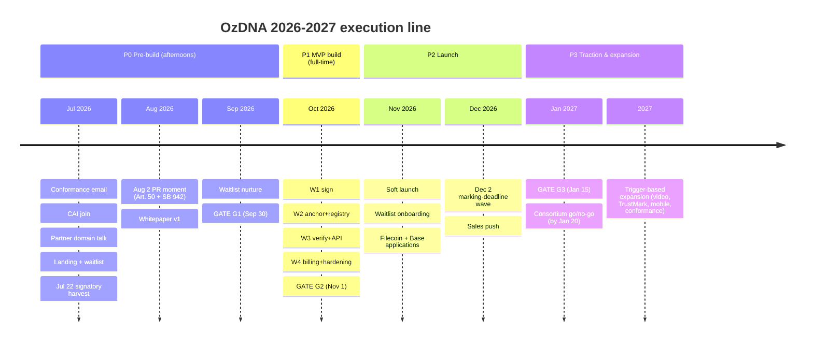
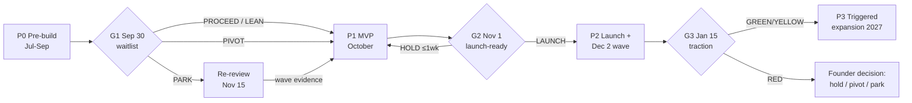

# 08 — OzDNA Master Roadmap & Decision Gates

> **Changelog** (newest first — add a line here on every edit)
> - 2026-07-06 · v1.3 · Ratification pass — G1 gate set to 07 §2.3 (BUILD: total ≥75, AI-company segment ≥25, ≥5 discovery calls); the A≥40/A≥25 threshold table and the PROCEED-LEAN *threshold* branches are RETIRED — PROCEED-LEAN survives only as a founder-override note ("the founder may override the gate outcome with a stated rationale recorded in the gate packet"). Hosting split resolved: the October product ships from Workers static assets (02 §4 owner); Cloudflare Pages is sanctioned for the throwaway July landing page (P0.4) only — no Pages-vs-Workers conflict.
> - 2026-07-06 · v1.2 · Cross-document consistency pass: `@contentauth/c2pa-web` baseline corrected v0.7.x → v0.12.0 in §4.1/§4.3 (02-TECH-STACK is the version owner, verified 2026-07-06). No gate/threshold changes — G1 numbers continue to defer to 07 per §3's note. Note: this file's v1.1 "P0.4 pinned to Cloudflare Pages" vs. 02-TECH-STACK §4's "Workers static assets, not Pages" lock — **resolved in v1.3 (2026-07-06)**: the hosting split is ratified — the throwaway July landing page (P0.4) stays on Cloudflare Pages, while the October product ships from Workers static assets per 02 §4; the two are different surfaces, so there is no conflict.
> - 2026-07-06 · v1.1 · Review-findings pass: G1 + G3 verdict tables made exhaustive; Paddle onboarding scheduled W2–W3 with G2 front-loading + Oct 29 packet rule; Alliance reclassified as equity (SAFE + token side letter), excluded from non-dilutive test; banned-phrase audit hardened; PARK-revival arithmetic corrected; P0.4 pinned to Cloudflare Pages; Base write-up placement guardrail; G2 item 13 (abuse/takedown); G2 PIVOT-build variant.
> - 2026-07-06 · v1.0 · Initial version, authored in the July 6 planning sweep. All volatile facts verified as of this date (sources inline).

**What this document is:** the execution contract between the founder and every future Claude Code session that works on OzDNA. It says what happens when, what "done" means, who decides, and what a fresh session must read and re-verify before touching anything. Strategy lives in `docs/BLUEPRINT.md`; the live task list lives in `docs/ACTION_PLAN.md`; this document is the spine that connects phases to decisions.

**Who decides:** Claude sessions prepare, build, and recommend. **The founder decides at every gate and signs off on every irreversible action** (see §1.3). No gate passes itself.

**Sibling documents** (written in parallel July 6, 2026; a consistency pass reconciles conflicts — where they conflict with this file, the owner listed below wins):

| Doc | Owns |
|---|---|
| `plan/00-INDEX.md` | Reading order, corpus map |
| `plan/01-*` (architecture) | System diagram, component boundaries |
| `plan/02-*` (tech stack) | Package choices/versions, hosting, billing provider |
| `plan/03-*` (algorithms) | Perceptual-hash choice, match thresholds |
| `plan/04-*` (MVP spec) | API schemas, SQL schemas, week-by-week build scope, SLOs |
| `plan/05-*` (risk register) | Risk list, mitigations, kill criteria detail |
| `plan/06-*` (cost model) | Every dollar; free-tier headroom math |
| `plan/07-*` (GTM/SEO/PR) | Waitlist funnel math, PR playbook, SEO targets — **G1 numbers defer to it** |
| `plan/08-ROADMAP-GATES.md` | **This file:** phases, gates, triggers, session bootstrap, corpus upkeep |

---

## 1. How to read the roadmap

### 1.1 The shape of the year



### 1.2 Gate mechanics

A **gate** is a founder decision meeting with a written packet. Before each gate, the active Claude session prepares a **gate packet**: one page, containing (a) each criterion below with its measured value, (b) a PROCEED / PIVOT / PARK recommendation with one paragraph of reasoning, (c) the top 3 risks carried into the next phase. The packet is saved as `plan/gates/G{n}-packet-YYYY-MM-DD.md`. The founder's decision is recorded in the `docs/ACTION_PLAN.md` decisions log — that log is the single source of truth for what was decided.

Verdicts mean:
- **PROCEED** — next phase starts as specced.
- **PROCEED-LEAN** — not a standalone gate verdict; a reduced-scope build the founder may choose under a **Founder call (override)** (§3.1), with the lean scope recorded in the packet.
- **PIVOT** — re-rank the customer wedges (BLUEPRINT §4) and re-scope; does not mean abandoning provenance.
- **PARK** — stop active work, keep the landing page harvesting, set a written re-review date. Parking is not killing; the regulatory clock (Dec 2, Feb 2) can revive a parked project.

### 1.3 Actions that ALWAYS require founder sign-off (every phase, no exceptions)

1. **Any deploy** to any environment reachable by the public (production *and* preview URLs that will be shared).
2. **Any spend**, of any size — including "free trial that needs a card," gas top-ups, domain purchases. The only pre-approved budget is ~$20/mo if unavoidable (CLAUDE.md).
3. **Any public communication** — posts, emails to outsiders, PR pitches, waitlist broadcasts, social accounts, replies to press.
4. **Anything touching ozdna.com** while the partner's LLM-cost site migration is pending (ACTION_PLAN 0.9). Until the decisions log records "partner migration DONE," treat the domain as not ours to modify.
5. Any change to the hard rules in `CLAUDE.md` (these are not changeable by a session at all — flag, never edit).
6. Sending any email from founder-adjacent addresses (conformance@c2pa.org outreach, grant applications): Claude drafts, founder sends.

Claude sessions may freely: write code locally, run local tests, write/update plan docs, prepare drafts of anything above.

---

## 2. Phase P0 — Pre-build (now → Sept 30, 2026)

**Constraint:** MetalTakip's 90-day plan stays primary until ~October. OzDNA gets **afternoons only**. Anything that can't fit an afternoon gets split.

**Goal:** validate demand (waitlist), secure the brand (domain migration), bank the PR moment (Aug 2), and resolve the one unknown number (conformance cost) — all at $0.

### 2.1 Task table (mirrors and extends ACTION_PLAN 0.1–0.9 — update statuses THERE, not here)

| # | Task | Owner | Exit criterion (binary — done or not) | Target date |
|---|---|---|---|---|
| P0.1 | Email conformance@c2pa.org asking Level 1 Generator-product cost + timeline | Claude drafts, **founder sends** | Email sent; any reply summarized into decisions log with the number(s) | Jul 8 (send first — replies take weeks) |
| P0.2 | Join Content Authenticity Initiative (free) | Founder | Membership confirmation received; "CAI member" usable in copy | Jul 10 |
| P0.3 | Partner conversation: ozDNA name/domain stays with provenance; partner's LLM-cost site gets new name/domain; Claude executes the migration | **Founder (conversation)**, Claude (migration work) | Partner's site live on its new domain; ozdna.com DNS under our control; decisions-log entry "partner migration DONE" | Jul 15 (hard: protects the Aug 2 window) |
| P0.4 | Landing page + segmented waitlist on ozdna.com — segments: (a) AI companies needing Art. 50 marking, (b) sellers/creators. May reuse the existing Netlify skeleton's *code/copy* + llms.txt, but it deploys on **Cloudflare Pages** (hard rule 7). Pages is sanctioned for this throwaway July landing page **only**; the October product (P1) ships from **Workers static assets** per 02-TECH-STACK §4 — a different surface, so there is no Pages-vs-Workers conflict. Hosting on Netlify itself would be a founder-decided rule-7 waiver requiring a Netlify free-tier ToS check added to §2.2 | Claude builds, founder approves copy + deploy | Page live; both segments captured with separate tags; submissions stored durably (not just email notifications); copy passes the §5.2 banned-phrase check | Jul 20 (before signatory-list close) |
| P0.5 | Jul 22 signatory-list harvest: when the EU Code of Practice signatory list closes, extract every small/medium GenAI signatory as a lead | Claude | Lead sheet exists (name, product, country, contact route) with ≥1 pass of dedup/qualification; stored in `plan/leads/` | Jul 24 |
| P0.6 | Whitepaper v1 (EN): architecture, DNA-registry thesis, regulatory map, explicit "token-optional architecture, no token planned" | Claude drafts, founder approves | PDF/page published or publishable; doubles as Filecoin application core; passes banned-phrase check | Aug 15 |
| P0.7 | Aug 2 PR push: Art. 50 + SB 942 land the same day; founder as commentary-source-with-a-solution | **Founder** (pitching is his superpower), Claude preps materials | Pitch list ready by Jul 25; ≥N pitches sent in the Jul 28–Aug 5 window (N set by 07-GTM); pickups and referral traffic logged | Aug 2 window |
| P0.8 | Waitlist nurture: 1 short email to each segment ~Aug 20 and ~Sep 15 (what's coming, ask one qualifying question) | Claude drafts, **founder approves send** | 2 sends done; reply/click data recorded for G1 | Sep 15 |
| P0.9 | Re-underwrite DATA Foundation (ex-Story) grants post-rebrand | Claude | One-paragraph verdict (fit / no fit / unclear) in decisions log | Sep 1 |
| P0.10 | (Optional) ETHGlobal Lisbon Jul 24–26 | Founder | Only if MetalTakip allows; skipping has zero penalty | — |
| P0.11 | G1 gate packet | Claude | Packet in `plan/gates/` ≥3 days before gate | Sep 27 |

### 2.2 P0 session bootstrap block

*A fresh Claude session starting P0 work does this before anything else:*

**Reading order:** `CLAUDE.md` → `plan/00-INDEX.md` → this file §2 → `docs/ACTION_PLAN.md` (current statuses) → `plan/07-*` (GTM) for waitlist/PR tasks, `plan/02-*` for landing-page stack.

**Re-verify these volatile facts at session start** (cite the check date next to anything you write down):

| Fact | Where to check |
|---|---|
| ozdna.com current state — has the partner migrated yet? | Load https://ozdna.com; check decisions log |
| EU Code of Practice status / signatory list | https://digital-strategy.ec.europa.eu (Code of Practice pages) |
| Art. 50 guidance changes, delay rumors | https://artificialintelligenceact.eu + EU AI Office news |
| C2PA conformance program / trust-list changes | https://c2pa.org/conformance (interim list froze Jan 1, 2026 — confirm still true) |
| Cloudflare Pages/Workers free-tier terms | https://developers.cloudflare.com/workers/platform/limits/ |
| CAI membership terms still free | https://contentauthenticity.org/membership |

**Founder sign-off (P0-specific):** every item in §1.3, plus: the landing page cannot go live on ozdna.com until P0.3 (partner migration) is logged DONE — if it isn't, deploy to a temporary subdomain/pages.dev URL only, unlinked, for founder review.

---

## 3. GATE G1 — Waitlist validation (Sept 30, 2026)

**Question the gate answers:** did anyone show up? Is the compliance buyer (wedge #1) real enough to spend 4 full-time weeks building for?

> **Numbers note:** the thresholds below now mirror `plan/07-*` §2.3 (the owner) as ratified 2026-07-06. `plan/07-*` (GTM) owns funnel math; if its numbers change, **07 wins** and this table gets a changelog-stamped update in the consistency pass.

### 3.1 Primary numeric criteria

Definitions (aligned to 07 §2.3): **Total** = all waitlist signups (A + B); **A** = segment-A signups (AI companies / compliance buyers — the "AI-company segment"); **B** = segment-B signups (sellers/creators); **C** = discovery calls (≥15-min call or ≥3-exchange substantive email thread).

| Verdict | Criteria — mirror `plan/07-*` §2.3 verbatim (07 owns the numbers); rows checked top-down, first match wins | What it means for October |
|---|---|---|
| **EXTEND** (check first) | The Aug 2 PR cycle did NOT execute — no coverage, < 500 total landing visitors — so the test never actually ran | Push the gate to Oct 31; MVP compresses to 3 weeks in November (07 §2.3) |
| **PROCEED (BUILD)** | **Total ≥ 75 AND A ≥ 25 AND ≥ 10 of A with a real `company_url` AND C ≥ 5** (calls sourced from inbound signups **plus** the 07 §2.4 pre-gate outbound, never inbound alone) — the `plan/07-*` §2.3 BUILD gate verbatim | Full 4-week MVP per `plan/04-*` |
| **PIVOT (re-lead)** | Total ≥ 75 **but** A < 15 while B ≥ 40 | Sellers showed up, compliance buyers didn't: re-rank wedge #2 (badge, $5–15/mo) primary; MVP re-scoped around badge + verify page; API becomes secondary |
| **PARK** | Total < 40 **and** A < 10 — *with the Aug 2 PR having actually executed* (≥ 2 pickups or ≥ 500 PR visitors; if it didn't, this is EXTEND) | Stop build. Landing page keeps harvesting. **Written re-review Nov 15, 2026** — BLUEPRINT §7 risk 1 says demand may only be *forced* by the Dec 2 deadline, so a quiet September is evidence but not proof. If Nov 15 shows a demand spike (signups accelerating, inbound mentions of Dec 2), run a compressed 3-week build — honest arithmetic: that launches ~Dec 6, *after* the deadline itself, so the target is the post-deadline laggard / enforcement-scare segment, not the pre-deadline scramble or the deadline-day PR moment (those are forfeited by parking) |
| **Founder call (override)** | Any near-miss the rows above don't cleanly resolve — apply 07 §2.3's three tiebreakers first (A 15–24 → ≥ 8 company URLs AND ≥ 5 calls = BUILD, else PARK; 40–74 total → ≥ 15 compliance signups with ≥ 8 URLs = BUILD, else PARK; otherwise default PARK) | The **founder may override the gate outcome with a stated rationale recorded in the gate packet**, weighing the §3.2 secondary signals — a reduced-scope "lean" build (sign + anchor + registry + verify page, deferring billing polish and the badge product) is one option. Default PARK if the signals are flat |

### 3.2 Secondary signals (recorded in the packet; they tilt borderline calls, they don't override the table)

1. **Conformance email answer (P0.1).** If Level 1 costs ≤ ~$1K: note it as an early milestone candidate. If thousands+: confirm the BLUEPRINT posture (grant-funded milestone, not launch blocker). If no reply by Sep 30: send one follow-up, treat as unknown, proceed anyway — v1 never depended on it.
2. **Signatory-list lead quality (P0.5).** ≥20 contactable small-GenAI leads = strong tilt toward PROCEED even at borderline A counts, because outbound in November can substitute for weak inbound.
3. **Aug 2 PR outcome.** Pickups, referral traffic, inbound emails. A founder whose superpower is PR failing to get *any* traction on a same-day two-jurisdiction regulatory story is itself a data point about the story's pull.
4. **Partner migration status.** If STILL pending on Sep 30, this becomes a build blocker: G1 cannot return PROCEED until domain control is logged. Escalate to founder as the gate's first agenda item.
5. **Competitive moves since July** — did Adobe ship video / open its registry? Did OpenAI+Google's joint marking absorb the niche? (Check list in §2.2.) Feeds the packet's risk section.

---

## 4. Phase P1 — MVP build (October 2026, 4 weeks)

**Precondition:** G1 returned PROCEED / PIVOT (with its re-scope) — or a founder-override build (§3.1). MetalTakip 90-day plan concluded; OzDNA is now primary.

**Scope authority:** `plan/04-*` (MVP spec) owns what gets built each week — API shapes, SQL schemas, SLOs. This section owns the *cadence, gates, and demo discipline*. If the week labels below disagree with 04's build order, **04 wins**.

### 4.1 Weekly sub-gates

Calendar (Oct 1, 2026 is a Thursday; W1 starts Mon Oct 5; W4 ends Sun Nov 1):

| Week | Build focus (per 04) | Friday demo — what the session must SHOW the founder (not describe: show) | Sub-gate exit criterion |
|---|---|---|---|
| **W1** (Oct 5–11) | In-browser C2PA signing, JPG/PNG, via `@contentauth/c2pa-web` (v0.12.0 as of 2026-07-06, per 02-TECH-STACK §1 — re-verify in October) | Founder drags a JPG into a local page, gets back a signed file; the manifest is readable by a second tool (`c2patool` or the c2pa-web reader) | Round-trip sign→read works on founder's own machine with founder's own photo |
| **W2** (Oct 12–18) | Batched hash anchoring (Base first) + DNA registry writes (crypto hash + perceptual hash at signing). Also this week: **Paddle onboarding starts** + G2 items 6 & 8 (see the front-load note below) | A signed image's hashes appear in the local registry DB; a batch anchor transaction is visible on a Base explorer (testnet acceptable in W2) | One batch containing ≥10 image hashes confirmed on-chain; registry row ↔ tx hash linkage demonstrated; **Paddle account created and site submitted for Paddle's website review** (with legal-page drafts attached) |
| **W3** (Oct 19–25) | Public verify page + match endpoint (stripped-copy → origin record) + compliance API v0 | Founder uploads a *screenshot* of a signed image (metadata gone) and the verify page still finds the origin record with a confidence score; one `curl` call signs an image via the API | Strip-and-match works live at thresholds from `plan/03-*`; API returns per `plan/04-*` schema; **Paddle account approved** (website review passed) so W4 is integration-only; monitoring (G2 item 9) in place |
| **W4** (Oct 26–Nov 1) | Billing *integration* (self-serve $49–199/mo — Paddle account already approved in W3), docs, hardening, remaining G2 checklist items; **G2 packet due Oct 29** | Founder completes a real end-to-end purchase (test mode then live mode), receives API key, signs an image with it | Every G2 checklist item (§5) is green or has a founder-accepted waiver |

**If a week slips:** cut scope, not quality, and never cut W3's match endpoint — the registry/matching is the moat (BLUEPRINT §7 risk 2). The pre-agreed cut order is: badge product → billing polish (manual invoicing acceptable at launch) → API rate-limit tiers → everything else. The cut is proposed by Claude, decided by founder at the Friday demo.

**G2 front-loading (don't let W4 eat the gate):** W4 ends the same day G2 convenes, so anything on the G2 checklist that doesn't depend on billing integration is executed earlier, not in W4. Specifically:

- **Paddle onboarding starts in W2, not W4** (founder sign-off per §4.3 "billing-provider account creation"). Paddle is a Merchant of Record: approving a UAE Free Zone entity needs business verification *plus* a website review that expects a live-looking site with a product description and legal pages — typically days to weeks. The P0.4 landing page plus the legal-page drafts (G2 item 3, drafted in W2 for this reason) are the review material. If approval hasn't landed by the W3 demo, that's a W3 sub-gate failure escalated there — not a surprise discovered at G2.
- **Key-management drill (item 6) and backup/restore runbook + drill (item 8)** run in W2, once the registry exists.
- **Monitoring & alerting (item 9)** lands in W3.
- **Banned-phrase audit (item 1)** runs on every copy change throughout, not once at the gate.
- The **G2 gate packet is due Oct 29** — the same ≥3-days-before-gate rule G1 gets via P0.11.

### 4.2 Deploy-rarely discipline (hard rule 8, operationalized)

- **All work happens locally** (`wrangler dev`, local D1, testnet). Sessions batch a full week of work.
- **Maximum one production deploy per week**, normally right after the Friday demo, founder sign-off each time. Preview deploys for founder review are allowed but count as deploys for sign-off purposes if the URL leaves the two of you.
- Every deploy gets a one-line entry in the decisions log: date, what shipped, deploy URL.
- No schema migration deploys without the backup step from §5 item 8 having a tested restore path.

### 4.3 P1 session bootstrap block

**Reading order:** `CLAUDE.md` → `plan/00-INDEX.md` → this file §4 + §5 → `plan/04-*` (the build bible for this phase) → `plan/02-*` (stack), `plan/03-*` (thresholds) → `docs/ACTION_PLAN.md` statuses → G1 packet + decision in decisions log (know which verdict you're building under).

**Re-verify at phase start (Oct 1) — do not trust July numbers:**

| Fact | Where to check | July 6 baseline |
|---|---|---|
| `@contentauth/c2pa-web` version + maintenance | npmjs.com / github.com/contentauth/c2pa-js | v0.12.0 (2026-06-16), active |
| `@trustnxt/c2pa-ts` (Workers-compatible pure TS) still maintained | npmjs.com/package/@trustnxt/c2pa-ts | active, zero native deps |
| `c2pa-node-v2` (fallback server signing) | github.com/contentauth/c2pa-node-v2 | active; prebuilt binaries |
| Workers free tier | developers.cloudflare.com/workers/platform/limits/ | 100K req/day, 10 ms CPU, 3 MB compressed worker |
| D1 free tier | developers.cloudflare.com/d1/platform/pricing/ | 5 GB total, 5M rows read/day, **100K rows written/day** |
| R2 free tier | developers.cloudflare.com/r2/pricing/ | 10 GB, 1M Class A + 10M Class B ops/mo (Standard storage only) |
| Base gas / anchoring cost per batch | basescan.org gas tracker; recompute `plan/06-*` math | benchmark $0.0001/asset (Numbers Protocol on Base) |
| C2PA spec version (breaking changes since v2.4?) | spec.c2pa.org | v2.4, Apr 2026 |
| Billing provider terms for UAE-seller entity | provider docs (02/06 own the choice) | Paddle supports sellers "anywhere in the world" except a sanctions list that does **not** include UAE — paddle.com/help/start/intro-to-paddle/which-countries-are-supported-by-paddle, checked 2026-07-06 |
| Regulatory drift | artificialintelligenceact.eu; digital-strategy.ec.europa.eu; SB 942 status via leginfo.legislature.ca.gov | Art. 50 + SB 942 applying Aug 2; Dec 2 grace expiry |

**Founder sign-off (P1-specific):** §1.3 list, plus: mainnet gas wallet funding (any amount), billing-provider account creation, production DNS changes, publishing API docs.

---

## 5. GATE G2 — Launch readiness (Nov 1, 2026)

**Question:** can a stranger pay us money, use the product, and get support — without anything embarrassing, illegal, or unrecoverable happening?

**Gate packet:** same rule as G1 — packet in `plan/gates/` ≥3 days before the gate, i.e. **due Oct 29**. The checklist below is executed across W2–W4 per §4.1's front-load note, not crammed into gate week.

Checklist — every item is demonstrated to the founder live, not asserted:

| # | Check | Pass condition |
|---|---|---|
| 1 | **Copy compliance review** | Run the banned-phrase audit (§5.2) over every public page, doc, email template, and API response string. Zero hits, or each hit founder-waived in writing |
| 2 | **C2PA claim audit** (hard rule 5) | No page or doc promises "trusted Content Credentials," "C2PA-certified," or implies our signatures validate as trusted in the official Verify tool. The verify page explains "unknown source" plainly |
| 3 | **Legal pages** | ToS, Privacy Policy (GDPR for EU buyers + KVKK for Turkey traffic), refund policy (aligned with billing provider's MoR terms), company identity (Find Below Ventures, Sharjah) in the footer. Claude drafts; **founder reviews; flag that a lawyer review is on him** |
| 4 | **Billing live test** | One real purchase of the cheapest plan with a real card in live mode → webhook received → API key issued → invoice correct (entity name, tax handled by MoR) → refund executed and confirmed. Then repeat purchase path in test mode for regression use. (Depends on Paddle approval — a W3 exit criterion; a slip there is escalated at the W3 demo, not discovered here) |
| 5 | **Load sanity** | Verify page and match endpoint survive a modest synthetic burst (default: 50 concurrent verifies, p95 < 2 s on match — `plan/04-*` SLOs win if different) without free-tier limit trips; daily-quota headroom math from `plan/06-*` re-checked against real request weights |
| 6 | **Key management drill** (BLUEPRINT §3: Nikon lesson) | Signing key storage location documented; key rotation procedure written AND executed once end-to-end in staging; a revocation note exists (what we do/say if a key leaks) |
| 7 | **Anchoring wallet hygiene** (hard rule 2) | Our gas wallet holds ≤ ~$20 equivalent; private key stored per `plan/02-*`; documented top-up procedure requiring founder action; zero code paths that could ever receive user funds |
| 8 | **Backup/restore drill** | `wrangler d1 export` of the registry DB to R2 + one off-Cloudflare copy → restore into a fresh D1 instance → row counts match → 10 random records spot-verified (hashes + anchor tx). The runbook lives at `plan/runbooks/backup-restore.md`. Scheduled backup cadence enabled (default daily; 06 owns cost check) |
| 9 | **Monitoring & alerting** | Uptime check on verify page + API health endpoint (free tier of any uptime service — verify current terms when chosen); error alerting reaches the founder's phone/email; a public status route exists even if minimal |
| 10 | **Support readiness** | support@ozdna.com receives mail; §6.3 playbook file exists with canned responses; docs quickstart tested by the founder personally, from scratch, in <15 minutes |
| 11 | **Onboarding dry run** | Founder plays a fake customer end-to-end: land → sign up → pay → sign an image → verify a stripped copy → cancel. Every friction point logged; blockers fixed before launch |
| 12 | **Rollback** | The previous deploy can be restored in <10 minutes (Workers/Pages version rollback demonstrated once) |
| 13 | **Abuse & takedown readiness** | ToS contains a prohibited-content/abuse policy; a report/takedown route is published (report@ozdna.com or a form); registry records can be tombstoned/delisted from the public verify page — with the docs stating plainly that the on-chain hash anchor is immutable but the public record display is not; the §6.3 escalation rule explicitly covers illegal-content reports (CSAM, DMCA, etc.) same-day |

**PIVOT-build variant** (if G1 returned PIVOT and October built the badge wedge): item 4's artifact is a badge subscription purchase → embeddable badge issued, instead of an API key; item 11's dry run is the seller flow — land → sign up → pay → get badge → badge verifies on the verify page. Every other item applies unchanged.

**Verdict options:** LAUNCH (all green / waived) · LAUNCH-QUIET (soft launch to waitlist only; unresolved items fixed in week 1 of P2) · HOLD (max 1 week; a HOLD past Nov 8 endangers the Dec 2 wave and must be escalated as a founder decision about scope cuts).

### 5.2 Banned-phrase audit (run verbatim, from repo root, against the marketing/site/docs dirs)

```bash
for d in site docs-public emails; do [ -d "$d" ] || { echo "MISSING $d — audit invalid"; exit 1; }; done
grep -rniE "AI ?[x×] ?Blockchain|trusted content credentials|C2PA.{0,12}(certified|approved|conformant|compliant)|detect(s|ing)? ?deepfakes?|deepfake ?detect(ion|or)?|(our|ozdna).{0,20}token|token (sale|launch|airdrop)|custod(y|ial)|we (hold|store) (your )?(funds|crypto|wallets)" site/ docs-public/ emails/
```

Interpretation: "deepfake" alone is fine (we *prevent deepfake harm by proving origin*); "detects deepfakes" is not. "Token-optional architecture, no token planned" in the whitepaper is the one permitted token sentence — waive that hit explicitly. The directory-existence loop is load-bearing: a renamed or missing directory must fail the audit loudly, never pass it silently (which is also why there is no `2>/dev/null`). If public copy ever moves, update **both** the loop and the grep paths in the same edit.

---

## 6. Phase P2 — Launch + the Dec 2 wave (Nov 2 – Dec 31, 2026)

### 6.1 Launch sequence (order matters — each step gets founder sign-off per §1.3)

1. **Soft launch (Nov 2–8):** email segment-A waitlist first ("you asked to be first"), personal-tone, one CTA. Segment B two days later. No public announcement yet — first 10 users find the sharp edges privately.
2. **Fix week (Nov 4–12):** triage soft-launch feedback daily; deploy fixes in max 2 batches (deploy-rarely still applies, loosened from weekly to twice-weekly during fix week only).
3. **Public launch (Nov 12–20):** PR push #2 — angle: "Dec 2 is three weeks away; here's the self-serve fix." Signatory-list leads (P0.5) get personal outbound from the founder. TR/MENA fact-checkers (Teyit etc.) onboarded free as flagship users — their names are the credibility for the paid tier.
4. **File Filecoin application (within 14 days of public launch):** shipped product + whitepaper + usage screenshots. Owner: Claude drafts against github.com/filecoin-project/devgrants (open, rolling, ≤$50K — checked 2026-07-06), founder submits.
5. **Base retro positioning (once anchoring contract is live on mainnet):** Builder Grants are retroactive 1–5 ETH by nomination/discovery, no application form (checked 2026-07-06) — so: contract verified on Basescan, builder profile public, one build-in-public post about the anchoring design. Don't chase; be findable. **Placement guardrail (hard rule 4):** the anchoring write-up lives on a builder-channel surface only — personal Farcaster/X/dev blog, or an `/engineering` path not linked from the marketing nav — written for the Base reviewer audience. It never appears on the homepage, in the customer-facing pitch, or in PR materials, and it still passes the §5.2 banned-phrase audit before publishing.
6. **Dec 2 wave (Nov 24 – Dec 12):** PR push #3 on the deadline itself; daily monitoring of "EU AI Act content marking"-type queries (07 owns the SEO plan); founder's afternoons go to demos and closing.

### 6.2 First-customer onboarding playbook (compliance API, wedge #1)

| Step | When | What (owner) |
|---|---|---|
| 1 | T+0 signup | Automated: welcome email with API key, quickstart link, one `curl` example that signs a test image (Claude pre-writes all templates in P1-W4) |
| 2 | T+0 | Automated: founder gets a "new customer" alert with plan + company domain |
| 3 | T+1 day | **Founder** sends a 3-line personal email: who are you, what are you marking, what would make this a no-brainer? (Template exists; personalization is human) |
| 4 | T+7 days | Check usage: if zero API calls, founder sends the "stuck?" email with a 15-min call offer. If active, ask for the compliance use case in writing — future case study |
| 5 | T+30 days | Usage review before renewal; log churn reasons verbatim in `plan/feedback-log.md` |

### 6.3 Support model for a solo founder

- **Channel:** support@ozdna.com only. No live chat, no phone, no Slack Connect — do not promise what one person can't staff.
- **Stated SLA:** reply within 1 business day (Istanbul time). Internally aim same-afternoon for paying customers.
- **Docs-first:** every support question answered twice = a docs page (Claude writes it from the email thread). Target: docs deflect 80% of repeat questions by January.
- **Canned responses** live in `plan/runbooks/support-canned.md`: key reset, "why does Verify say unknown source" (the §5 item-2 explanation), match-confidence questions, refund route (billing provider handles), GDPR data-deletion request procedure.
- **Escalation rule:** anything touching money, legal threats, illegal-content/takedown reports (G2 item 13), or a security report goes to the founder same-day, no drafting delay.
- **Incident norm:** if the verify page is down >30 min, status route updated first, apology email only to affected paying customers, postmortem paragraph in decisions log.

### 6.4 P2 session bootstrap block

**Reading order:** `CLAUDE.md` → `plan/00-INDEX.md` → this file §6 → G2 packet + verdict → `plan/07-*` (launch PR plays) → `plan/runbooks/` → `docs/ACTION_PLAN.md`.

**Re-verify at phase start (Nov 2):** everything in the §4.3 table (versions, tiers, gas), **plus**: Filecoin devgrants process still as described (github.com/filecoin-project/devgrants); Base Builder Grants/Batches status (base.org ecosystem pages); Alliance application status + terms (alliance.xyz — **equity, not a grant**: $500K SAFE at $5M post-money with a standard 1:1 token side letter; rolling, ~2-week decisions; the side letter is passive — no obligation to launch a token — so it's hard-rule-1-compatible; checked 2026-07-06); Dec 2 grace-expiry date unchanged (artificialintelligenceact.eu); Etsy AI-disclosure enforcement still active (wedge #2 dependency); Adobe Content Authenticity app scope (did video ship? — contentauthenticity.org); billing provider payout terms to UAE entity actually working (first real payout is the test).

**Founder sign-off (P2-specific):** §1.3 list, plus: every launch-sequence step above, every grant submission, every case-study publication (customer consent first), any pricing change.

---

## 7. GATE G3 — Traction review (Jan 15, 2027)

**Question:** did the Dec 2 wave convert? What does that unlock — grants, the consortium, expansion — or force — pivot or park?

### 7.1 Traction verdicts (defaults; revenue definitions per `plan/06-*`)

| Verdict | Criteria (measured over Nov 2 – Jan 15; rows checked top-down, first match wins — the three rows partition every outcome) | Consequence |
|---|---|---|
| **GREEN** | ≥3 paying customers **or** ≥$150 MRR, with ≥1 wedge-#1 (compliance API) customer | Full P3 posture: Alliance application within 2 weeks (equity, not a grant — see §7.2; taking dilution is a founder decision, not an automatic step); consider Workers Paid ($5/mo) headroom; expansion triggers (§8) armed |
| **YELLOW** | 1–2 paying, **or** ≥3 paying but none from wedge #1 (compliance API), **or** 0 paying with ≥10 WAU (≥50 WAU or fact-checker flagship usage with public credit is the strong end of this band) | Continue; February focus = converting free/flagship usage into case studies and outbound; re-review Mar 1 |
| **RED** | 0 paying and <10 WAU despite the Dec 2 deadline having passed | Founder decision meeting with three options on paper: (a) hold until the Feb 2 interoperable-detection duty creates a second wave, (b) PIVOT to whichever segment showed *any* pull, (c) PARK with the registry kept alive read-only (anchoring paused, backups retained) |

### 7.2 Funding-application triggers (application-ready criteria — the Type column matters: dilutive and non-dilutive money are not the same kind of money)

| Funding | Type | Trigger | Ready when | Status check source |
|---|---|---|---|---|
| **Filecoin Open Grants** (≤$50K) | Non-dilutive grant | Public launch (should already be filed in P2 step 4 — G3 verifies) | Live product URL + whitepaper + 2-page proposal + usage evidence | github.com/filecoin-project/devgrants |
| **Base retro Builder Grant** (1–5 ETH) | Non-dilutive (retroactive) | Anchoring contract live on Base mainnet + real batches flowing | Verified contract on Basescan, builder profile, one public write-up; nomination-based — visibility is the application | Base ecosystem/Batches pages |
| **Base Batches cohort** | Cohort program (re-verify terms at apply time) | GREEN verdict + founder bandwidth | Working product + Base contract + traction narrative | Base Batches announcements |
| **DATA Foundation** | Non-dilutive grant | Only if P0.9 verdict was "fit" | Per P0.9 notes | their post-rebrand site |
| **Alliance** ($500K) | **Equity/accelerator — NOT a grant:** $500K SAFE at $5M post-money (~10% dilution) + standard 1:1 token side letter (checked 2026-07-06) | "First real usage" = ≥1 paying customer **or** ≥5 external orgs actively signing/verifying weekly — *and* an explicit founder decision to take dilution | Metrics dashboard screenshot-able; founder story tight; "token-optional, no token planned" stance stated up front. The token side letter is passive — it creates **no obligation to ever launch a token** and is therefore compatible with hard rule 1 — but any session prepping this application must surface it to the founder so diligence holds no surprises | alliance.xyz |
| **Conformance (C2PA Level 1)** | A fee we pay, not funding — listed because it's grant-gated | First **non-dilutive** grant money lands (Alliance SAFE money does NOT count toward this test) **and** quoted fee ≤ available non-dilutive funds | P0.1 reply gave the number; SSL.com free Level 1 cert (needs conformance record ID) is the follow-on | c2pa.org/conformance |

### 7.3 Consortium go/no-go (decide by **Jan 20, 2027** — before the Feb 2 interoperable-detection duty)

The Feb 2, 2027 requirement sanctions a shared-consortium route explicitly open to SMEs — a coalition play built for a PR-strong founder. Decision criteria, all four required for GO:

1. Joining cost is free or nominal (≤ the monthly budget, i.e. ~$20).
2. Time commitment ≤ ~4 hours/month of founder time.
3. At least one credible co-member (a fact-checking org, CAI member, or EU signatory) is in or joining.
4. Membership creates **no obligation to build detection classifiers** (hard rule 3) — provenance/registry contributions must satisfy our end.

NO-GO is fine: Feb 2 binds GenAI *providers*, not us; the consortium is an amplifier, not a compliance duty for OzDNA itself. Log either way in the decisions log.

### 7.4 G3 session bootstrap block

**Reading order:** `CLAUDE.md` → `plan/00-INDEX.md` → this file §7 → G2 packet + P2 decisions-log entries → `plan/06-*` (real vs. modeled costs) → `plan/feedback-log.md`.

**Re-verify at gate prep (early Jan 2027):** all grant-program statuses in §7.2 (programs change quarterly); Feb 2 duty final guidance + consortium landscape (artificialintelligenceact.eu, EU AI Office); C2PA conformance fees if P0.1 went unanswered; competitor scan (Adobe video? Truepic pricing? OpenAI/Google marking scope); Cloudflare tier changes; billing provider fee changes; Turkey AI-labeling bill status (TBMM/BTK news — if passed, wedge #3 accelerates).

**Founder sign-off (G3-specific):** the verdict itself, every grant submission, consortium membership, any 2027 pricing change.

---

## 8. Phase P3 — 2027 expansion (trigger-based, not calendar-based)

Nothing below starts on a date. Each starts when its trigger fires and the founder signs off. A session noticing a fired trigger writes a one-page proposal; it does NOT start building.

| Expansion | Trigger (all conditions) | Notes |
|---|---|---|
| **Video support** | (a) ≥10 paying customers requesting it OR ≥3 existing customers stating they'd upgrade for it, AND (b) MRR sustainably covers the required paid compute (video can't ride free tiers — 06 re-models first), AND (c) c2pa video tooling maturity re-verified. **Adobe shipping video is market validation, not a starting gun** — neutrality + API-first is our differentiation, we don't have to be first (BLUEPRINT §7 risk 3) | Biggest single expansion; needs its own mini-spec appended to 04 |
| **TrustMark invisible watermark** (alongside perceptual hashing) | (a) Registry matching in production ≥2 months with measured false-positive/negative rates (03 owns thresholds), AND (b) either a customer-visible match-failure pattern on stripped copies or Q2 2027, whichever first | Open-source, C2PA-approved; makes us speak the standard's own soft-binding language; low cost, schedule when stable |
| **Mobile capture app** | Wedge #3 (TR/MENA legal evidence) validated: ≥5 qualified legal-sector leads asking for certified capture, AND Turkey labeling bill status known | TrueScreen benchmark €99/mo; do NOT build on spec — this is the most expensive wedge to serve |
| **C2PA Conformance entry** | Grant money covers the quoted fee (§7.2 last row) | Unlocks SSL.com free Level 1 cert → signatures stop showing "unknown source"; the single biggest product-credibility upgrade money can buy |
| **Turkey/MENA localization push** | Turkey AI-labeling bill passes (BTK fines make the pain concrete) | Founder's home-field advantage; 07 owns the TR SEO plan |
| **Per-verification metered pricing** ($0.05–0.50) | ≥1 customer asks for volume beyond flat tiers | Pricing ladder step 4 from BLUEPRINT §4 |

### 8.1 P3 session bootstrap block

**Reading order:** `CLAUDE.md` → `plan/00-INDEX.md` → this file §8 → G3 packet + verdict → the fired trigger's owning doc (04 for product, 06 for cost, 07 for GTM).

**Re-verify at any P3 session start:** the full §4.3 volatile-facts table (by 2027, assume EVERY number there is stale: package major versions, Cloudflare tiers, gas costs, grant programs); C2PA spec version breaking changes; EU AI Act enforcement actions (first fines = PR material); new entrants in provenance SaaS; Adobe/Google/OpenAI marking scope.

**Founder sign-off:** every trigger activation is a founder decision on a written one-pager; plus the standing §1.3 list.

---

## 9. Keeping this corpus alive

1. **Decisions land in one place:** every gate verdict, pivot, waiver, deploy, and spend gets a dated line in the `docs/ACTION_PLAN.md` decisions log. If a decision isn't in the log, it wasn't made.
2. **Plan docs update in place** — never fork `08-ROADMAP-GATES-v2.md`. Edit this file and add a dated line to the changelog block at the top. Same rule for all `plan/` docs.
3. **Task statuses** update in `docs/ACTION_PLAN.md` only; this file's task tables are contracts (exit criteria), not status trackers.
4. **Verification stamps:** any volatile fact written into any doc carries `(checked YYYY-MM-DD, source)`. Anything a session couldn't verify carries the literal prefix `UNVERIFIED:`. A stamp older than ~60 days is treated as unverified.
5. **Gate packets** are immutable once the founder decides — corrections go in the decisions log, not by editing the packet.
6. **Consistency pass debts:** when a sibling doc changes a number this file cites (G1 thresholds ↔ 07, SLOs ↔ 04, costs ↔ 06), the session making the change updates BOTH files in the same batch, with matching changelog lines.
7. **New session, first minute:** `CLAUDE.md` → `plan/00-INDEX.md` → the current phase's bootstrap block here. If you cannot tell which phase is current, the newest decisions-log entry tells you.
8. **CLAUDE.md hard rules are immutable to sessions.** If reality seems to contradict one (e.g., a token grant "requires" a token), the session writes up the conflict for the founder and stops; it never edits the rule.

